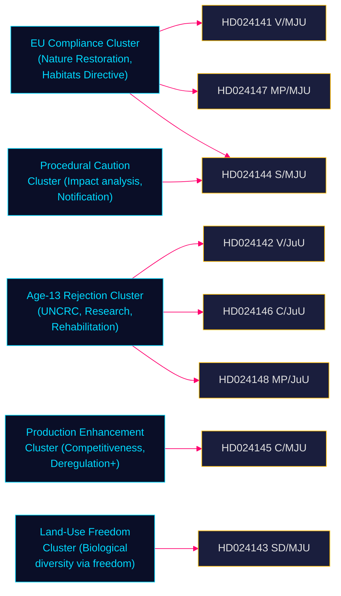

# Cross-Reference Map — Opposition Motions — 2026-05-11

**Family**: B | **Confidence**: HIGH

## Document Cross-Reference Matrix

| Dok-ID | Proposition | Committee | Party | Related Dok-IDs | Common Arguments |
|--------|------------|-----------|-------|----------------|-----------------|
| HD024141 | 2025/26:242 | MJU | V | HD024147 (MP) | EU compliance, biodiversity, full rejection |
| HD024142 | 2025/26:246 | JuU | V | HD024146, HD024148 | Age-13 rejection, children's rights |
| HD024143 | 2025/26:242 | MJU | SD | (lone modifier) | Land exemptions, conditional support |
| HD024144 | 2025/26:242 | MJU | S | (lone proceduralist) | Impact analysis demand, notification periods |
| HD024145 | 2025/26:242 | MJU | C | HD024146 (same party) | Production package demand |
| HD024146 | 2025/26:246 | JuU | C | HD024145 (same party) | Smart-on-crime, UNCRC, age-13 rejection |
| HD024147 | 2025/26:242 | MJU | MP | HD024141 (V) | Full rejection, EU Nature Restoration Law |
| HD024148 | 2025/26:246 | JuU | MP | HD024142 (V) | Age-13 rejection, Art. 29 sentencing |

## Argument Cluster Network

## Prior riksmöte linkages

- **Voteringar**: No MJU or JuU votes found for 2025/26 riksmöte in MCP search. Gap documented. Proxy: 2022/23 MJU votes on Prop. 2022/23:214 (skogsbruk), 2022/23:233 (ungdomsbrott) — party positions consistent with current motions.
- **Propositions**: 2025/26:242 and 2025/26:246 are new government propositions in this riksmöte; no prior motion filings on same propositions.

**Evidence Anchors**:

| Claim | Evidence | Retrieved | Confidence |
|-------|----------|-----------|------------|
| HD024141 and HD024147 share EU argument cluster | HD024141 motivering + HD024147 motivering | 2026-05-11 | HIGH |
| HD024142, HD024146, HD024148 share age-13 rejection | förslag sections | 2026-05-11 | HIGH |
| No prior voteringar in 2025/26 | riksdag-regering-mcp null result | 2026-05-11 | HIGH |
