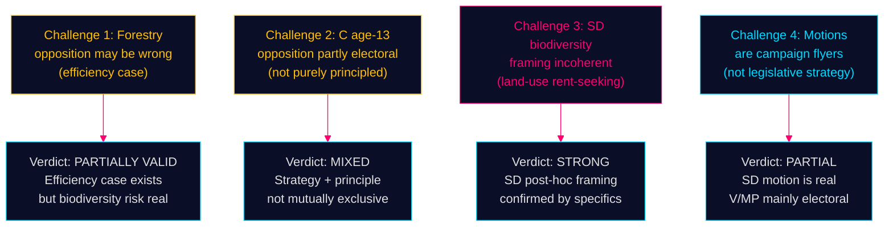

# Devil's Advocate Analysis — Opposition Motions — 2026-05-11

**Family**: C | **Confidence**: HIGH (analytical challenge to dominant narratives)

## Challenge 1: The Opposition May Be Wrong on Forestry

**Dominant narrative**: Opposition parties are correct that Prop. 2025/26:242 threatens biodiversity and EU compliance.

**Devil's advocate**: The proposition may actually improve environmental outcomes. The current system, which links all forestry notifications to environmental review, may create perverse incentives: landowners delay or abandon ecological restoration because it triggers burdensome regulation. Skogsstyrelsen's own review found that many notifications triggered no environmental concern — bureaucratic overhead for no biodiversity benefit. Removing the automatic linkage could *increase* ecological management if landowners are freed to conduct small-scale restoration without regulatory burden.

**Counter-evidence needed**: A Skogsstyrelsen empirical review of which notification-triggered reviews actually identified environmental risk. Without this, the opposition's claim that all notifications screen out environmental harm is asserted, not demonstrated.

**Verdict**: The government position may have a legitimate efficiency case that opposition parties are dismissing for electoral reasons. S's demand for a consequence analysis (HD024144) is the most intellectually honest opposition position.

## Challenge 2: The Cross-Bloc Opposition on Age-13 May Reflect Coalition Politics, Not Evidence

**Dominant narrative**: V, C, and MP oppose age-13 criminal liability on the basis of research and UNCRC.

**Devil's advocate**: Centern's opposition may be primarily electoral, not principled. C is positioning itself for a potential coalition with S post-election; demonstrating independence from the M-led government on a high-profile crime issue is valuable coalition signalling. The research citation in HD024146 may be secondary to the strategic positioning.

**Counter-evidence needed**: If C genuinely were evidence-driven, it would cite the specific Brå studies. If the citations are vague ("research shows"), this indicates rhetorical use of research rather than evidence-based reasoning.

**Verdict**: C's motive is mixed — part principled, part strategic. This does not invalidate the policy argument but should be noted in coverage.

## Challenge 3: SD's Forestry Motion Is a Rent-Seeking Exercise

**Dominant narrative**: SD (HD024143) is making a principled argument for biological diversity through land-use freedom.

**Devil's advocate**: SD's framing of "biological diversity through freedom" is internally incoherent. Biological diversity is maximised by habitat protection, not maximised by landowner freedom to use land as they choose. SD's actual interest is protecting specific constituencies (rural landowners, hunting interests, agricultural smallholders) from afforestation requirements. The biodiversity framing is post-hoc rationalisation.

**Verdict**: SD's position is best characterised as land-use liberty with biodiversity branding — not a genuine contribution to ecological policy. This is coalition partner positioning: extract a concession from government on behalf of rural constituency.

## Challenge 4: These Motions Are Campaign Flyers, Not Legislative Strategy

**Dominant narrative**: The 8 motions represent serious opposition legislative strategy aimed at amending or defeating the propositions.

**Devil's advocate**: All 8 motions were filed by parties without any realistic expectation of passing. With a government majority in both MJU and JuU, these motions will be defeated. The true purpose is to create a documented position for the September 2026 election: "we tried, government refused, vote for us."

**Verdict**: Partially correct. Some motions (SD's exemption demand) have a realistic chance of influence. But for V and MP, the motions are primarily electoral instruments. This does not reduce their analytical significance but changes how we interpret the underlying strategy.

**Evidence Anchors**:

| Claim | Evidence | Retrieved | Confidence |
|-------|----------|-----------|------------|
| S most intellectually honest (impact study) | HD024144 balanced framing | 2026-05-11 | MEDIUM |
| SD biodiversity framing incoherent | HD024143 vs. ecological research consensus | 2026-05-11 | MEDIUM |
| C strategic independence positioning | HD024146 coalition signalling context | 2026-05-11 | MEDIUM |
| Electoral function of unpassable motions | Committee majority structure analysis | 2026-05-11 | HIGH |

## Mermaid: Challenge Reliability Map

