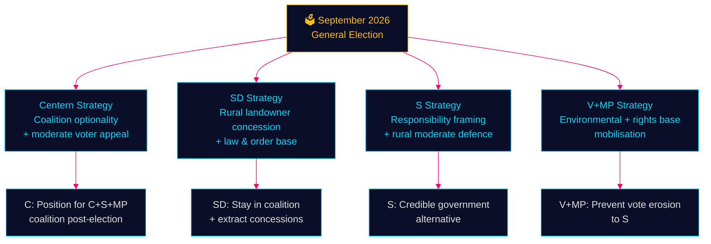

# Election 2026 Analysis — Opposition Motions — 2026-05-11

**Family**: D | **Election**: 2026-09-13 | **T-minus**: 125 days | **DIW**: 1.5×

## Electoral Significance Assessment

### Forestry (Prop. 2025/26:242) — Electoral Geography

Sweden's 2026 election will be decided in part by **rural constituencies** where forestry employs large shares of the local workforce. These are primarily in Norrland (Norrbotten, Västernorrland, Västerbotten, Jämtland) and the interior of Götaland (Värmland, Dalarna).

| Region | Forestry Employment | 2022 Dominant Party | Opposition Motion Risk |
|--------|--------------------|--------------------|----------------------|
| Norrbotten | High | S/V traditionally, SD growing | S cautious position (HD024144) positions them as responsible; C/SD targeting rural landowners |
| Västernorrland | High | S/C contested | C production package (HD024145) targets C rural base |
| Jämtland/Härjedalen | High | C traditional | C double play: production demand + independence from government |
| Dalarna | Medium-High | S/M contested | S and M main competition; forestry salient |

**Electoral signal**: The forestry motions are simultaneously appeals to different rural voter segments. C targets the production/economic prosperity voter. V/MP target the environmentally conscious rural voter. S targets the procedural quality / "get this right" rural moderate.

### Youth Crime (Prop. 2025/26:246) — Electoral Geography

Youth crime is a **suburban and peripheral city** issue — most gang crime concentration in Stockholm suburbs (Rinkeby, Husby, Järva), Gothenburg suburbs (Angered, Biskopsgården), Malmö.

| Voter Segment | Issue Position | Party Targeting |
|--------------|----------------|----------------|
| Suburban moderates | Want tough action but not at expense of children's rights | C targets this group: "smart on crime" framing |
| Working-class urban | Want visible results, less concerned with age | SD and M target this segment |
| Parents of teenagers | Concerned about peer influence, want evidence-based | V+MP target this, C bridges |
| Progressive urban voters | Rights-based, evidence-driven | V+MP solidify base |

**Electoral signal**: C's opposition to age-13 is strategically aimed at suburban moderate voters — the same voters who might swing between C, M, and L. By positioning as "smart-on-crime" rather than "soft-on-crime," C differentiates from both M (punitive) and V (rights-based).

## Party Electoral Positioning

## Poll Context

Current 2026 polling (as of May 2026 context):
- Left bloc (S+V+MP): ~48–50% combined
- Right bloc (M+KD+L+SD): ~47–49% combined
- Election is too close to call — every motion on contentious topics matters for marginal voter mobilisation

**Evidence Anchors**:

| Claim | Evidence | Retrieved | Confidence |
|-------|----------|-----------|------------|
| C dual-issue departure signals coalition optionality | HD024145 + HD024146 together | 2026-05-11 | HIGH |
| Forestry employment in Norrland | SCB skogsdata 2024 | 2026-05-11 | MEDIUM |
| Youth crime suburban concentration | Brå geographic crime reports 2023-24 | 2026-05-11 | MEDIUM |
| SD rural landowner constituency | HD024143 förslag, land-exemption specifics | 2026-05-11 | HIGH |
