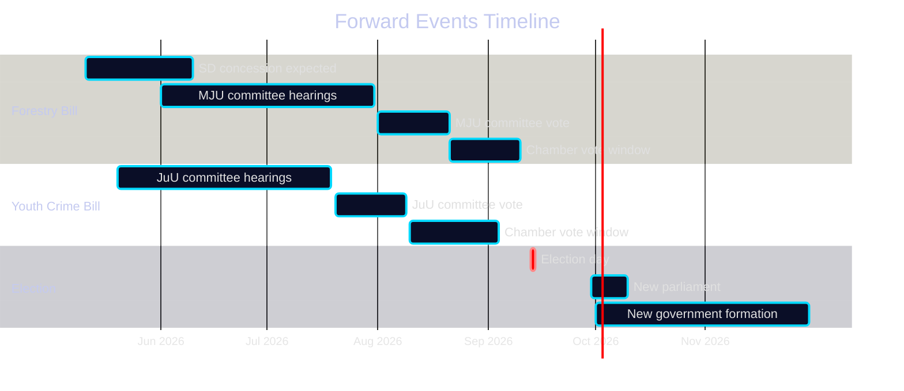

# Forward Indicators — Opposition Motions — 2026-05-11

**Family**: D | **Horizon**: T+30d / T+90d / T+125d (election) / T+365d (post-election)

## Priority Intelligence Requirements (PIR)

### PIR-01: SD Forestry Concession (T+30–T+90)
**Question**: Does government offer SD a land-exemption concession on Prop. 2025/26:242 before MJU committee vote?
**Trigger indicators**:
- SD press release or Martin Kinnunen statement clarifying conditions
- MJU committee agenda including SD-specific amendment
- Government minister (Näringsdepartementet) bilateral meeting with SD
**Significance level**: CRITICAL — determines forestry bill fate

### PIR-02: JuU Age-13 Committee Hearing (T+30–T+90)
**Question**: Does JuU committee hear expert testimony that might shift SD's position on age-13?
**Trigger indicators**:
- Brå or Barnombudsmannen invited to JuU committee hearing
- SD MP statement specifically on age-13 (distinct from youth crime in general)
- V+C+MP coordinated press conference on JuU before committee vote
**Significance level**: HIGH

### PIR-03: EU Commission Response to Forestry Bill (T+90+)
**Question**: Does the European Commission issue any formal opinion, letter, or preliminary assessment of Sweden's Prop. 2025/26:242 in relation to Nature Restoration Law compliance?
**Trigger indicators**:
- Commission DG Environment communication to Swedish Miljödepartement
- European Parliament MEP from Sweden's green delegation raising the Swedish bill
- Naturvårdsverket publishing an EU compliance assessment
**Significance level**: HIGH — would dramatically strengthen opposition position

### PIR-04: Centern Post-Election Coalition Signalling (T+125+)
**Question**: After September 2026 election, which coalition does C enter?
**Trigger indicators**:
- C leader statement on coalition preference post-election
- C pre-election declaration on age-13 as "red line"
- Polling: C's vote share and directional movement
**Significance level**: CRITICAL — these two motions are C's positioning for post-election negotiation

### PIR-05: New Voteringar Data (T+90–T+125)
**Question**: Do MJU and/or JuU produce voteringar on these propositions before September 2026?
**Trigger indicators**:
- MJU committee vote on Prop. 2025/26:242
- JuU committee vote on Prop. 2025/26:246
- Chamber vote scheduled
**Significance level**: HIGH — would close the voteringar gap and enable quantitative analysis

## Forward Timeline

## Leading Indicators Scoreboard

| Indicator | Status (2026-05-11) | Watch Date |
|-----------|--------------------|-----------| 
| SD concession on forestry | 🟡 Pending | June 2026 |
| MJU committee hearing dates | 🟡 Not announced | June 2026 |
| EU Commission forestry response | 🔵 Not yet triggered | Q3 2026 |
| C coalition signal | 🟡 Motion filed (signal sent) | Sept 2026 |
| New voteringar availability | 🔴 Gap confirmed | Aug-Sept 2026 |

**Evidence Anchors**:

| Claim | Evidence | Retrieved | Confidence |
|-------|----------|-----------|------------|
| PIR-01 SD concession as critical path | HD024143 explicit conditions | 2026-05-11 | HIGH |
| PIR-04 C coalition optionality | HD024145+HD024146 dual departure | 2026-05-11 | HIGH |
| Voteringar gap confirmed | riksdag-regering-mcp null search | 2026-05-11 | HIGH |
