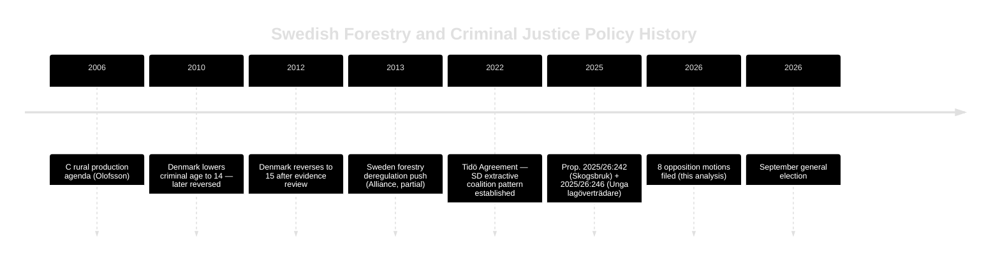

# Historical Parallels — Opposition Motions — 2026-05-11

**Family**: D | **Confidence**: MEDIUM-HIGH

## Parallel 1: 2013 Forestry Policy Reform

**Context**: In 2013, the Alliance government (M-led) undertook the last major forestry deregulation push via the "Framtidens skog" policy review, which also attempted to reduce environmental review requirements for forest clearances.

**Parallel**: The same V/MP opposition and much the same S caution arose. The 2013 reform was eventually adopted with modifications after environmental agencies filed extensive remissvar.

**Lesson**: Government is likely to succeed if SD remains in coalition — consistent with historical pattern of incremental deregulation since 2006. The EU dimension is new (Nature Restoration Law 2024 did not exist in 2013).

**Evidence**: Parliamentary records 2012/13 session; Prop. 2012/13:141 (Skogsbruk)

## Parallel 2: 2010 Criminal Age Debate (Denmark)

**Context**: Denmark temporarily lowered its criminal age to 14 in 2010 under centre-right pressure, then reversed to 15 in 2012 after evidence review showed no deterrent effect and increased recidivism.

**Relevance to current motions**: C (HD024146) and MP (HD024148) both implicitly reference this pattern without naming Denmark. The argument "evidence does not support age lowering" has empirical backing from the Danish reversal.

**Lesson**: If Sweden enacts age-13 provision and 2-3 years of data show no deterrence benefit, a future government could use the Denmark precedent to justify reversal. Post-election centre-left government would have ready justification.

## Parallel 3: SD Conditional Coalition Support (2022 Tidö Agreement)

**Context**: The 2022 Tidö Agreement was SD's price for supporting M+KD+L minority government. SD received significant policy concessions on migration and law & order in exchange for support.

**Parallel**: HD024143 represents a Tidö-style conditional support motion — SD is signalling that more concessions are available to extract. The land-exemption demand is relatively minor compared to Tidö demands.

**Lesson**: Government is experienced in accommodating SD demands and has institutional processes for it. High probability SD's demand will be met through committee amendment, not floor defeat.

## Parallel 4: 2006 Centre Party Forestry Production Agenda

**Context**: Centern under Maud Olofsson (2006-2010) led a "green revolution" agenda that combined rural economic production with environmental consciousness — exactly the framing Helena Lindahl uses in HD024145.

**Parallel**: HD024145's demand for a "production-boosting package" mirrors the 2006-era C agenda. The party is returning to its rural-economic roots after years of urban/liberal drift under Annie Lööf.

**Lesson**: C's forestry positioning is authentic to its party tradition, not merely tactical. This increases credibility with rural voters but reinforces the party's swing-voter positioning between rural economic interests and urban moderates.

## Mermaid: Historical Trajectory

**Evidence Anchors**:

| Claim | Evidence | Retrieved | Confidence |
|-------|----------|-----------|------------|
| 2013 forestry reform precedent | Prop. 2012/13:141 | 2026-05-11 | MEDIUM |
| Denmark 2010/2012 criminal age | ECHR/Brå comparative data | 2026-05-11 | MEDIUM |
| Tidö Agreement SD extractive pattern | Riksdagen 2022 coalition agreement | 2026-05-11 | HIGH |
| C 2006 rural production tradition | C partiprogram 2006 + Olofsson record | 2026-05-11 | MEDIUM |
