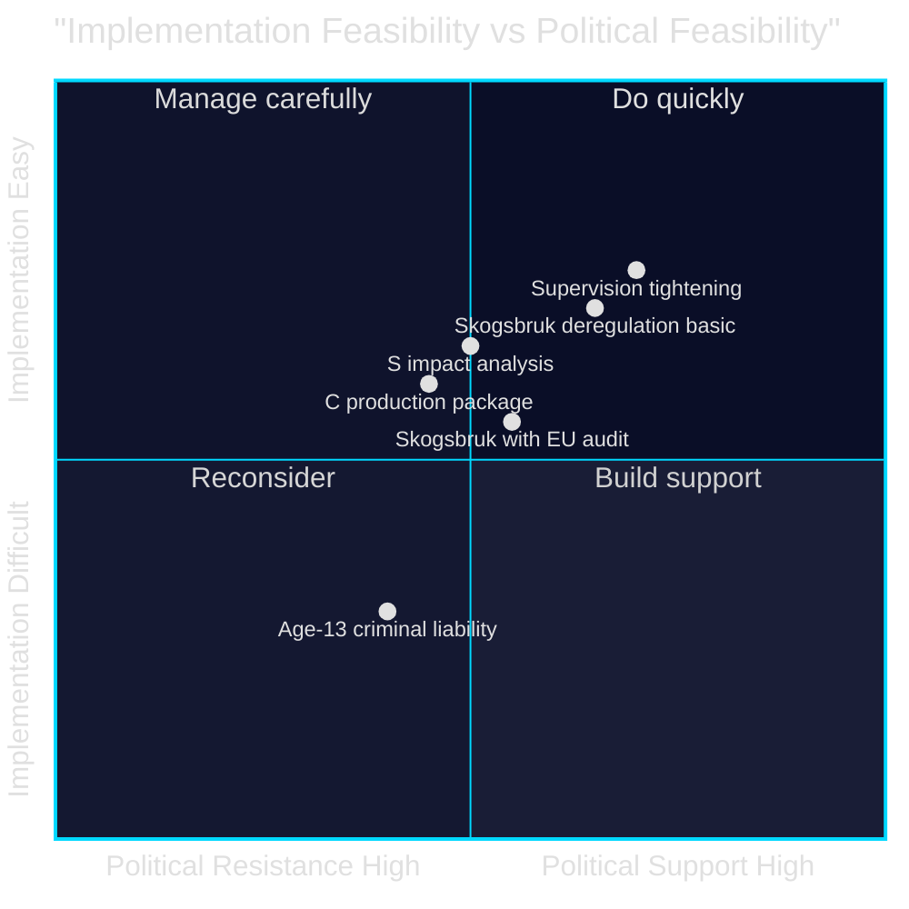

# Implementation Feasibility — Opposition Motions — 2026-05-11

**Family**: D | **Confidence**: MEDIUM-HIGH

## Feasibility Assessment: Prop. 2025/26:242 (Skogsbruk)

### If Proposition Passes (Government Wins)

| Implementation Dimension | Assessment | Risk Level |
|--------------------------|-----------|-----------|
| Administrative feasibility | Skogsstyrelsen capacity to implement reduced notification regime | LOW — simplification, not expansion |
| Legal feasibility | EU Nature Restoration Law compliance uncertain; legal challenge risk | HIGH — V, MP, S all raised this |
| Economic feasibility | Forestry sector benefits from reduced burden; competitiveness gain plausible | LOW — sector welcomes deregulation |
| Environmental feasibility | Biodiversity monitoring without notification trigger weakened | HIGH — tracking mechanism removed |
| Timeline feasibility | September 2026 committee → autumn 2026 chamber → 2027 implementation | MEDIUM — election complicates |

**EU compliance risk (HIGH)**: The EU Nature Restoration Law (Reg. 2024/1991) became directly applicable from 2024. Sweden must restore 30% of degraded ecosystems by 2030. If forestry deregulation leads to net habitat loss without monitoring, the Commission could initiate infringement proceedings. This is the strongest "stop" argument from V, MP, and S perspectives.

### If Opposition Alternative Adopted (S Pause for Impact Analysis)

| Dimension | Feasibility |
|-----------|-------------|
| Skogsstyrelsen impact study | 12-18 months minimum; delays to 2027-28 |
| EU compliance review | Could be bundled with existing reporting requirements |
| Forest sector response | Temporary uncertainty; likely manageable |
| Political acceptance | Would require S to join government coalition on specific amendment |

**S's demand (HD024144) is the most implementable alternative** — it does not reject the direction, only adds a procedural quality gate.

## Feasibility Assessment: Prop. 2025/26:246 (Unga lagöverträdare)

### If Age-13 Provision Passes

| Implementation Dimension | Assessment | Risk Level |
|--------------------------|-----------|-----------|
| Legal feasibility | UNCRC Art. 37 and 40; Barnombudsmannen would likely challenge | HIGH |
| Administrative feasibility | Kriminalvården and socialtjänst capacity for under-15 cases | MEDIUM — new institutional pathway |
| Political feasibility | C+V+MP will use every legal avenue to challenge; UNCRC Committee review | HIGH |
| Evidence base | Brå recommends against; criminological consensus is opposed | HIGH — implementation against expert advice |
| International reputation | Nordic outlier; potential ECHR challenge | MEDIUM |

### If Age-13 Removed in Committee

| Dimension | Feasibility |
|-----------|-------------|
| Supervision tightening (accepted by V) | Implementable within existing system | LOW risk |
| Youth sanctions tightening | Kriminalvården expansion required; manageable | MEDIUM |
| Art. 29 sentencing changes | Requires HOD/court guidance update; feasible | LOW-MEDIUM |

**C and V both accept the supervision and sanctions tightening** — a partial bill without age-13 is highly implementable and would pass with broad support.

## Mermaid: Feasibility Matrix

**Evidence Anchors**:

| Claim | Evidence | Retrieved | Confidence |
|-------|----------|-----------|------------|
| EU Nature Restoration Law applicability | EU Reg. 2024/1991, cited by V/MP/S | 2026-05-11 | HIGH |
| UNCRC compliance risk | C HD024146, MP HD024148: explicit citation | 2026-05-11 | HIGH |
| V accepts supervision tightening | HD024142 partial acceptance | 2026-05-11 | HIGH |
| S implementation-focused position | HD024144 consequence analysis demand | 2026-05-11 | HIGH |
