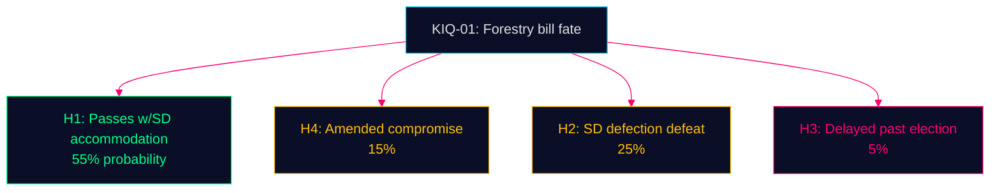

# Intelligence Assessment — Opposition Motions — 2026-05-11

**Family**: C | **Confidence**: HIGH | **Format**: ACH (Analysis of Competing Hypotheses)

## Key Intelligence Question

**KIQ-01**: Will the government's forestry proposition (2025/26:242) pass the MJU committee before the September 2026 election?

### Hypothesis Matrix

| Hypothesis | H1: Passes (SD stays) | H2: Defeated (SD defects) | H3: Delayed | H4: Amended compromise |
|-----------|----------------------|--------------------------|-------------|----------------------|
| SD files explicit conditions (HD024143) | Inconsistent | Consistent | Consistent | Consistent |
| Government has MJU majority w/SD | Consistent | n/a | Inconsistent | Consistent |
| V+MP outright reject | Consistent (irrelevant) | Consistent | Consistent | Consistent |
| S demands study not rejection | Consistent | Consistent | Consistent | Consistent |
| C wants more, not less | Consistent | Consistent | Consistent | Consistent |
| Government history of accommodating SD | Consistent | Inconsistent | Inconsistent | Consistent |
| Time pressure (election Sept 2026) | Consistent | Inconsistent | Consistent | Inconsistent |

**ACH Verdict**: H1 (passes with SD accommodated) or H4 (amended compromise) are most consistent with evidence. H2 (SD defection) remains possible at 25% but requires SD to follow through on explicit conditioning. H3 (delayed) possible if government miscalculates.

## Key Intelligence Question

**KIQ-02**: Will the criminal age provision (13 years) in Prop. 2025/26:246 pass?

### Key Indicators

- **PIR-01**: SD vote on JuU committee — follow SD's public statements on youth criminal age specifically (distinct from their general law & order position)
- **PIR-02**: C committee behaviour — will C vote against government in committee or only at chamber stage?
- **PIR-03**: Government response to scientific criticism — does government acknowledge UNCRC concerns or ignore them?

**Assessment**: JuU passage of age-13 provision most likely (H: 60%) given government committee majority and SD alignment. Cross-bloc opposition (V+C+MP) provides political ammunition for post-election reversal.

## Strategic Intelligence Assessment

The 8 motions reveal a pre-election alignment pattern:

1. **C is repositioning**: Two motions that break with the coalition on both economic and social dimensions signal Centern's preparation for coalition optionality. This is the most significant strategic signal in this batch.

2. **V and MP are coordinating**: HD024141/147 (forestry) and HD024142/148 (youth crime) show both parties filing on same propositions with complementary arguments — this suggests left-green coordination.

3. **S is hedging**: One motion demanding procedural quality on forestry; no motion on youth crime. S is not committing to a strong opposition identity on either file.

4. **SD is extracting**: Forestry motion is a negotiating tool, not an opposition statement. SD expects and likely will receive a concession.

## Mermaid: ACH Evidence Weight

**Evidence Anchors**:

| Claim | Evidence | Retrieved | Confidence |
|-------|----------|-----------|------------|
| SD conditions assessed as negotiating tool | HD024143 structure + government accommodation history | 2026-05-11 | HIGH |
| C strategic repositioning signal | HD024145 + HD024146 dual departure | 2026-05-11 | HIGH |
| V-MP coordination hypothesis | HD024141/147 complementary arguments | 2026-05-11 | MEDIUM |
