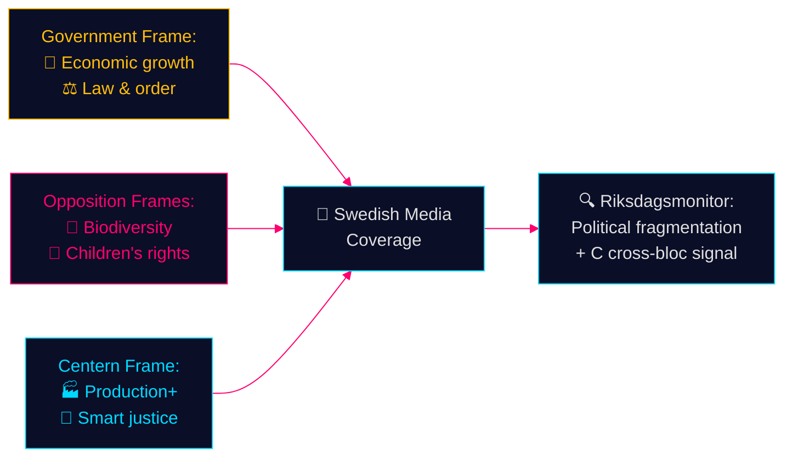

# Media Framing Analysis — Opposition Motions — 2026-05-11

**Family**: D | **Confidence**: MEDIUM-HIGH

## Competing Media Frames

### Forestry (Prop. 2025/26:242)

| Frame | Likely Source | Core Message | Target Audience |
|-------|--------------|-------------|----------------|
| Economic competitiveness | Government, LRF, Skogen media | "Deregulation will create jobs, boost exports, strengthen rural Sweden" | Rural workers, industry, business media |
| Environmental catastrophe | V, MP, environmental NGOs | "Destroying biodiversity for short-term profit; EU infringement risk" | Environmental media, urban progressives |
| Procedural quality | S | "Needs more study before adoption; responsible governance" | S voters, proceduralists |
| Production opportunity | C | "Good start but needs a full package; government not ambitious enough" | Forestry sector, rural moderates |
| Sovereignty/freedom | SD | "Swedish landowners should control their land; biodiversity through freedom" | SD rural base, nationalist media |

**Predicted dominant media frame**: Economic competitiveness frame will dominate general Swedish media (Dagens Nyheter, Aftonbladet, SvD). Environmental frame will dominate niche environmental media (Natursidan, Miljöaktuellt). Riksdagsmonitor should prioritise the **political fragmentation frame** — 5-party opposition is underreported by media focused on pro/con binary.

### Youth Crime (Prop. 2025/26:246)

| Frame | Likely Source | Core Message | Target Audience |
|-------|--------------|-------------|----------------|
| Law & order | Government, SD, M | "Tougher rules for young criminals; protect public safety" | Crime-concerned suburban voters |
| Children's rights | V, MP, Barnombudsmannen | "Criminalising 13-year-olds violates UNCRC; evidence shows harm" | Progressive, educated urban |
| Smart governance | C | "We want effective solutions, not politically driven age numbers" | Moderate, suburban middle-class |
| Research-based | V, C, MP, Brå | "The evidence does not support age lowering; Denmark tried it, reversed it" | Expert community, quality press |

**Predicted dominant media frame**: Law & order frame will dominate tabloid coverage (Expressen, Aftonbladet crime section). Research-based frame will dominate quality press (DN, SvD). Riksdagsmonitor should prioritise **C's cross-bloc significance** — a centrist breaking with a coalition government on criminal justice is counter-intuitive and underreported.

## Framing Risk for Opposition

1. **Soundbite vulnerability** (Skogsbruk): "Opposition wants to keep forests locked up, killing rural jobs" — government will deploy this. V and MP are vulnerable; S and C are better protected.

2. **Soft-on-crime label** (Unga lagöverträdare): "Left-wing parties want 13-year-old criminals to walk free" — V and MP are vulnerable; C's "smart-on-crime" framing is specifically designed to inoculate against this.

## SEO/Framing Recommendations for Riksdagsmonitor

- **Headline approach**: Lead with the cross-bloc youth crime opposition (most counter-intuitive); secondary forestry fragmentation
- **Key phrases**: "Centern bryter med regeringen", "åldersgräns 13 år", "skogsbruk EU-krav", "avvikande röster"
- **Meta description**: "Åtta oppositionsmotioner mot regeringens skogsbrukslag och ungdomsbrottsregler — Centern bryter med koalitionen på två fronter inför valet 2026"

**Evidence Anchors**:

| Claim | Evidence | Retrieved | Confidence |
|-------|----------|-----------|------------|
| C "smart on crime" self-framing | HD024146 explicit phrase | 2026-05-11 | HIGH |
| EU Nature Restoration Law = opposition anchor | HD024141, HD024147 | 2026-05-11 | HIGH |
| C forestry production frame | HD024145 motivering: konkurrenskraft | 2026-05-11 | HIGH |
