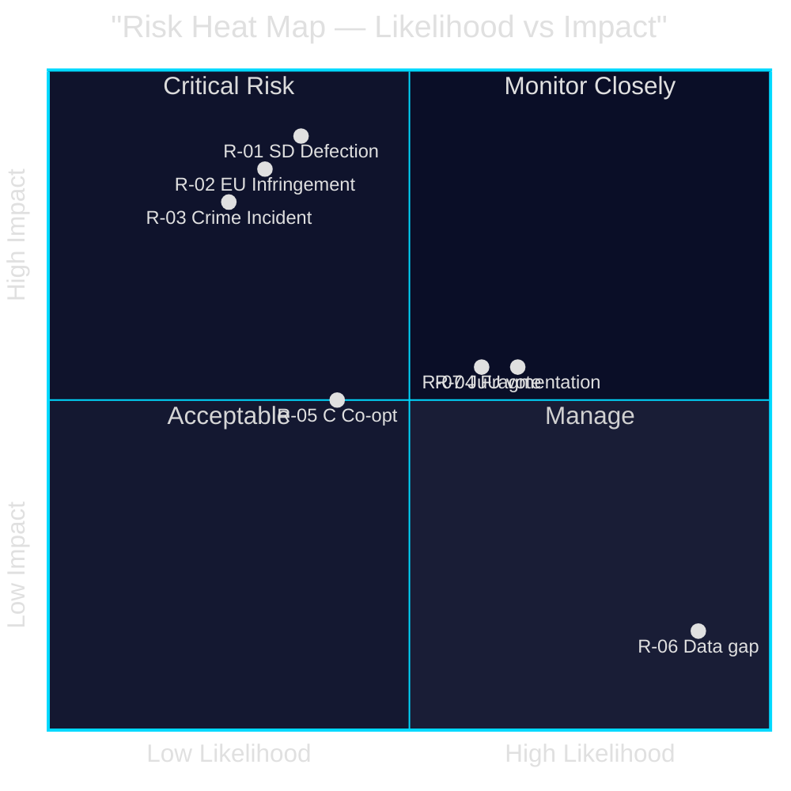

# Risk Assessment — Opposition Motions — 2026-05-11

**Family**: A | **Confidence**: HIGH | **Election Proximity**: T-125 days

## Risk Register

| Risk ID | Risk Description | Likelihood | Impact | Risk Score | Owner | Mitigation |
|---------|-----------------|-----------|--------|------------|-------|-----------|
| R-01 | SD withdraws forestry support → MJU defeat | MEDIUM (35%) | HIGH | 7 | MJU committee | SD land-exemption concession |
| R-02 | EU infringement proceeding on forestry deregulation | MEDIUM (30%) | HIGH | 6 | Miljödepartementet | Legal review, Habitats compliance audit |
| R-03 | Youth crime incident before election → C cracks | LOW-MEDIUM (25%) | HIGH | 5 | JuU committee | C commitment to evidence-based reform |
| R-04 | Opposition fragmentation undermines counter-narrative | HIGH (65%) | MEDIUM | 6.5 | Opposition party leaders | Coordination, joint statement on EU compliance |
| R-05 | Government co-opts C via minor forestry concession | MEDIUM (40%) | MEDIUM | 5 | C party leadership | C insistence on full production package |
| R-06 | New riksmöte voteringar gap limits accountability coverage | HIGH (confirmed) | LOW | 2 | Riksdagen open data | Proxy analysis from 2022/23 cycle |
| R-07 | Criminal age bill passes on party-line JuU vote | HIGH (60%) | MEDIUM | 6 | JuU committee | SD loyalty depends on forestry deal |

## Priority Risks

### R-01: SD Forestry Defection (Highest Consequence)
SD (Martin Kinnunen, HD024143) explicitly conditions forestry support on a land-exemption clause. The forestry bill is a government flagship. If MJU committee hearings do not accommodate SD's specific demand, the bill could fail or be amended beyond government intent.

**Probability pathway**: SD files this motion signalling to government. Government either concedes (probability 55%) or holds firm (probability 45%). If government holds firm, SD defects in committee vote (probability 75% given explicit conditioning).

### R-04: Opposition Fragmentation
Five parties oppose the forestry bill but want five different things. This fragmentation is actually a risk for government (no majority can agree on an alternative) but also a risk for opposition coherence: no unified alternative means no counter-narrative in the election campaign.

## Mermaid: Risk Heat Map

**Evidence Anchors**:

| Claim | Evidence | Retrieved | Confidence |
|-------|----------|-----------|------------|
| SD conditions support explicitly | HD024143 förslag 1: "undantag för viss mark" | 2026-05-11 | HIGH |
| EU legal risk on forestry | HD024141, HD024147: Nature Restoration Law, Habitats Dir. | 2026-05-11 | HIGH |
| C dual departure from coalition | HD024145, HD024146 | 2026-05-11 | HIGH |
