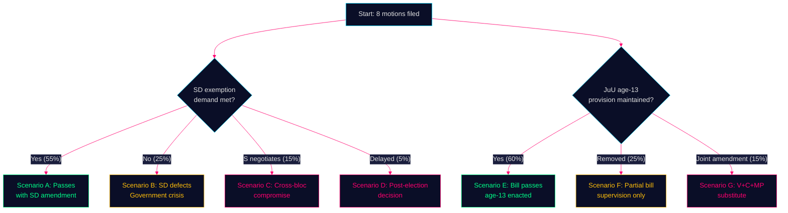

# Scenario Analysis — Opposition Motions — 2026-05-11

**Family**: C | **Confidence**: HIGH | **Horizon**: T+125 days (election) + T+365 days (post-election)

## Scenario Tree

### Prop. 2025/26:242 (Skogsbruk)

**Branch point**: Does government accommodate SD's land-exemption demand?

**Scenario A: Government accommodates SD** (probability: 55%)
- SD withdraws opposition motion, supports amended bill in MJU
- V/S/C/MP outvoted; bill passes with modifications
- Government claims coalition cohesion victory
- Environmental groups escalate to EU Nature Restoration Law enforcement
- Post-election: If centre-left coalition forms, bill likely amended or repealed
- *WEP confidence*: MODERATE — SD's explicit demand creates genuine leverage

**Scenario B: Government holds firm, SD defects** (probability: 25%)
- SD joins V/MP in defeating bill in MJU committee
- Major government crisis: flagship legislation defeated by own coalition partner
- Election year narrative: "government incompetent" vs. "SD stands on principle"
- Government likely withdraws and reintroduces in next parliament
- *WEP confidence*: LOW-MEDIUM — requires SD to actually follow through

**Scenario C: S negotiates compromise** (probability: 15%)
- S joins government in exchange for comprehensive impact analysis commitment
- V and MP outvoted; bill passes with procedural concession
- SD satisfied; C satisfied with minor production amendment
- Government claims cross-bloc success
- *WEP confidence*: LOW — S breaking with left opposition unlikely pre-election

**Scenario D: Bill delayed past election** (probability: 5%)
- MJU committee hearings run long; no vote before September 2026
- Becomes post-election negotiating item
- Centre-right re-elected: original bill passes; Centre-left: bill withdrawn

### Prop. 2025/26:246 (Unga lagöverträdare)

**Branch point**: Does JuU committee hold firm on age-13?

**Scenario E: Age-13 provision survives committee** (probability: 60%)
- Government coalition maintains JuU majority; V/C/MP outvoted
- Bill passes; controversial age reduction enacted
- Post-election: Centre-left majority would repeal age-13 provision first session
- *WEP confidence*: MODERATE-HIGH — committee majority likely holds

**Scenario F: Age-13 removed in committee** (probability: 25%)
- JuU committee chairs negotiate partial revision: removes age-13, keeps supervision tightening
- C votes with government on supervision changes; opposition fragmented on partial bill
- Both sides can claim a win; real C flexibility tested
- *WEP confidence*: LOW-MEDIUM

**Scenario G: Opposition joint amendment** (probability: 15%)
- V+C+MP file a joint substitute that accepts supervision but deletes age-13
- Requires unusual cross-bloc legislative drafting
- If S also joins, creates surprise majority
- *WEP confidence*: LOW

## Scenario Mermaid

**Evidence Anchors**:

| Claim | Evidence | Retrieved | Confidence |
|-------|----------|-----------|------------|
| SD explicit exemption condition | HD024143 förslag 1 | 2026-05-11 | HIGH |
| C cross-bloc on age-13 | HD024146 | 2026-05-11 | HIGH |
| Government coalition MJU majority | Riksdagen mandatfördelning 2022 | 2026-05-11 | HIGH |
