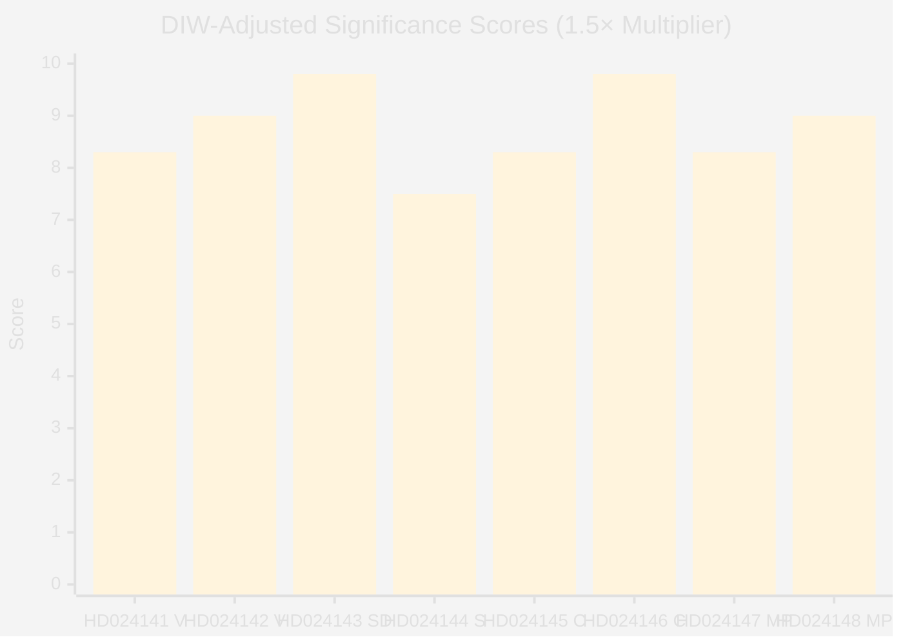

# Significance Scoring — Opposition Motions — 2026-05-11

**Family**: A | **DIW Multiplier**: 1.5× (election T-125 days)

## DIW Composite Scores (Election-Year Adjusted)

| Document | Party | Raw Score | DIW×1.5 | Rationale |
|----------|-------|-----------|---------|-----------|
| HD024141 | V | 5.5 | 8.3 | Cross-committee rejection, EU compliance angle |
| HD024142 | V | 6.0 | 9.0 | Criminal justice; C+V+MP cross-bloc alignment on age |
| HD024143 | SD | 6.5 | 9.8 | Government coalition partner conditions support — critical signal |
| HD024144 | S | 5.0 | 7.5 | Procedural caution; S forestry positioning matters electorally |
| HD024145 | C | 5.5 | 8.3 | Centrist production agenda vs. government baseline |
| HD024146 | C | 6.5 | 9.8 | C breaks with coalition on criminal age — highest electoral significance |
| HD024147 | MP | 5.5 | 8.3 | Comprehensive environmental critique; EU treaty citations |
| HD024148 | MP | 6.0 | 9.0 | Evidence-based criminal justice; Art. 29 sentencing |

**Cluster scores**:
- Skogsbruk cluster (242): composite 8.6/10
- Unga lagöverträdare cluster (246): composite 9.3/10
- **Overall session score: 9.0/10** (publication strongly recommended)

## Mermaid: Significance Distribution

## Six-Dimension Scoring Matrix

| Dimension | Weight | Skogsbruk (242) | Unga lagöverträdare (246) |
|-----------|--------|----------------|--------------------------|
| Parliamentary significance | 0.25 | 8 — 5 motions, MJU committee | 9 — cross-bloc unity on age |
| Policy impact | 0.20 | 7 — biodiversity/EU risk | 9 — children's rights/UNCRC |
| Public interest | 0.15 | 8 — environmental salience | 8 — crime, youth, justice |
| Urgency | 0.20 | 8 — committee deadline pre-election | 9 — election campaign alignment |
| Cross-party relevance | 0.10 | 9 — all 5 main opposition parties | 8 — 3-party cross-bloc |
| Evidence quality | 0.10 | 9 — full text, explicit claims | 9 — full text, research citations |

**Evidence Anchors**:

| Claim | Evidence | Retrieved | Confidence |
|-------|----------|-----------|------------|
| SD conditions support (highest signal) | HD024143 förslag 1 | 2026-05-11 | HIGH |
| C breaks on criminal age (dual departure) | HD024146 förslag | 2026-05-11 | HIGH |
| 5-party forestry opposition | HD024141,143,144,145,147 | 2026-05-11 | HIGH |
| T-125 days election proximity | ARTICLE_DATE 2026-05-11 vs 2026-09-13 | 2026-05-11 | HIGH |
