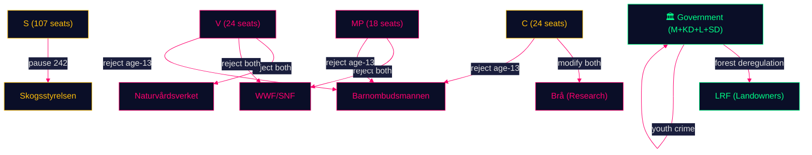

# Stakeholder Perspectives — Opposition Motions — 2026-05-11

**Family**: A | **Confidence**: HIGH

## Primary Stakeholders

### Legislative Actors

| Stakeholder | Interest | Position | Power | Evidence |
|------------|---------|---------|-------|---------|
| V (Fredholm, Nordborg) | Biodiversity, children's rights | Reject both propositions (with partial caveat on 246) | MEDIUM — 24 seats | HD024141, HD024142 |
| S (Westlund) | Procedural quality, electoral position | Pause forestry for impact study | HIGH — 107 seats | HD024144 |
| SD (Kinnunen) | Conditional forestry support, land rights | Modify forestry, support youth bill | HIGH — 73 seats (coalition) | HD024143 |
| C (Lindahl, Liljeberg) | Production economy, smart justice | Modify forestry, reject age-13 | MEDIUM — 24 seats | HD024145, HD024146 |
| MP (Le Moine, Westerlund) | Environment, children's rights | Reject both propositions | LOW — 18 seats | HD024147, HD024148 |
| M/KD/L (government) | Economic competitiveness, law & order | Pass both propositions | HIGH — majority coalition | Propositions 2025/26:242, 246 |

### Civil Society and Expert Stakeholders

| Stakeholder | Interest | Likely Position | Relevance |
|------------|---------|----------------|-----------|
| Skogsstyrelsen | Forest policy implementation | Neutral-technical; may flag implementation risks | Regulatory body, named in forestry motions |
| Naturvårdsverket | Biodiversity, environmental law | Would likely validate opposition EU compliance concerns | Key expert agency |
| WWF Sverige / SNF | Biodiversity | Strongly aligned with V/MP rejection position | Civil society voice |
| LRF (Lantbrukarnas Riksförbund) | Landowner interests | Aligned with government deregulation | Pro-proposition, forestry sector |
| Brå (Brottsförebyggande rådet) | Crime statistics, research | Would likely validate C/MP evidence-based critique of age-13 | Key criminology reference |
| Barnombudsmannen | Children's rights/UNCRC | Would oppose age-13 criminal liability | UNCRC obligations |
| UNICEF Sverige | Children's rights | Oppose lowering criminal age | International framework |

## Stakeholder Coalition Map

## Stakeholder Interest Analysis: Key Tensions

### Forestry: Economic vs. Ecological
- **Government + LRF + SD**: Frame forestry as economic necessity (jobs, export revenue, energy security from biofuels)
- **V + MP + Naturvårdsverket + WWF**: Frame as ecological emergency (biodiversity collapse, EU treaties, climate carbon stocks)
- **S**: Frame as procedural adequacy (neither economic nor ecological, but "let's get this right")
- **C**: Frame as economic opportunity (needs *more* deregulation, not less)

### Youth Crime: Punitive vs. Rehabilitative
- **Government**: Frame as public safety necessity (youth gang crime, firearms)
- **V + C + MP + Brå + Barnombudsmannen + UNCRC**: Frame as violation of children's rights and evidence about what works

**Evidence Anchors**:

| Claim | Evidence | Retrieved | Confidence |
|-------|----------|-----------|------------|
| V+C+MP aligned on age-13 rejection | HD024142, HD024146, HD024148 | 2026-05-11 | HIGH |
| SD conditions forestry support | HD024143 | 2026-05-11 | HIGH |
| UNCRC cited by C opposition | HD024146 barnrättscitation | 2026-05-11 | HIGH |
| EU Nature Restoration Law cited | HD024147 EU-rätt | 2026-05-11 | HIGH |
