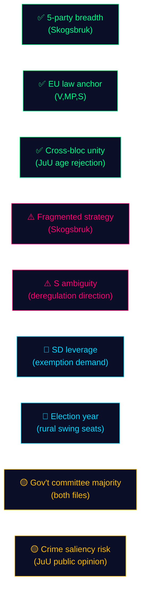

# SWOT Analysis — Opposition Motions — 2026-05-11

**Family**: A | **Subject**: Government propositions 2025/26:242 and 2025/26:246 from opposition perspective

## Skogsbruk SWOT (Prop. 2025/26:242)

### Strengths (Opposition arguments)
- **Breadth of opposition**: 5 parties oppose or condition support — demonstrates cross-ideological concern
- **EU compliance anchor**: References to Nature Restoration Law and Habitats Directive provide legal grounding (V: HD024141; MP: HD024147; S: HD024144)
- **Evidence of environmental risk**: Shortened notification periods remove de facto environmental screening; supported by empirical claim that most interventions requiring notification also require environmental assessment

### Weaknesses (Opposition challenges)
- **Fragmented strategy**: V wants rejection; S wants pause; C wants more; SD wants modification — impossible to present a unified alternative
- **S ambiguity**: Social Democrats do not explicitly oppose direction of deregulation, weakening left coalition
- **No voteringar baseline**: Cannot use historical voting record to demonstrate prior majority positions in this riksmöte (new riksmöte gap)

### Opportunities
- **SD leverage**: SD's conditional support (land exemptions) creates opening for cross-bloc negotiation that could force government to accept weakening amendments
- **EU infringement risk**: If government ignores EU Nature Restoration Law compliance questions, opposition can escalate to Brussels dimension
- **Election environment**: September 2026 election means every forestry vote in MJU becomes a campaign event; rural areas with strong forestry economy are swing constituencies

### Threats
- **Government majority**: M+KD+L+SD hold MJU majority if SD does not defect; opposition motions likely to lose on party-line vote
- **C fragmentation**: Centern's demand for a production package may be co-opted by government through minor concession, neutralising C opposition
- **Information asymmetry**: Government has access to full consequence analysis; opposition is responding to summaries in the proposition

## Unga lagöverträdare SWOT (Prop. 2025/26:246)

### Strengths (Opposition arguments)
- **Cross-bloc unity on core issue**: V+C+MP all reject age-13 criminal liability — unusual left-centre-green agreement
- **Research consensus**: International criminology and UNCRC both oppose lowering criminal ages; opposition has scientific establishment on its side
- **C credibility**: Centern's opposition signals this is not a partisan left-wing stance — it is a principled centrist rejection

### Weaknesses (Opposition challenges)
- **Partial V acceptance**: V accepts tighter youth supervision rules, creating a split in the "total rejection" bloc
- **Public opinion**: Swedish public consistently reports concerns about youth crime; government's framing of "stricter rules" may poll well even if expert opinion rejects age lowering
- **JuU committee composition**: Government coalition likely holds committee majority; opposition needs SD defection to block

### Opportunities
- **International comparison**: C (HD024146) and MP (HD024148) both call for return with research-based alternatives — positions opposition as constructive reformers
- **Post-election relevance**: If C-S-MP coalition forms post-September 2026, these motions become the baseline for a reversed criminal justice bill

### Threats
- **Crime saliency**: Any high-profile youth crime incident before September 2026 will increase public pressure on opposition parties to accept age lowering
- **SD wedge**: SD supports the age reduction; if government grants SD the forestry exemptions, SD loyalty on JuU is secured

## Mermaid: Opposition Strength Map

**Evidence Anchors**:

| Claim | Evidence | Retrieved | Confidence |
|-------|----------|-----------|------------|
| V cites EU Habitats Directive | HD024141 motivering, EU-hänvisning | 2026-05-11 | HIGH |
| C invokes UNCRC on age-13 | HD024146 förslag, barnrättsargument | 2026-05-11 | HIGH |
| SD conditional support (land exemptions) | HD024143 förslag 1 | 2026-05-11 | HIGH |
