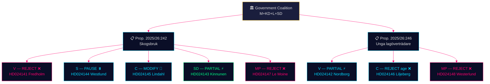

# Synthesis Summary — Opposition Motions — 2026-05-11

**Family**: A | **Confidence**: HIGH | **IMF Vintage**: WEO-2026-04

## Core Synthesis

Two distinct but thematically linked proposition clusters reveal the structural tensions defining Sweden's pre-election policy environment. The government coalition — led by Moderaterna with KD, L, and SD support — advances an agenda of economic liberalisation (forestry deregulation) and punitive reform (lowering criminal liability). The opposition response is not monolithic: it is fractured along ideological lines that illuminate each party's electoral strategy for September 2026.

### Cluster 1: Prop. 2025/26:242 — Skogsbruk (Forestry)

The government's forestry bill removes the procedural linkage between forest clearance notifications and environmental review. It reduces landowner administrative burdens and is framed as a competitiveness measure for Sweden's 90 000-worker forestry sector (IMF: 1.0% of GDP).

**Opposition fracture map**:
- **V** (HD024141): Total rejection except appeals provision. Frames as biodiversity threat and EU compliance risk. Strong Habitats Directive citation.
- **S** (HD024144): Procedural caution. Does not reject the deregulation direction but demands a comprehensive consequence analysis before adoption. Highlights shortened notification periods as procedural risk.
- **C** (HD024145): Accepts direction but demands broader production-boosting package. Positions Centre as pro-forestry economy, not anti-production. Seeks regulatory relief beyond what the proposition offers.
- **SD** (HD024143): Supportive with a modification: seeks exemption for specific land categories from afforestation requirements. Frames as protecting biological diversity through land-use freedom.
- **MP** (HD024147): Total rejection. Most comprehensive environmental critique. Cites ecosystem services, climate targets, and EU Nature Restoration Law.

**Key finding**: The government's coalition partner SD conditions support on a land-exemption concession. If this demand is not met in committee, government risks a narrow MJU defeat.

### Cluster 2: Prop. 2025/26:246 — Unga lagöverträdare (Young Offenders)

The government proposes lowering the minimum age of criminal responsibility to 13 years (from 15) and tightening enforcement of youth supervision orders.

**Cross-bloc rejection of age lowering**:
- **V** (HD024142): Partially accepts tighter supervision rules but rejects age reduction. Frames as UNCRC violation, citing research showing custody harms adolescent development.
- **C** (HD024146): Rejects age reduction and Art. 29 sentencing changes. Invokes the Swedish "smart-on-crime" tradition and calls the age reduction politically driven rather than evidence-based.
- **MP** (HD024148): Rejects age reduction and Art. 29 changes. Calls for evidence-based alternatives and return for further review.

**Key finding**: C's break with the government on criminal justice is the most significant signal — Centern is explicitly choosing moderate-voter appeal over coalition solidarity, positioning for a potential post-election role with S or as a genuine swing voter force.

## Mermaid: Opposition Position Map

## Integrated Assessment

Both policy files are election-year positioning exercises. The parties are not primarily trying to pass legislation; they are staking out ground for September 2026. Forestry sharpens the environment/economy cleavage. Youth crime sharpens the evidence-based/punitive cleavage. The most intelligence-significant signal is C's double break with the government coalition (forestry: wants more, not less; youth crime: rejects punitive age measure) — this suggests Centern is actively rebuilding its centrist profile ahead of a potential coalition switch.

**Evidence Anchors**:

| Claim | Evidence | Retrieved | Confidence |
|-------|----------|-----------|------------|
| SD conditions forestry support | HD024143 förslag 1 | 2026-05-11 | HIGH |
| C breaks on age-13 liability | HD024146 förslag | 2026-05-11 | HIGH |
| EU Nature Restoration Law cited | HD024147, MP motion | 2026-05-11 | HIGH |
| S demands consequence analysis | HD024144 förslag | 2026-05-11 | HIGH |
