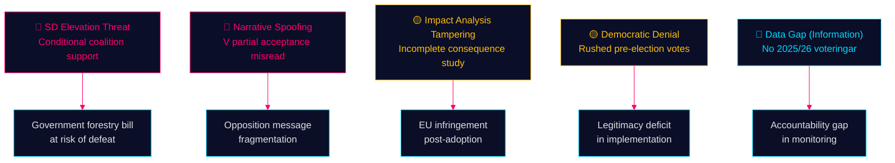

# Threat Analysis — Opposition Motions — 2026-05-11

**Family**: A | **Framework**: STRIDE adapted for democratic accountability

## STRIDE Political Threat Analysis

### S — Spoofing (Narrative misrepresentation)
Opposition parties risk having their nuanced positions reduced to soundbites. V's partial acceptance of youth supervision improvements (HD024142) risks being framed as "V supports stricter youth rules" — misrepresenting their categorical rejection of the age threshold. Government communications teams will exploit opposition fragmentation.

**Threat actor**: Government press office, pro-government media  
**Mitigation**: Opposition parties must communicate the specific asks (e.g., "we accept supervision but not age-13") clearly.

### T — Tampering (Evidence manipulation)
The government's impact analysis underpinning Prop. 2025/26:242 may omit biodiversity assessments. S (HD024144) explicitly demands a consequence analysis, implying the current one is incomplete. This constitutes a tampering risk in legislative quality.

**Threat actor**: Ministry of Enterprise (Näringsdepartementet), government preparatory commission  
**Mitigation**: Environmental agencies (Naturvårdsverket, Skogsstyrelsen) could provide counter-analyses via remissvar.

### R — Repudiation (Accountability evasion)
Coalition partner SD supports the forestry bill publicly while filing a motion demanding concessions. This dual-track strategy allows SD to claim support if the bill passes and distance if it fails — classic repudiation risk.

**Threat actor**: SD (Martin Kinnunen, HD024143)  
**Mitigation**: Riksdagsmonitor must flag this conditional dual-track behaviour explicitly.

### I — Information disclosure (Data gaps)
No voteringar data for current riksmöte (2025/26). This is a structural information gap: we cannot compare current committee voting patterns to prior sessions for MJU or JuU.

**Threat actor**: Data availability — new riksmöte gap  
**Mitigation**: Document gap; use 2022/23 MJU proxy analysis.

### D — Denial (Democratic bypass)
If committee processes are truncated before the election (September 2026), both propositions may be rushed to chamber vote without adequate hearing of opposition testimony. Government could invoke urgency to bypass normal deliberation.

**Threat actor**: Government (Statsminister, committee chairs)  
**Mitigation**: Monitor committee scheduling announcements from June 2026.

### E — Elevation (Coalition defection leverage)
SD's conditional forestry support gives it leverage to extract policy concessions beyond what the proposition offers. This is an "elevation" of SD's de facto veto power within the coalition — structurally destabilising to government discipline.

**Threat actor**: SD (strategic interest in extracting concessions before election)  
**Mitigation**: Government must decide: full concession, partial accommodation, or call SD's bluff.

## Key Threat Vectors

**Evidence Anchors**:

| Claim | Evidence | Retrieved | Confidence |
|-------|----------|-----------|------------|
| SD dual-track (support + conditions) | HD024143 | 2026-05-11 | HIGH |
| V partial acceptance risk | HD024142 partial rejection structure | 2026-05-11 | HIGH |
| S demands impact analysis (tampering signal) | HD024144 förslag | 2026-05-11 | HIGH |
| No voteringar 2025/26 | riksdag-regering-mcp search null result | 2026-05-11 | HIGH |
