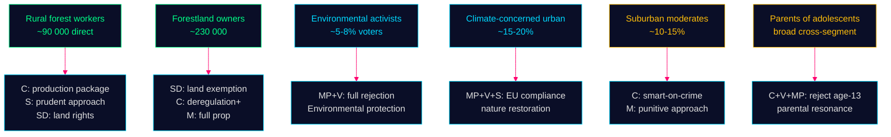

# Voter Segmentation — Opposition Motions — 2026-05-11

**Family**: D | **Confidence**: HIGH

## Target Voter Segments by Motion

### Forestry Motions (Prop. 2025/26:242)

| Segment | Size (est.) | Priority Party | Motion Appeal |
|---------|------------|---------------|--------------|
| Rural forest workers | ~90 000 direct, 400 000 dependent | C, S, SD | Economic security: C offers production; S offers prudence; SD offers land rights |
| Environmental activists | ~5-8% active voters | MP, V | Biodiversity protection — MP/V total rejection |
| Forestland owners (private) | ~230 000 households | C, SD, M | Deregulation appeal; SD exemption demand speaks directly |
| Rural municipalities | Elected officials + residents | C, S | Economic vitality of timber communities |
| Climate-concerned urban | ~15-20% voters | MP, V, S | Environment vs. production tension |

### Youth Crime Motions (Prop. 2025/26:246)

| Segment | Size (est.) | Priority Party | Motion Appeal |
|---------|------------|---------------|--------------|
| Suburban moderates (crime concern) | ~10-15% | C, M, L | C "smart on crime" differentiation from punitive M |
| Working-class urban (safety concern) | ~15-20% | SD, S | SD punitive; S procedural |
| Parents of adolescents | Broad cross-segment | C, V | Age-13 raises parental concern about criminalising teens |
| Youth justice professionals | Opinion leaders | V, C, MP | Evidence-based consensus; opposition reinforces expert community |
| Rights-oriented urban progressive | ~8-12% | V, MP | Civil liberties, UNCRC, anti-criminalisation |

## Cross-Segment Electoral Dynamics

The most significant segmentation finding is the **suburban moderate voter**:
- This voter wants crime action but does not want extreme measures
- C's "smart on crime" framing (HD024146) speaks directly to this segment
- If C successfully differentiates from M on criminal justice while maintaining economic credibility on forestry (HD024145), C can consolidate moderate voter support
- This is a classic centre-party squeeze play between punitive right (M/SD) and rights-focused left (V/MP)

## Mermaid: Voter Segment Map

**Evidence Anchors**:

| Claim | Evidence | Retrieved | Confidence |
|-------|----------|-----------|------------|
| 90 000 forestry direct jobs | SCB Skogsdata 2024 | 2026-05-11 | MEDIUM |
| C smart-on-crime moderate targeting | HD024146 explicit "smart on crime" framing | 2026-05-11 | HIGH |
| SD land-exemption = rural landowner targeting | HD024143 förslag specifics | 2026-05-11 | HIGH |
