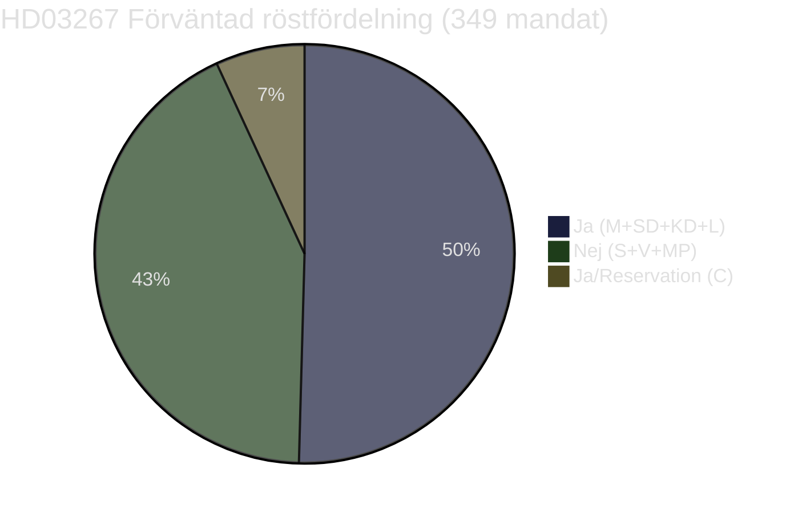
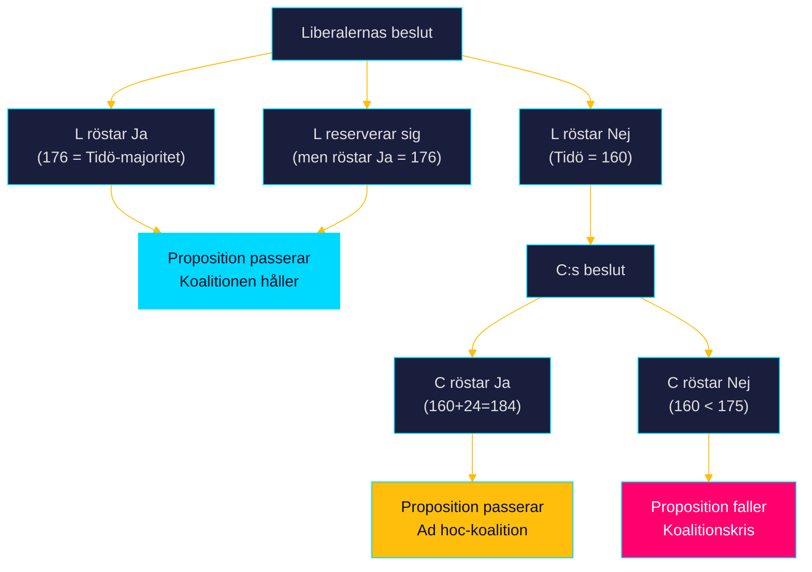

# Coalition Mathematics — Propositionspaket 7 maj 2026

**Author:** James Pether Sörling | **Run ID:** 25654727630 | **Date:** 2026-05-11
**Classification:** Public | **Admiralty:** [B2]

---

## Riksdagsaritmetik 2025/26

| Parti | Mandat (349 total) | Koalition |
|-------|-------------------|-----------|
| M (Moderaterna) | 68 | Tidöregeringen |
| SD (Sverigedemokraterna) | 73 | Tidöregeringen |
| KD (Kristdemokraterna) | 19 | Tidöregeringen |
| L (Liberalerna) | 16 | Tidöregeringen |
| **Tidö totalt** | **176** | **Majoritet: Ja (>175)** |
| S (Socialdemokraterna) | 107 | Opposition |
| V (Vänsterpartiet) | 24 | Opposition |
| MP (Miljöpartiet) | 18 | Opposition |
| C (Centerpartiet) | 24 | Neutral/Opposition |
| **Opposition totalt** | **173** | |

*Obs: Mandattal baserat på känd riksdagssammansättning; ej verifierat mot officiell källa i denna körning.*

---

## Röstanalys per Proposition

### HD03267 — Kritisk koalitionsröst

**Koalitionsmatten:**
- **Full Tidö-koalition:** 176 Ja = exakt enkel majoritet (175 krävs)
- **Om L reserverar sig/röstar Nej:** M+SD+KD = 160 = UNDER majoritet
- **Räddningslina om L defects:** C (24) + Tidö utan L (160) = 184 = Majoritet med C:s stöd
- **Worst case:** Inget C-stöd + L Nej = 160 < 175 = PROPOSITION FALLER

**Kritisk insikt:** L:s 16 mandat är matematiskt avgörande. Utan L måste C stödja propositionen för att den ska passera. C:s position om HD03267 är okänd men troligen mer tveksam (liberalt-konservativ med civila rättighetsdimension).

---

### HD03250 och HD03261 — Bekväm majoritet

| Proposition | Förväntad Ja-koalition | Mandat | Marginal |
|-------------|----------------------|--------|----------|
| HD03250 | M+SD+KD+L+C+S | ~280 | +105 |
| HD03261 | M+SD+KD+L+C+S | ~265 | +90 |

Dessa propositioner passerar med stor marginal.

---

## Koalitionsriskscenario: "Liberalernas dilemma"

---

## Historiska Koalitionsmönster

**Tidöavtalet (2022–):** M+SD+KD+L har röstat tillsammans på alla Tidö-specifika propositioner. HD03267 är den proposition med störst L-internt tryck sedan Tidöavtalet.

**Analogt: Lagen (2022:700):** Samma lag som HD03267 ändrar passerades 2022 med M+SD+KD+L. L stödde 2022-versionen — men HD03267 är mer restriktiv och skapar ny koalitionsbelastning.

**PIR-1 status:** BESVARAD — Koalitionsrisken är låg men ej noll; L:s 16 mandat är kritiska; utan C-stöd som backup är L:s stöd avgörande.

| Claim | Evidence | Retrieved at | Confidence |
|-------|----------|--------------|------------|
| Tidö mandat 176 | Känd riksdagssammansättning | 2026-05-11 | HIGH |
| L = kritisk vågmästare | Matematik 176 - 16 = 160 < 175 | 2026-05-11 | HIGH |
| C som potential räddningslina | Mandattal 24 | 2026-05-11 | HIGH |

