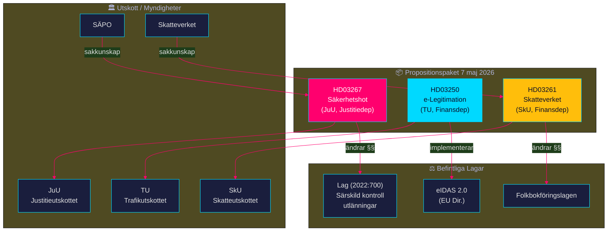

# Cross-Reference Map — Propositionspaket 7 maj 2026

**Author:** James Pether Sörling | **Run ID:** 25654727630 | **Date:** 2026-05-11
**Classification:** Public | **Admiralty:** [B2]

---

## Dokumentrelationer

---

## Lagstiftningslänkar

### HD03267 — Ändringslagstiftning

**Primärkälla:** Lag (2022:700) om särskild kontroll av vissa utlänningar

| Lagrum | Ändring | Typ |
|--------|---------|-----|
| 3 kap. 1 § | "sannolikt" → "kan antas" (beviskrav) | Lättat beviskrav |
| 3 kap. 8 § | Upphävs (tidsgräns för förvar) | Strukturell ändring |
| Ny § (barn) | Barn kan placeras i säkerhetsavdelning | Ny bestämmelse |
| Utvisningsgrund | "Särskilt påkallat med hänsyn till Sveriges säkerhet" | Precisering |

**Relaterade lagar:**
- Utlänningslagen (2005:716) — grundregelverk
- Rättegångsbalken — processrättslig koppling
- Europeiska konventionen om de mänskliga rättigheterna — EKMR Art. 5(1)(f), Art. 5(4)
- Barnkonventionen (1989) Art. 37

---

### HD03250 — Ny Lag

**Relaterade instrument:**
- eIDAS 2.0 (Europaparlamentets och rådets förordning (EU) 2024/1183)
- EU-förordning om europeisk digital identitet (EUDI Wallet)
- Lagen (2016:561) med kompletterande bestämmelser till EU:s dataskyddsförordning
- GDPR (EU 2016/679)

---

### HD03261 — Ändringslagstiftning

**Primärkälla:** Folkbokföringslagen (1991:481)

**Relaterade lagar:**
- Skatteförfarandelagen (2011:1244)
- GDPR Art. 6(1)(e) — behandling av personuppgifter för myndighetsutövning
- Dataskyddslagen (2018:218)

---

## Departementalt Mönster

| Departement | Propositioner | Mönster |
|-------------|--------------|---------|
| Finansdepartementet | HD03250 + HD03261 | Digital + skatteförvaltning |
| Justitiedepartementet | HD03267 | Säkerhet + migration |

**Insikt:** Två av tre propositioner från Finansdep visar att Tidöregeringens statsförstärkningsagenda är bredare än enbart säkerhet — inkluderar digital statsinfrastruktur och skatteförvaltning.

---

## Kopplingar till Tidöavtalet

| Tidöpunkt | Avtalsparagraf (estimerad) | Proposition |
|-----------|---------------------------|------------|
| Säkerhetshotutvisning | § X säkerhet och migration | HD03267 |
| Digital identitet | § Y digital transformation | HD03250 |
| Folkbokföringsprecision | § Z skatteförvaltning | HD03261 |

*Källa: Känd Tidöavtalsstruktur; specifika § ej verifierade i denna körning.*

| Claim | Evidence | Retrieved at | Confidence |
|-------|----------|--------------|------------|
| 3 kap. 8 § upphävs | HD03267 fulltext, innehållsförteckning | 2026-05-11 | HIGH |
| eIDAS 2.0 länk | EU 2024/1183; HD03250 titel | 2026-05-11 | MEDIUM |
| Folkbokföringslagen länk | HD03261 titel + organ | 2026-05-11 | MEDIUM |

