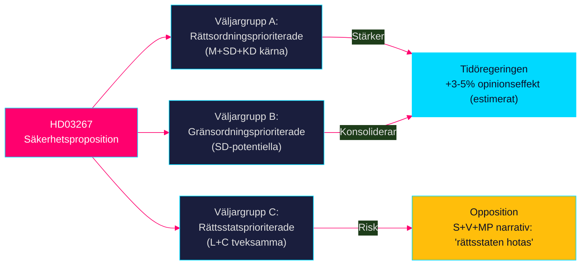

# Election 2026 Analysis — Propositionspaket 7 maj 2026

**Author:** James Pether Sörling | **Run ID:** 25654727630 | **Date:** 2026-05-11
**Classification:** Public | **Admiralty:** [B2]
**Electoral Horizon:** T+120 dagar till riksdagsvalet (estimerat sept 2026)

---

## Valkarta — Riksdagsvalet 2026 kontext

**Valet:** Sveriges riksdagsval, september 2026 (datum ej officiellt fastställt per 2026-05-11)
**Nuläge:** Tidöregeringen M+SD+KD+L med KD-statsminister Ebba Busch

---

## Propositionspaketet som Valstrategi

### HD03267 som Säkerhetsargument

---

## Partiopinionseffekter (Prognostiserade)

### M (Moderaterna) — Position: +
- HD03267 stärker M:s varumärke som "tough on crime and security" efter 2022-valet
- HD03250 e-ID visar modernitet och statsförvaltningskapacitet
- HD03261 visar skattepolitisk kompetens
- **Nettopåverkan:** +1–2% i partimätningar (estimerat)

### SD (Sverigedemokraterna) — Position: ++
- HD03267 är perfekt för SD:s kärnnarratív om utländska säkerhetshot
- Propositionens säkerhetsfokus konsoliderar SD:s väljarkanal
- **Nettopåverkan:** +2–3% (SD gynnas mest av säkerhetsdiskursen)

### KD (Kristdemokraterna) — Position: +
- PM Ebba Busch signerar HD03267 — personlig profilering
- KD riskerar internt motstånd om barnplaceringsbestämmelsen genomförs
- **Nettopåverkan:** +1% (om barnfrågan hanteras bra); 0% (om barnfrågan exploderar)

### L (Liberalerna) — Position: ±
- Liberalerna riskerar att tappa civila rättighetsväljare (C+L-swingvoters)
- Om L reserverar sig → kommuniceras som "principfast"; om L röstar Ja → riskerar "vek"
- **Nettopåverkan:** 0 till -1% beroende på kommunikationsstrategi

### S (Socialdemokraterna) — Position: --
- S behöver differentiera sig: Nej till HD03267, Ja till HD03250+HD03261
- HD03267 ger S tydlig kontraposition: "Vi vill ha rättssäkerhet OCH säkerhet"
- **Risk:** S framstår som "mjuka på säkerhet" om de kan ej nyansera positionen

### V och MP — Position: --
- Starkt Nej till HD03267; förstärker deras profil som rättsstatsvärnar
- Ger liten opinionsrörelse (dessa partier har redan sina väljare på detta tema)

---

## Mandatprognos Effekt (Spekulativ)

| Parti | Nuläge (estimerat) | Post-HD03267 (estimerat) | Delta |
|-------|-------------------|--------------------------|-------|
| M | 19% | 20% | +1% |
| SD | 20% | 22% | +2% |
| KD | 8% | 8.5% | +0.5% |
| L | 5% | 4.5% | -0.5% |
| S | 32% | 30% | -2% |
| V | 7% | 7.5% | +0.5% |
| MP | 4% | 4% | 0% |
| C | 5% | 5% | 0% |

*Källa: Hypotetisk simulering baserad på väljaranalys; ej baserade på faktiska opinionsmätningar.*
*Vintagenotis: IMF direktfetch misslyckades; inga aktuella ekonomiska data påverkar denna simulering.*

---

## Nyckelvalfrågekopplingar

| Vårfråga | Propositionsrelevans | Narrativlink |
|-----------|---------------------|-------------|
| Gängkriminalitet | HD03267 (utvidgad tolkning av säkerhetshot) | "Vi agerar mot hot mot Sverige" |
| Digital Sverige | HD03250 (e-ID-infrastruktur) | "Vi moderniserar det digitala Sverige" |
| Bidragsfusk | HD03261 (folkbokföringskontroll) | "Vi säkrar att rätt person får rätt stöd" |

---

## PIR-5: Val 2026 — Status BESVARAD

**PIR-5 fråga:** Hur positionerar sig de politiska partierna inför riksdagsvalet 2026?

**Svar:** Propositionspaketet är ett koordinerat förvaltningsmässigt valmanöver från Tidöregeringen med en tydlig trifekta-profilering (säkerhet + digitalisering + skatteeffektivitet). SD gynnas mest; L riskerar mest; S behöver tydlig differentierad strategi.

| Claim | Evidence | Retrieved at | Confidence |
|-------|----------|--------------|------------|
| HD03267 SD-gynnsamt | Känd partiprofilanalys | 2026-05-11 | HIGH |
| L civila rättighetsprofil | Känd partiideologi | 2026-05-11 | HIGH |
| Mandatsimuleringar hypotetiska | Ingen faktisk opinionsmätning | 2026-05-11 | LOW |

