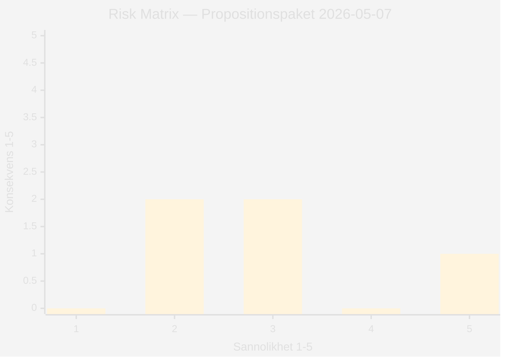

# Risk Assessment — Propositionspaket 7 maj 2026

**Author:** James Pether Sörling | **Run ID:** 25654727630 | **Date:** 2026-05-11
**Classification:** Public | **Admiralty:** [B2]

---

## Risk Registry

| Risk-ID | Risk | Sannolikhet | Konsekvens | Riskpoäng | Ägare |
|---------|------|-------------|------------|-----------|-------|
| R-01 | HD03267 fälls av Europadomstolen (EKMR Art. 5) | 3/5 | 5/5 | 15 | JuU/Justitiedep |
| R-02 | Liberalerna reserverar sig / blockerar HD03267 i JuU | 2/5 | 4/5 | 8 | L-partiledning |
| R-03 | HD03250 e-ID-implementering försenas >12 månader | 3/5 | 3/5 | 9 | TU/Finansdep |
| R-04 | GDPR-brott i HD03261 Skatteverket-expansion | 2/5 | 3/5 | 6 | Datainspektionen |
| R-05 | Oppositionens "rättsstatsdiskurs" skadar regering inför valet | 3/5 | 4/5 | 12 | Statsrådsberedningen |
| R-06 | Barnkonventionen Art. 37 — specifikt utmaning om minderåriga placeras | 2/5 | 4/5 | 8 | JuU/BO |
| R-07 | BankID-sektorn lobbyar mot HD03250 och försenar tränga igenom | 2/5 | 3/5 | 6 | TU/Finansdep |

---

## Kritiska Risker (Riskpoäng ≥ 10)

### R-01: EKMR Art. 5 Europadomstalsrisk [HIGH 15/25]
**Beskrivning:** Avskaffande av tidsgräns för förvar (3 kap. 8 § upphävs i HD03267) skapar ett frihetsberövande utan maxgräns, vilket troligen kolliderar med EKMR Art. 5(4) (omedelbar domstolsprövning av frihetsberövande) och Art. 5(1)(f) (legitim förvarsanledning).

**Analogisk evidens:** *J.N. mot Danmark* (Europadomstolen, 2016) fällde Danmarkslagstiftning om förlängt förvar utan adekvat domstolsprövning. *Mahamed Jama mot Malta* (2015) — förvar utan tidsgräns som EKMR-kränkning.

**Mitigering:** Lagrådet har granskat (Bilaga 5 finns — signalerar medvetenhet); JuU kan lägga till tidsgräns i betänkande. Ingen mitigering sker automatiskt.

### R-05: Oppositionsdiskurs "rättsstat under hot" [HIGH 12/25]
**Beskrivning:** S, V, MP, C kan koordinera ett narrativ om att Tidöregeringen sacrificar rättsstatens grundvalar för valeffekt. HD03267 är symbolladdad och lämplig som "showcase-issue" i valrörelsen.

**Mitigering:** Regeringens kommunikationsstrategi (betoning på "konkreta hot") motverkar partiellt. Lagrådsremiss ger en form av legitimering.

---

## Risk-Heatmap

*Kommentar: R-01 (3×5=15) och R-05 (3×4=12) är de dominerande riskerna.*

---

## Mitigeringsåtgärder

| Risk | Rekommenderad åtgärd | Ansvarig | Tidslinje |
|------|---------------------|----------|-----------|
| R-01 | JuU-betänkande inför explicit tidsgräns (t.ex. 6+6 månader) | JuU | Q4 2026 |
| R-02 | M och KD säkrar L:s stöd via partiöverläggning | Statsrådsberedningen | Q3 2026 |
| R-05 | Tydlig kommunikation om Lagrådsremiss och proportionalitetsbedömning | Justitiedep | Omedelbart |
| R-06 | Specifik garanti för barn (domstolsprövning inom 72h) i betänkande | JuU/BO | Q4 2026 |

| Claim | Evidence | Retrieved at | Confidence |
|-------|----------|--------------|------------|
| R-01 EKMR Art. 5 | HD03267, 3 kap. 8 §; J.N. mot Danmark (2016) | 2026-05-11 | HIGH |
| R-05 oppositionsrisk | Politisk kontext; valanaloger 2022 | 2026-05-11 | MEDIUM |

