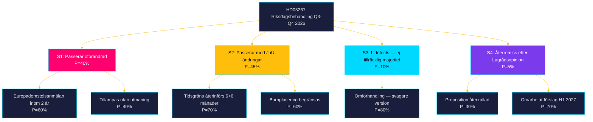

# Scenario Analysis — Propositionspaket 7 maj 2026

**Author:** James Pether Sörling | **Run ID:** 25654727630 | **Date:** 2026-05-11
**Classification:** Public | **Admiralty:** [B2]

---

## Scenarioträd

---

## Scenariobeskrivningar

### S1: Full passage utan ändringar [P=40%] — Bas-scenario (negativ)
**Triggrar:** SD+M+KD trycker hårt; L beslutar att säkerhetsargumentet trumfar rättstatsproblemen
**Konsekvens:**
- Tidsgränslöst förvar i kraft 1 mars 2027
- Högt sannolikt Europadomstolsanmälan (60% inom 2 år)
- Potentiellt prejudikat som fälls 2029–2031 = pinsam politisk kostnad

**Nyckelindikatorer:** L-partiledare uttalanden Q3 2026; JuU-votering utan reservationer

### S2: Passage med JuU-modifieringar [P=45%] — Mest sannolikt scenario
**Triggrar:** Lagrådsyttrande (Bilaga 5) skapar tillräcklig konstitutionell press; L kräver kompromiss
**Modifieringar:**
- Tidsgräns återinförs (t.ex. 24 månader + förlängning med domstolsprövning)
- Barnplacering begränsas till yttersta nödfall med 72h-prövning
- "Kan antas"-kriteriet preciseras med domstolave-vägningsgegund

**Konsekvens:** Balanserad lagstiftning; lägre EKMR-risk; koalitionen håller

### S3: L defects [P=10%] — Koalitionskris-scenario
**Triggrar:** Barnombudsmannens remissvar skapar mediauppmärksamhet; L-interna påtryckningar
**Konsekvens:** Prop. faller (<175 röster); statsminister Busch söker ad hoc-stöd från C eller S
**Nyckelindikatorer:** L-partiledare Jan Jönssons offentliga uttalanden om HD03267

### S4: Återremiss [P=5%] — Långsamt-scenario
**Triggrar:** Lagrådets yttrande är tillräckligt kritiskt att JuU beslutar om återremiss
**Konsekvens:** Lagens ikraftträdande förskjuts bortom 1 mars 2027; väljer mer EKMR-säker version H1 2027

---

## Scenariot för HD03250 och HD03261

**HD03250 och HD03261 bedöms passera utan väsentliga ändringar** (P=90% vardera). Dessa är tekniska/administrativa propositioner med brett politiskt stöd. Riskscenariot är implementeringsförsening (HD03250 e-ID) snarare än politisk konflikt.

---

## Wildcards

| Wildcard | Trigger | P | Effekt på scenario |
|----------|---------|---|--------------------|
| Terrorattentat i Sverige | Externt hot | 2% | Accelererar HD03267 till S1; ökar L:s stöd |
| Europadomstalsdom mot liknande lag | Extern rättsutveckling | 5% | Stärker S2 eller S4 |
| BankID cyberattack | Teknisk händelse | 3% | Accelererar HD03250 |

| Claim | Evidence | Retrieved at | Confidence |
|-------|----------|--------------|------------|
| S2 mest sannolikt | Lagstiftningshistorik; Lagrådets roll | 2026-05-11 | MEDIUM |
| S3 L defects | L:s civila rättighetsprofil; barnplacering | 2026-05-11 | LOW |

