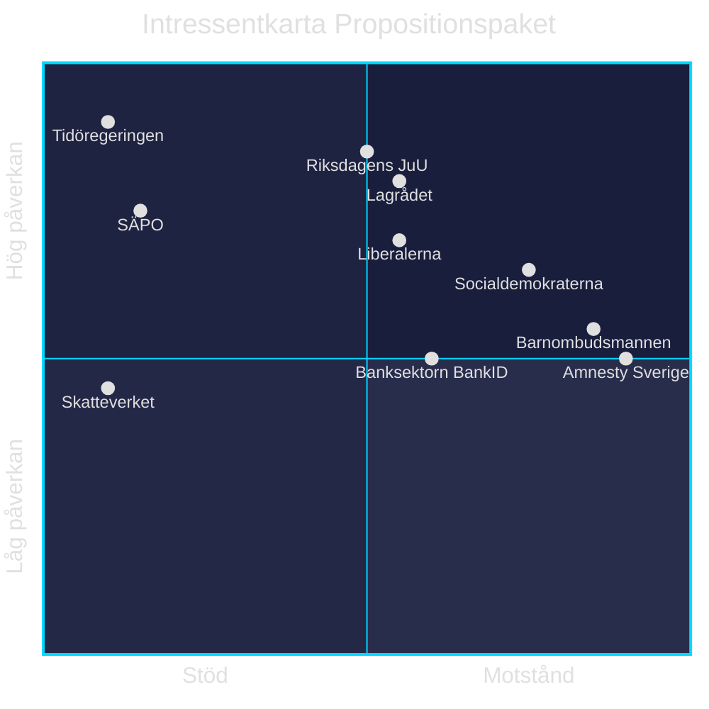

# Stakeholder Perspectives — Propositionspaket 7 maj 2026

**Author:** James Pether Sörling | **Run ID:** 25654727630 | **Date:** 2026-05-11
**Classification:** Public | **Admiralty:** [B2]

---

## Intressentmatris

---

## Intressentanalys per Aktör

### Starka Förespråkare

**Tidöregeringen (M+SD+KD+L)**
- *Intresse:* Visa handlingskraft på säkerhet inför val 2026; leverera på Tidöavtalet
- *Position:* Starkt stöd för hela paketet; HD03267 är flaggskeppspropositionen
- *Inflytande:* Avgörande (regeringsinstitiation)
- *Potentiell svaghet:* L:s civila rättighetsflygel kan tveka om HD03267

**SÄPO — Säkerhetspolisen**
- *Intresse:* Utökade juridiska verktyg för utvisning av säkerhetshot
- *Position:* Sannolikt stark förespråkare av HD03267 (myndigheten som utför säkerhetsbedömningar)
- *Inflytande:* Hög (fackorgan vars expertis präglar lagstiftningsgrund)
- *Offentlig position:* Ej bekräftad (sekretessbelagd)

**Skatteverket**
- *Intresse:* Utökade befogenheter för folkbokföringsverksamheten (HD03261)
- *Position:* Förespråkare av sina egna befogenhetsutvidgningar
- *Inflytande:* Medel (remissinstans)

---

### Kritiska Granskare

**Lagrådet**
- *Intresse:* Konstitutionell och rättslig korrekthet; EKMR-compliance
- *Position:* Granskar HD03267 kritiskt (Bilaga 5 — yttrande existerar)
- *Inflytande:* Hög (konstitutionellt rådgivande organ; riksdagen respekterar normalt Lagrådets synpunkter)
- *Sannolik synpunkt:* Tidsgränslöst förvar och "kan antas"-kriteriet sannolikt kommenterade

**Liberalerna**
- *Intresse:* Balans säkerhet / individuella friheter; kärnfråga för liberalt varumärke
- *Position:* Troligen stöd men med reservationer om barnplacering och tidsgränser
- *Inflytande:* Avgörande (koalitionspartner; defection = lagstiftningsrisk)

**Barnombudsmannen (BO)**
- *Intresse:* Barnkonventionen Art. 37 — barn i säkerhetsavdelning
- *Position:* Sannolikt kritisk; BO publicerar normalt remissvar på säkerhetslagstiftning som berör barn
- *Inflytande:* Medel-hög (opinionsbildande; skapar politisk kostnad)

---

### Starka Motståndare

**Socialdemokraterna (S)**
- *Intresse:* Oppositionsroll; skilja sig från Tidöregeringen
- *Position:* Sannolikt Nej på HD03267; JA på HD03250 och HD03261 (pragmatiska frågor)
- *Inflytande:* Hög (störst oppositionsparti; JuU-ledamöter)

**Amnesty Sverige / Civil Society**
- *Intresse:* Rättsstatsprinciper; skydd av asylsökandes rättigheter
- *Position:* Starkt Nej till HD03267; publicerar sannolikt pressmeddelanden
- *Inflytande:* Låg-medel (opinion men ej röster i riksdagen)

**Vänsterpartiet (V)**
- *Intresse:* Principiellt motstånd mot utvisnings-/migrationsrestriktioner
- *Position:* Starkt Nej till HD03267
- *Inflytande:* Medel (vågmästarroll potentiellt i höstval)

---

## Koalitions-Kalkyl

| Proposition | Förväntade Ja-röster | Riskscenario |
|-------------|---------------------|--------------|
| HD03267 | M+SD+KD+(L) = 176–191 | L defects = risk om 175 = exakt gräns |
| HD03250 | M+SD+KD+L+C+S+(V)+(MP) = ~280–300 | Inga nämnvärda risker |
| HD03261 | M+SD+KD+L+C+S+C = ~260–280 | Inga nämnvärda risker |

*175 röster behövs för enkel majoritet i 349-ledamöters riksdag.*

| Claim | Evidence | Retrieved at | Confidence |
|-------|----------|--------------|------------|
| L:s civila rättighetsprofil | Känd partiideologi | 2026-05-11 | HIGH |
| BO Barnkonventionen Art. 37 | HD03267, placering av barn i säkerhetsavdelning | 2026-05-11 | HIGH |
| Lagrådet Bilaga 5 | HD03267 fulltext, bilagetabell | 2026-05-11 | HIGH |

