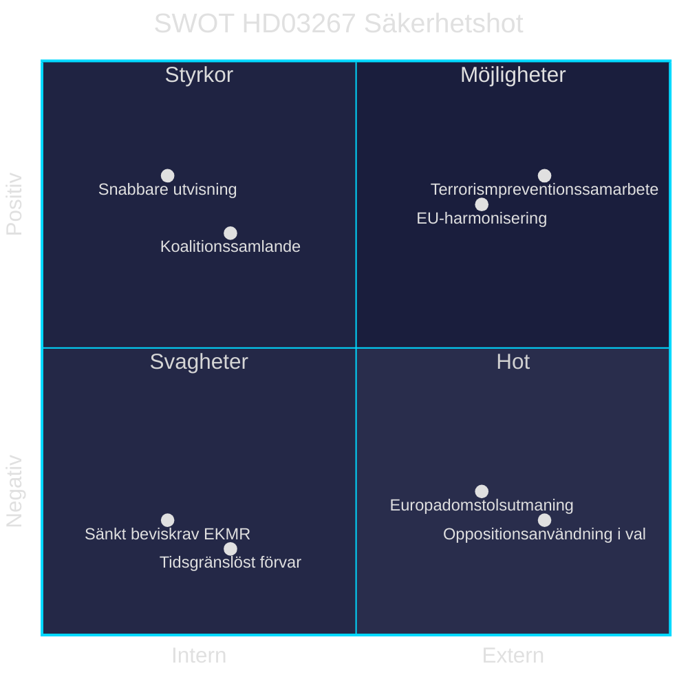

# SWOT-analys — Propositionspaket 7 maj 2026

**Author:** James Pether Sörling | **Run ID:** 25654727630 | **Date:** 2026-05-11
**Classification:** Public | **Admiralty:** [B2]

---

## SWOT per Proposition

### HD03267 — Stärkt skydd mot säkerhetshot

**Styrkor:**
- Fyller identifierad legislativ lucka efter NJA-prejudikat
- Stärker koalitionssammanhållning (M+SD+KD+L)
- Tydlig valfokusfråga om säkerhet inför 2026

**Svagheter:**
- EKMR Art. 5 risk — tidsgränslöst förvar utan konventionsstöd
- Barnkonventionen Art. 37 — placering av barn i säkerhetsavdelning kontroversiellt
- Sänkt beviskrav ("kan antas" vs "sannolikt") urholkar rättssäkerhetsprincipen

**Möjligheter:**
- Harmonisering med EU:s Return Directive (Dir. 2008/115/EG)
- Förstärkt nordiskt polissamarbete om terrorismutvisning
- Skapar prejudikat för effektivare säkerhetslagstiftning

**Hot:**
- Europadomstalsanmälan (se analogi: *J.N. mot Danmark*)
- Oppositionsbruk av HD03267 som "rättsstatshot" i valrörelsen
- Liberalernas interna tryck att moderera (risken för koalitionstension)

---

### HD03250 — Statlig e-legitimation

**Styrkor:**
- Skapar nationell digital infrastruktur oberoende av privata banker
- Höjer digital inkludering (äldre, utrikesfödda utan BankID)
- Ger staten kontroll över kritisk digital infrastruktur

**Svagheter:**
- Hög implementeringskostnad (statlig IT-infrastruktur)
- Risk för monopolisering (staten som ensam aktör)
- Konkurrens med etablerat BankID skapar dubbla system

**Möjligheter:**
- Europeisk interoperabilitet via eIDAS 2.0
- Minskar bankberoendet för offentlig service
- Modell för nordisk digital identitetsstandardisering

**Hot:**
- Motstånd från banksektorn (BankID-intressenter)
- Implementeringsförsening skapar tillfällig osäkerhet
- Dataskyddsrisk om statlig e-ID konsoliderar persondata

---

### HD03261 — Skatteverket folkbokföringsbefogenheter

**Styrkor:**
- Förbättrar folkbokföringens precision och motverkar adressbedrägerier
- Stärker skatteunderlaget och reducerar välfärdsfel
- Politiskt lågkontroversiellt — brett stöd möjligt

**Svagheter:**
- Utökade kontrollbefogenheter utan tydligt proportionalitetstest
- Ökad administrativ börda för enskilda
- GDPR-risk vid utökat datainsamling

**Möjligheter:**
- Synergier med HD03250 (e-ID + folkbokföring)
- Möjliggör mer precist välfärdssystem
- Reducerar adressfusk som underminerar kommunal skattebase

**Hot:**
- Datainspektionens granskning (GDPR Kap. 6)
- Potentiell överklagandestorm från drabbade individer
- Missbrukspotential om Skatteverket erhåller disproportionella befogenheter

---

## Aggregat SWOT — Paketet som helhet

| Dimension | Sammanvägd bedömning |
|-----------|---------------------|
| **Styrkor** | Koalitionssammanhållande; valpositionerande; legislativ modernisering |
| **Svagheter** | HD03267 EKMR-risk dominerar; IT-implementeringskomplexitet |
| **Möjligheter** | EU-harmonisering (eIDAS 2.0, Return Dir.); nordiskt samarbete |
| **Hot** | Europadomstolsutmaning; oppositionsanvändning i val |

| Claim | Evidence | Retrieved at | Confidence |
|-------|----------|--------------|------------|
| HD03267 EKMR Art. 5 risk | HD03267, 3 kap. 8 § upphävs | 2026-05-11 | HIGH |
| Barnkonventionen Art. 37 | HD03267, placering av barn | 2026-05-11 | HIGH |
| HD03250 eIDAS 2.0 | Känd EU-lagstiftning; titel HD03250 | 2026-05-11 | MEDIUM |

