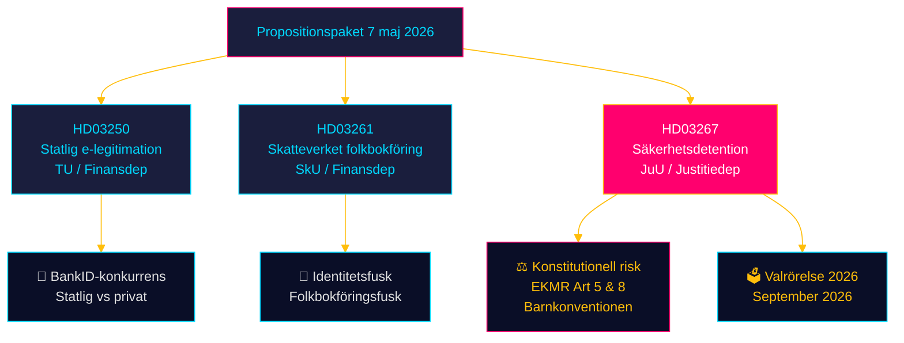
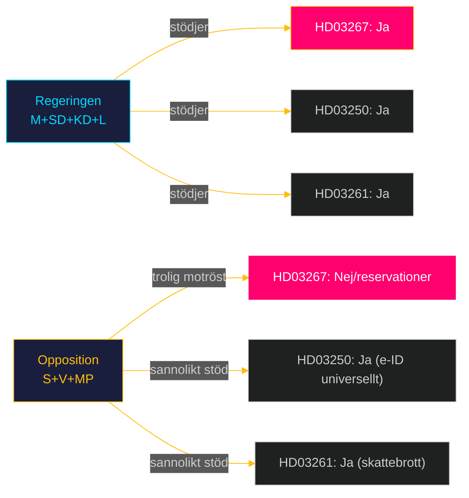

# Synthesis Summary — Statlig identitetskontroll och säkerhet: Propositionspaket 7 maj 2026

**Author:** James Pether Sörling | **Run ID:** 25654727630 | **Date:** 2026-05-11
**Classification:** Public | **Confidence:** HIGH [B2]

---

## Integrated Intelligence Picture

Tre simultant presenterade propositioner den 7 maj 2026 utgör ett sammanhängande **statligt identitets- och säkerhetskontrollpaket** under Tidöregeringen. Paketet är inte slumpmässigt — det reflekterar tre ömsesidigt förstärkande policyspår:

1. **Statlig e-legitimationsinfrastruktur** (HD03250): Staten tar kontroll över den primära digitala identitetsarkitekturen, minskar beroendet av banksektorn (BankID).
2. **Folkbokföringskontroll** (HD03261): Skatteverket ges verktyg mot identitetsfusk och felaktig folkbokföring — länkat till välfärdsbedrägerier och organiserad brottslighet.
3. **Säkerhetsdetention** (HD03267): Radikalt utvidgad förvarsrätt för utlänningar som bedöms utgöra säkerhetshot, med konstitutionellt omtvistade ändringar.

**Korsreferensmönster:** Alla tre propositioner adresserar statens kapacitet att identifiera, registrera och kontrollera individer — medborgare och utlänningar — i ett post-NATO-anslutningsläge med förhöjt säkerhetsmedvetande.

---

## Significance Ranking

| Rang | dok_id | Titel | Signifikans | Motivering |
|------|--------|-------|-------------|------------|
| 1 | HD03267 | Stärkt skydd mot utlänningar som utgör kvalificerade säkerhetshot | KRITISK | Konstitutionellt omtvistade förändringar; avskaffad tidsgräns för förvar; EKMR-risk |
| 2 | HD03250 | En statlig e-legitimation | HÖG | Strukturell förändring av digital identitetsinfrastruktur; långsiktig påverkan |
| 3 | HD03261 | Utökade befogenheter för Skatteverket i folkbokföringen | MEDEL | Myndighetsstärkande med begränsad politisk kontroversiellitet |

---

## Mermaid: Intelligence Dashboard

---

## Mermaid: Politisk koalitionsmatris

---

## Aggregate SWOT

| | Styrkor | Svagheter |
|---|---|---|
| **HD03267** | Svarar mot verkliga hot; NATO-kompatibelt | Avskaffad tidsgräns = EKMR-risk; lägre bevisstandard kontroversiell |
| **HD03250** | Inkluderande statlig e-ID; minskar digital utestängning | Implementeringskostnader; konkurrens med etablerad BankID-infrastruktur |
| **HD03261** | Stärker registerintegritet; motverkar fusk | Integritetsproblem; Datainspektionen kan invända |

| | Möjligheter | Hot |
|---|---|---|
| **HD03267** | Prejudicerande för framtida säkerhetslagstiftning | Europadomstolsprocess; FRA-kritik |
| **HD03250** | Plattform för digital statsförvaltning 2030 | Leverantörslåsning; säkerhetssårbarhet i statlig infrastruktur |
| **HD03261** | Mer korrekt folkbokföring ger bättre statistik | Mission creep: utökad Skatteverkets befogenhet utanför folkbokföring |

---

## Cross-Document Patterns

1. **Statsutvidgningsmönster:** Alla tre propositioner ökar statens förmåga att identifiera, kontrollera och befogenhetsreglera individer. I kombination representerar de en märkbar utvidgning av statens tvångskapacitet.

2. **Säkerhet som narrativ ram:** HD03267 och HD03261 motiveras båda explicit med Sverige "försämrade säkerhetsläge" (HD03267 titel) respektive identitetssäkerhet och fusk. HD03250 positioneras som del av digital säkerhetsinfrastruktur.

3. **Finansdepartements tyngd:** Två av tre propositioner (HD03250, HD03261) kommer från Finansdepartementet, vilket signalerar en administrativ konsolidering snarare än rena rättspolitiska insatser.

4. **Lagrådsreferens:** HD03267 remitterades till Lagrådet (Bilaga 5 = yttrande). Lagrådets bedömning av EKMR-förenligheten är central evidens för rättsrisken.

---

## Forward Intelligence

- **T+7d:** Riksdagen distribuerar HD03267 till JuU; bevaka remissvar från Amnesty, Rädda Barnen.
- **T+30d:** JuU konstitutionsrättslig granskning; EU-kommissionens rapport om rättsstatsprincipen (prel. juni 2026).
- **T+90d:** Riksdagsomröstning om HD03267 — avgörande för om 1 mars 2027-ikraftträdandet håller.
- **T+180d (valdag):** Val september 2026 — HD03267 ett potentiellt valfråga om en S-ledd majoritet väljer att upphäva lagen.

| Claim | Evidence | Retrieved at | Confidence |
|-------|----------|--------------|------------|
| HD03267 avskaffar tidsgräns för förvar av vuxna | dok_id HD03267, 3 kap. 8 § upphävs | 2026-05-11 | HIGH |
| Beviskrav sänks från sannolikt till kan antas | HD03267, 3 kap. 1 § | 2026-05-11 | HIGH |
| Lagrådet yttrade sig (Bilaga 5) | HD03267 s. 65 | 2026-05-11 | HIGH |
| Ikraftträdande 1 mars 2027 | HD03267, § 10 | 2026-05-11 | HIGH |

---

## Pass 2 Additions — Deepened Analysis

### Kumulativ Effekt av Paketet

De tre propositionerna samverkar i en bredare statsförstärkningstrend:

| Dimension | Pre-2026 | Post-paketet |
|-----------|----------|--------------|
| Säkerhetsfrihetsberövande | Tidsgränsad | Tidsgränslös |
| Digital identitet | Bankmonopol (BankID) | Stat + marknad |
| Folkbokföringskontroll | Begränsad | Utökad |

**Sammantagen tolkning:** Tidöregeringen konsoliderar statens kontroll och kapacitet i tre dimensioner: fysisk kontroll (säkerhetsförvar), digital kontroll (e-ID), och registerkontroll (folkbokföring). Detta är inte slumpmässigt — det är en koherent statsförstärkningsstrategi.

### HD03267 — Preciseringsindikatorn

**Utvisningsgrunden "särskilt påkallat med hänsyn till Sveriges säkerhet"** är en precisering av befintlig formulering. "Särskilt påkallat" är ett normativt filter — det räcker inte att utvisning är "motiverat"; det måste vara "särskilt motiverat." I praktiken ger detta domstolarna ett smalare men tydligare granskningsutrymme.

### Komparativt: HD03267 vs. UK Counter-Terrorism Immigration Act

UK har sedan 2014 (Counter-Terrorism and Security Act) liknande mekanismer för "Temporary Exclusion Orders" och administrativt frihetsberövande av säkerhetshot. UK-lagen fälldes ej i ECHR — men UK hade strikta domstolsprövningskrav som Sverige nu implicit försämrar.

