# Cross-Reference Map — Year-Ahead 2026-05-11

## Same-day siblings (2026-05-11)

- `analysis/daily/2026-05-11/propositions/` — likely tracking prop. 263 + 264 from government side
- `analysis/daily/2026-05-11/committeeReports/` — KU34, MJU23, SoU31 details
- `analysis/daily/2026-05-11/motions/` — HD024149, HD024150 V motions
- `analysis/daily/2026-05-11/interpellations/` — opposition statsråd-interrogations
- `analysis/daily/2026-05-11/month-ahead/` — 30-day-window forecasting
- `analysis/daily/2026-05-11/election-cycle/` — multi-year electoral projection

## Cross-horizon citations (mandatory ≥ 2 quarter-ahead + ≥ 4 monthly-review)

### Quarter-ahead citations (≥ 2 required, 3 cited)

1. **`analysis/daily/2026-05-10/quarter-ahead/`** — Most recent quarter-ahead. Continued relevance: Q3 2026 fiscal-political dynamics around the election; coalition probability matrix similar with -5/+6 pp drift.
2. **`analysis/daily/2026-05-04/quarter-ahead/`** — 7-day-prior. Established the BP 26/27 framing baseline; this year-ahead extends to T+365 with new KU34 architecture overlay.
3. **`analysis/daily/2026-04-27/quarter-ahead/`** — 14-day-prior. First quarter-ahead to incorporate prop. 263 + 264 substantive analysis; informed today's HD024149/HD024150 valuation.

### Monthly-review citations (≥ 4 required, 5 cited)

1. **`analysis/daily/2026-04-30/monthly-review/`** — End-April retrospective. Established trajectory of constitutional reform discussion in KU.
2. **`analysis/daily/2026-03-31/monthly-review/`** — End-March retrospective. Documented the political consensus formation around abortion-as-grundlagsskydd.
3. **`analysis/daily/2026-02-28/monthly-review/`** — End-February retrospective. Tracked early-spring vandel proposition criticism.
4. **`analysis/daily/2026-01-31/monthly-review/`** — End-January retrospective. Documented the Tidö coalition's late-year-2025 strategic recalibration.
5. **`analysis/daily/2025-12-31/monthly-review/`** — End-2025 yearly close. Anchor for 12-month-back PIR trajectory analysis.

## Cross-document references within today's analysis

| Source | Reference target | Relationship |
|--------|------------------|--------------|
| HD01KU34 | HD024149, HD024150 | Constitutional framework provides architecture for migration enforcement (§2/§3 powers) |
| HD024149 | HD024150 | Both V motions; coordinated framework against migration enforcement consolidation |
| HD024149 | Lagrådet yttrande prop. 264 | Direct alignment of V motion with Lagrådet criticism |
| HD024150 | Lagrådet yttrande prop. 263 | Same |
| HD11804 (kvinnor våld) | HD11807 (Malmö kvinnojourer) | Connected welfare-political narrative for 2026 election |
| HD11806 (europeiskt tekn.) | HD11808 (export-konkurrens) | Industrial-policy framing for centre-right voter mobilisation |
| HD11810 (livsmedel) | HD11808 (export) | Food-security narrative for opposition critique of trade-policy framing |

## External citations

- IMF WEO Apr-2026 (`data/imf-context.json`)
- SCB monthly-CPI (latest April 2026)
- SCB Aktuell statistik AKU (April 2026)
- Riksbank Penningpolitisk rapport Q1 2026
- Försvarsberedningen Sammanfattning 2025-12 (latest update)
- SÄPO årsrapport 2025/2026 (March 2026 publication)
- Statskontoret 2024:08, 2024:14, 2024:21, 2025:12 (referenced in Statskontoret enrichment)
- Lagrådet yttranden on prop. 263, prop. 264 (Q4 2025)

## Mermaid: cross-horizon dependency

```mermaid
graph TD
    classDef yearAhead fill:#0a0e27,stroke:#00d9ff,color:#e0e0e0;
    classDef qa fill:#1a1e3d,stroke:#ff006e,color:#e0e0e0;
    classDef mr fill:#1a1e3d,stroke:#ffbe0b,color:#e0e0e0;

    YA2026_05_11[Year-Ahead 2026-05-11]:::yearAhead
    QA2026_05_10[Quarter-Ahead 2026-05-10]:::qa
    QA2026_05_04[Quarter-Ahead 2026-05-04]:::qa
    QA2026_04_27[Quarter-Ahead 2026-04-27]:::qa
    MR2026_04_30[Monthly-Review 2026-04-30]:::mr
    MR2026_03_31[Monthly-Review 2026-03-31]:::mr
    MR2026_02_28[Monthly-Review 2026-02-28]:::mr
    MR2026_01_31[Monthly-Review 2026-01-31]:::mr
    MR2025_12_31[Monthly-Review 2025-12-31]:::mr

    QA2026_05_10 --> YA2026_05_11
    QA2026_05_04 --> YA2026_05_11
    QA2026_04_27 --> YA2026_05_11
    MR2026_04_30 --> YA2026_05_11
    MR2026_03_31 --> YA2026_05_11
    MR2026_02_28 --> YA2026_05_11
    MR2026_01_31 --> YA2026_05_11
    MR2025_12_31 --> YA2026_05_11
```

---

## Pass-2 Recalibration (2026-05-11T15:23:28Z)

Cross-link added: KU34§2 ↔ HD024150 V-motion ↔ Lagrådet 2026-04-08 yttrande on association-freedom proportionality.

_Pass-2 critical re-read complete; deltas integrated above._
