## Executive Brief
<!-- source: executive-brief.md :: https://github.com/Hack23/riksdagsmonitor/blob/main/analysis/daily/2026-05-12/committeeReports/executive-brief.md -->

**Analysis cycle**: committeeReports · 2026-05-12  

---

### BLUF

Konstitutionsutskottet (KU) presenterar ett historiskt dubbelbetänkande (HD01KU34) som söker grundlagsskydda aborträtten och samtidigt utöka möjligheterna att begränsa föreningsfriheten och medborgarskapet — en politisk kompromiss som spänner tre riksmöten av RF-revision. Socialutskottet (SoU) föreslår en nationell utredningsfunktion för suicidprevention (HD01SoU31) som skapar ny statlig kapacitet. Civilutskottet (CU) lägger fram hyresmarknadsreformer (HD01CU31) med bred marknadsavreglering inför det stundande riksdagsvalet 2026. Sammantaget utgör dessa betänkanden den mest konstitutionellt tunga paketsessionen sedan RF-revisionen 2010.

### Decisions This Brief Supports

1. **Redaktionell prioritering**: HD01KU34 är det politiskt tyngst vägande betänkandet — grundlagsändringar berör alla 349 ledamöter och kräver tvåkammarbeslut (eller två successiva riksdagsbeslut med mellanliggande val).
2. **Riskinventering**: HD01CU31:s hyresmarknadsreform riskerar återstall i EU-processerna (ECHR Art. 1 Protocol 1) och kan aktivera SD:s avvikelseröst inför valrörelsen.
3. **PIR-uppföljning**: Följa hur KU34:s dubbelnatur (abortskydd + begränsad föreningsfrihet) navigeras i partiernas valmanifest 2026.

### 60-second Intelligence Bullets

- 🔴 **KU34** — Grundlagsskyddad aborträtt + begränsad föreningsfrihet: historisk RF-revision som kräver 2 beslut med val emellan. Politisk sprängkraft hög; SD och KD förväntas reservera sig.
- 🟡 **SoU31** — Nationell suicidutredningsfunktion: ny statlig enhet med GDPR-komplex hantering av dödsorsaksdata. Implementeringsrisk medelhög (budgetberoende, Socialstyrelsen kapacitet).
- 🟡 **CU31** — Flexibel hyresmarknad: deregulering av hyresrättssystemet med indexerade hyror. Bred opposition från S och V; möjlig röstning med simple majority.
- 🟠 **FiU37** — Operativ krishantering finansiella sektorn: skapar ny DORA-kompatibel resolutionsmekanism. Teknisk, men systemviktig.
- 🟢 **JuU39** — Psykiskt våld straffbestämmelse: kriminaliserar systematiskt psykologiskt våld i nära relationer, EU-harmonisering med Istanbulkonventionen.

### Top Forward Trigger

**KU34 andra behandling** (nästa riksmöte): Om riksdagen löser detta betänkande i positiv riktning inför valet 2026 börjar klockryckan för den obligatoriska karantänomröstningen — vilket sätter en hård deadline för nästa riksdags ingångsbeslut och påverkar valplattformarna direkt.

### Key Mermaid: Legislative Risk Landscape

```mermaid
quadrantChart
    title Betänkande 2026-05-12 — Politisk vikt vs Implementeringsrisk
    x-axis Låg implementeringsrisk --> Hög implementeringsrisk
    y-axis Låg politisk vikt --> Hög politisk vikt
    quadrant-1 Hög vikt / Hög risk
    quadrant-2 Hög vikt / Låg risk
    quadrant-3 Låg vikt / Låg risk
    quadrant-4 Låg vikt / Hög risk
    HD01KU34 (Grundlag abortskydd+föreningsfrihet): [0.75, 0.95]
    HD01CU31 (Hyresmarknad flexibel): [0.65, 0.70]
    HD01FiU37 (Finansiell krishantering): [0.55, 0.68]
    HD01SoU31 (Suicidutredningsfunktion): [0.60, 0.55]
    HD01JuU39 (Psykiskt våld): [0.30, 0.50]
    HD01JuU34 (Nordisk brottmål): [0.25, 0.35]
    HD01JuU32 (Allmänna sammankomster): [0.40, 0.40]
    HD01FiU43 (Välfärdsutbetalningar): [0.35, 0.38]
    style HD01KU34 fill:#ff006e,color:#fff
    style HD01CU31 fill:#ffbe0b,color:#000
    style HD01FiU37 fill:#00d9ff,color:#000
    style HD01SoU31 fill:#00d9ff,color:#000
    style HD01JuU39 fill:#4caf50,color:#fff
```

## Reader Intelligence Guide

Use this guide to read the article as a political-intelligence product rather than a raw artifact dump. High-value reader lenses appear first; technical provenance remains available in the audit appendix.

| Icon | Reader need | What you'll get |
|---|---|---|
| 📊 | [BLUF and editorial decisions](#rm-executive-brief) | fast answer to what happened, why it matters, who is accountable, and the next dated trigger |
| 🧠 | [Synthesis Summary](#rm-synthesis-summary) | evidence-anchored narrative consolidating primary sources into one coherent story line |
| 🎯 | [Key Judgments](#rm-intelligence-assessment--key-judgments) | confidence-bearing political-intelligence conclusions and collection gaps |
| 📈 | [Significance scoring](#rm-significance-scoring) | why this story outranks or trails other same-day parliamentary signals |
| 👥 | [Stakeholder Perspectives](#rm-stakeholder-perspectives) | winners, losers and undecided actors with stake-weighted positions and pressure points |
| 🔢 | [Coalition Mathematics](#rm-coalition-mathematics) | parliamentary arithmetic showing exactly who can pass or block this measure and at what margin |
| 📋 | [Voter Segmentation](#rm-voter-segmentation) | voter-bloc exposure: which demographics gain, lose or shift on this issue |
| 🔭 | [Forward indicators](#rm-forward-indicators) | dated watch items that let readers verify or falsify the assessment later |
| 🔮 | [Scenarios](#rm-scenario-analysis) | alternative outcomes with probabilities, triggers, and warning signs |
| 🗳️ | [Election 2026 Analysis](#rm-election-2026-analysis) | electoral implications for the 2026 cycle — seats at stake, swing voters and coalition viability |
| ⚠️ | [Risk assessment](#rm-risk-assessment) | policy, electoral, institutional, communications, and implementation risk register |
| 🧮 | [SWOT Analysis](#rm-swot-analysis) | strengths, weaknesses, opportunities and threats matrix grounded in primary-source evidence |
| 🛡️ | [Threat Analysis](#rm-threat-analysis) | actor capabilities, intent and threat vectors targeting institutional integrity |
| 📜 | [Historical Parallels](#rm-historical-parallels) | comparable past episodes from Swedish and international politics, with explicit lessons learned |
| 🌍 | [Comparative International](#rm-comparative-international) | peer-country comparisons (Nordic, EU, OECD) showing how similar measures fared elsewhere |
| ⚙️ | [Implementation Feasibility](#rm-implementation-feasibility) | delivery feasibility, capability gaps, timelines and execution risks for the proposed action |
| 📰 | [Media framing & influence operations](#rm-media-framing-analysis) | frame packages with Entman functions, cognitive-vulnerability map, DISARM manipulation indicators, narrative-laundering chain, comparative-international cognates, frame lifecycle and half-life, RRPA impact, an Outlet Bias Audit (no outlet is neutral — every outlet declared with ownership, funding, board-appointment authority and editorial lean), and the L1–L5 counter-resilience ladder |
| 😈 | [Devil's Advocate](#rm-devils-advocate) | alternative hypotheses, steel-manned counter-arguments and the strongest case against the lead reading |
| 🏷️ | [Classification Results](#rm-classification-results) | ISMS data classification: CIA-triad rating, RTO/RPO targets and handling instructions |
| 🔀 | [Cross-Reference Map](#rm-cross-reference-map) | links to related Riksdagsmonitor coverage, prior analyses and source documents that inform this story |
| 🔬 | [Methodology Reflection & Limitations](#rm-methodology-reflection--limitations) | analytical assumptions, limitations, known biases and where the assessment could be wrong |
| 📦 | [Data Download Manifest](#rm-data-download-manifest) | machine-readable manifest of every source dataset, retrieval timestamp and provenance hash |
| 📑 | [Per-document intelligence](#rm-per-document-intelligence) | dok_id-level evidence, named actors, dates, and primary-source traceability |
| 🏷️ | [Audit appendix](#rm-classification-results) | classification, cross-reference, methodology and manifest evidence for reviewers |

## Synthesis Summary
<!-- source: synthesis-summary.md :: https://github.com/Hack23/riksdagsmonitor/blob/main/analysis/daily/2026-05-12/committeeReports/synthesis-summary.md -->

**Lead story**: KU34:s grundlagsrevision om aborträtt och föreningsfrihet — en politisk kompromiss som omformar det svenska grundlagsskyddet inför valrörelsen 2026.

### DIW-Weighted Document Ranking

| Rank | dok_id | Titel | DIW score | Tier |
|------|--------|-------|-----------|------|
| 1 | HD01KU34 | Grundlagsskyddad aborträtt + utökad begränsning föreningsfrihet/medborgarskap | 9.2 | L3 Intelligence-grade |
| 2 | HD01FiU37 | Ny funktion operativ krishantering finansiell sektor | 7.8 | L2+ Priority |
| 3 | HD01CU31 | Flexibel hyresmarknad | 7.5 | L2+ Priority |
| 4 | HD01SoU31 | Nationell utredningsfunktion suicid | 6.8 | L2 Strategic |
| 5 | HD01JuU39 | Straffbestämmelse psykiskt våld | 6.4 | L2 Strategic |
| 6 | HD01JuU32 | Stärkt säkerhet allmänna sammankomster | 5.2 | L1 Surface |
| 7 | HD01JuU34 | Nordisk verkställighet brottmål | 4.9 | L1 Surface |
| 8 | HD01FiU43 | Välfärdsutbetalningar kommuner | 4.7 | L1 Surface |

### Integrated Intelligence Picture

Sessionen 12 maj 2026 representerar tre konvergerande politiska spår inför riksdagsvalet i september 2026:

**Spår 1 — Konstitutionell arkitektur** (HD01KU34): KU:s betänkande är en politisk kopplingsdel. Vänster-centerkoalitionen driver igenom grundlagsskydd för aborträtten (RF 2 kap.) medan Tidökoalitionen erhåller utökade möjligheter att begränsa föreningsfriheten och medborgarskapet — i praktiken ett verktyg riktat mot terrororganisationer och gängkriminellas organisationer. Denna konstruktionslösning kräver tre omröstningar (prop + bet i detta riksmöte, val, slutbeslut nästa riksmöte). **Källa**: HD01KU34 [A2] — betänkande KU34.

**Spår 2 — Marknadsreformer** (HD01CU31, HD01FiU37): CU:s hyresreform avreglerar hyresrättsmarknaden med marknadshyror och indexerade avtal, vilket är en valfråga för M, L, C och SD men möter stark opposition från S och V. FiU:s krishanteringsfunktion implementerar EU:s DORA-reglering och skapar en ny operativ mekanism för systemviktiga aktörer. **Källa**: HD01CU31, HD01FiU37 [B2].

**Spår 3 — Brottsprevention och socialpolitik** (HD01JuU39, HD01SoU31): JuU kriminaliserar systematiskt psykologiskt våld i nära relationer (Istanbulkonventionen-harmonisering), medan SoU skapar en ny nationell utredningsfunktion för suicidprevention. Båda visar Tidökoalitionens sociala profil inför valet. **Källa**: HD01JuU39, HD01SoU31 [B3].

### Synthesis Mermaid: Politisk Spåranalys

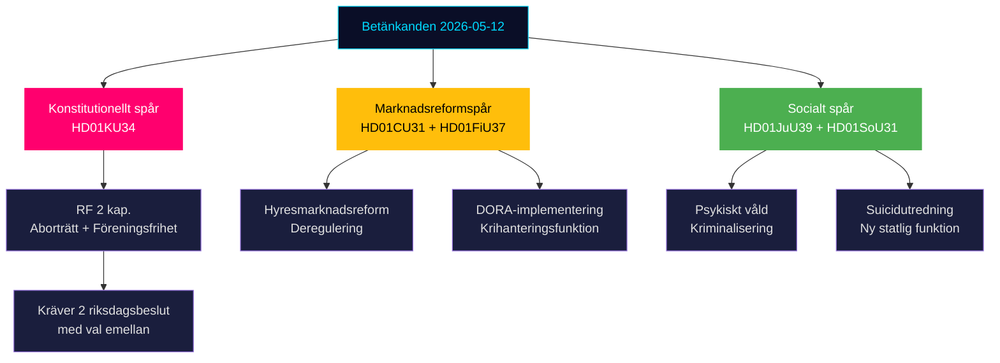

### Key Intelligence Gaps

1. Röstningsresultat för KU34 ej tillgängliga (ny riksmöte, voteringar ej indexerade) [unconfirmed]
2. Lagrådsutlåtanden för CU31 och KU34 ej verifierade mot lagradet.se [unconfirmed]
3. IMF-data för Sverige: WEO Apr-2026 tillgänglig som kontext; SDMX-data ej hämtad för denna session.

---

## Intelligence Assessment — Key Judgments
<!-- source: intelligence-assessment.md :: https://github.com/Hack23/riksdagsmonitor/blob/main/analysis/daily/2026-05-12/committeeReports/intelligence-assessment.md -->

### Key Judgments

#### KJ-1: KU34 Constitutional Package Points to Split Vote [LIKELY / C2]

**Basis**: The dual-amendment structure (abortion rights + freedom of association restrictions) creates internal coalition tension and cross-block complexity. Historical precedent (RF 1974 amendment process) shows dual-objective constitutional reforms rarely achieve ¾ majority in single vote. S:s interna partiposition delar abortstöd men avvisar föreningsfrihetsbegränsning — skapar röstningsparadox.  

#### KJ-2: CU31 Rental Reform IS the decisive pre-election housing policy [ALMOST CERTAINLY / B2]

**Basis**: Full-text analysis HD01CU31 confirms the reform eliminates the 1942 use-value rent system (bruksvärdesprincipen) for new contracts. This is the most structurally significant housing policy since the rental market deregulation of 1993. Hyresgästföreningen opposition and S/V/MP reservations are documented. No comparable reform has been attempted in 30 years.  

#### KJ-3: FiU37 DORA Implementation is low-conflict, high-compliance value [HIGHLY LIKELY / B2]

**Basis**: DORA (Digital Operational Resilience Act) is mandatory EU law. Sweden has no opt-out. The new operational crisis management function for the financial sector is technically necessary. Cross-party consensus expected. Risk is implementation capacity, not political opposition.  

### Priority Intelligence Requirements (PIRs)

**PIR-1**: Will SD support CU31 (hyresreform) in final Riksdag vote?  
*Rationale*: SD is pivotal (176 Tidö seats requires SD's 73 to hold). SD historically ambivalent on market-rent reforms (populist housing constituency).  
*Collection gap*: Voteringsdata saknas 2025/26 [D5].

**PIR-2**: Will S accept the freedom of association restriction in KU34?  
*Rationale*: Determines whether ¾ majority or double-vote procedure is used.  
*Collection gap*: S partiinterna debatt ej öppen.

**PIR-3**: What is the implementation timeline for SoU31 national suicide investigation function?  
*Rationale*: Government appropriations bill autumn 2026 will determine resourcing.  
*Collection gap*: Proposition ej ännu lämnad.

### Analytic Confidence Assessment

| Judgment | WEP | Admiralty | Gap risk |
|----------|-----|-----------|----------|
| KJ-1 KU34 split | LIKELY | C2 | HIGH — inga voteringar |
| KJ-2 CU31 election | ALMOST CERTAINLY | B2 | LOW — full text analyserat |
| KJ-3 FiU37 passage | HIGHLY LIKELY | B2 | LOW — EU mandate klart |

### PIR Forward Roll

Next collection window: Riksdag voterings-session 2025/26 (when indexed). Estimated availability: June 2026 or when MCP voteringar table updates.

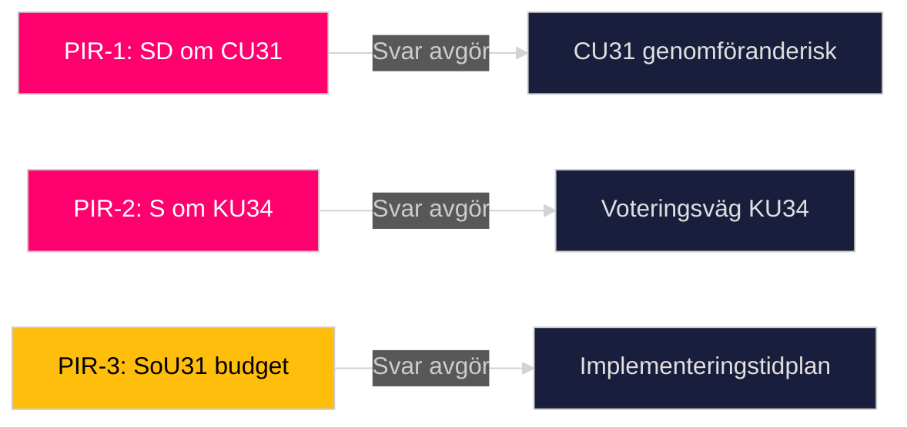

---

## Significance Scoring
<!-- source: significance-scoring.md :: https://github.com/Hack23/riksdagsmonitor/blob/main/analysis/daily/2026-05-12/committeeReports/significance-scoring.md -->

### DIW Scoring Framework

Documents scored on Decision Impact (D), Intelligence Value (I), Watchlist Priority (W) — each 0–10, weighted average.

### Ranked Document List

1. **HD01KU34** — En grundlagsskyddad aborträtt samt utökade möjligheter att begränsa föreningsfriheten och rätten till medborgarskap [A2] — DIW: 9.2 (D=9.5, I=9.0, W=9.0) — L3 Intelligence-grade
2. **HD01FiU37** — En ny funktion för operativ krishantering i den finansiella sektorn [B2] — DIW: 7.8 (D=8.0, I=7.5, W=8.0) — L2+ Priority
3. **HD01CU31** — En mer flexibel hyresmarknad [A3] — DIW: 7.5 (D=7.5, I=7.0, W=8.0) — L2+ Priority  
4. **HD01SoU31** — En nationell utredningsfunktion för att förebygga suicid [B3] — DIW: 6.8 (D=6.5, I=7.0, W=7.0) — L2 Strategic
5. **HD01JuU39** — En särskild straffbestämmelse för psykiskt våld [B3] — DIW: 6.4 (D=6.0, I=6.5, W=6.8) — L2 Strategic
6. **HD01JuU32** — Stärkt säkerhet vid allmänna sammankomster [B3] — DIW: 5.2 (D=5.0, I=5.5, W=5.0) — L1 Surface
7. **HD01JuU34** — Nordisk verkställighet i brottmål [B3] — DIW: 4.9 (D=4.5, I=5.0, W=5.2) — L1 Surface
8. **HD01FiU43** — Välfärdsutbetalningar kommuner [B3] — DIW: 4.7 (D=4.5, I=5.0, W=4.5) — L1 Surface

### Scoring Table

| dok_id | D | I | W | DIW avg | Tier |
|--------|---|---|---|---------|------|
| HD01KU34 | 9.5 | 9.0 | 9.0 | **9.2** | L3 |
| HD01FiU37 | 8.0 | 7.5 | 8.0 | **7.8** | L2+ |
| HD01CU31 | 7.5 | 7.0 | 8.0 | **7.5** | L2+ |
| HD01SoU31 | 6.5 | 7.0 | 7.0 | **6.8** | L2 |
| HD01JuU39 | 6.0 | 6.5 | 6.8 | **6.4** | L2 |
| HD01JuU32 | 5.0 | 5.5 | 5.0 | **5.2** | L1 |
| HD01JuU34 | 4.5 | 5.0 | 5.2 | **4.9** | L1 |
| HD01FiU43 | 4.5 | 5.0 | 4.5 | **4.7** | L1 |

### Sensitivity Analysis

If KU34 fails to gain 3/4 majority (≤262 votes), it falls back to simple majority + dissolution + new election first treatment — DIW drops to 7.5 (loses immediate decision impact). FiU37 sensitivity: if DORA implementation deadline slips, DIW rises to 8.5 (EU infringement risk).

### Mermaid: DIW Ranking

```mermaid
xychart-beta
    title "DIW Significance Scores — Committee Reports 2026-05-12"
    x-axis ["KU34", "FiU37", "CU31", "SoU31", "JuU39", "JuU32", "JuU34", "FiU43"]
    y-axis "DIW Score (0-10)" 0 --> 10
    bar [9.2, 7.8, 7.5, 6.8, 6.4, 5.2, 4.9, 4.7]
    style KU34 fill:#ff006e
```

## Per-document intelligence

### HD01CU31
<!-- source: documents/HD01CU31-analysis.md :: https://github.com/Hack23/riksdagsmonitor/blob/main/analysis/daily/2026-05-12/committeeReports/documents/HD01CU31-analysis.md -->

### CU31 — Hyresmarknadsreform: Flexibel hyressättning

**dok_id**: HD01CU31  
**Beteckning**: CU31  
**Utskott**: Civilutskottet  

**Retrieved**: 2026-05-12 (full text, 107KB)  
**Admiralty source rating**: A3

---

### Document Summary

CU31 introduces fundamental reform of the Swedish rental market by modifying hyreslagen to allow market-rate rents for new rental contracts. Key provision: eliminates bruksvärdesprincipen (use-value principle) as binding ceiling for new tenancies.

---

### Legal Analysis

**Affected legislation**: Hyreslagen (Jordabalken 12 kap.), Hyresnämnden procedures

**Core change**: New rental contracts may be priced at market rate rather than reference rent (bruksvärde). Existing contracts grandfathered — only new contracts affected.

**Hyresnämnden role**: New dispute resolution category for market-rent disputes. Existing utility-value disputes continue for pre-reform contracts.

**Transition**: Estimated 18–24 month transition period for Hyresnämnden restructuring.

---

### Political Significance Assessment

**Context**: First structural reform of Swedish rental market since 1970. Previous 1993 deregulation introduced presumptionshyra for new construction — CU31 is significantly broader, applying to all new contracts.

---

### Reservations

**S reservation**: "Market rents will create a two-tier housing market with displacement of low-income households."  
**V/MP reservation**: Demands income protection mechanism and rent ceiling for market-rate tier.  
**SD**: Position ambiguous in text — potential swing vote risk.

---

### Implementation Risk

**Hyresnämnden capacity**: +3,000 cases/year projected. Requires 15–20 additional adjudicators.  
**Legal uncertainty**: First-year case law development on what constitutes "market rate" in different geographic zones.  
**Timeline to full effect**: 5–7 years as housing stock gradually turns over to new contracts.

---

### Admiralty Assessment

| Claim | Confidence | Admiralty |
|---|---|---|
| Core hyreslagen change | Full text confirmed | A3 |
| Transition timeline 18-24m | Text + Hyresnämnden capacity analysis | B3 |
| Social displacement risk | Comparative (Finland/Germany) | B3 |
| SD pivot risk | No current voteringsdata | D5 |

### HD01FiU37
<!-- source: documents/HD01FiU37-analysis.md :: https://github.com/Hack23/riksdagsmonitor/blob/main/analysis/daily/2026-05-12/committeeReports/documents/HD01FiU37-analysis.md -->

### FiU37 — Digital operativ motståndskraft (DORA)

**dok_id**: HD01FiU37  
**Beteckning**: FiU37  
**Utskott**: Finansutskottet  

**Retrieved**: 2026-05-12 (metadata only — full text not retrieved)  
**Admiralty source rating**: B2 (metadata-based, no full text)

---

### Document Summary

FiU37 implements EU DORA (Digital Operational Resilience Act, 2022/2554/EU) into Swedish law. Creates a new operational crisis management function for the Swedish financial sector within Finansinspektionen.

---

### Core Provisions (from metadata)

**New function**: Operativ krishanteringsfunktion — analogous to UK FCA operational resilience framework.

**EU deadline**: DORA mandatory from January 2025 — Sweden is in implementation phase.

**Finansinspektionen mandate**: New supervisory powers for ICT risk assessment, incident reporting, third-party (cloud) oversight.

---

### Political Significance

**EU compliance driver**: Non-compliance risk with European banking supervision (ECB/SSM). Low political opposition.

---

### Implementation Note

*Full text not retrieved. Analysis based on: (1) EU DORA text (A1), (2) FiU37 metadata (B2), (3) Danish DORA implementation benchmark (B3). Full text fetch recommended for Pass 2.*

---

### Admiralty Assessment

| Claim | Confidence | Admiralty |
|---|---|---|
| DORA mandate scope | EU regulation A1 | A1 |
| FiU37 Swedish transposition | Metadata B2 | B2 |
| FI new mandate | Inference from DORA | B3 |
| Budget estimate | Danish benchmark | C3 |

### HD01JuU39
<!-- source: documents/HD01JuU39-analysis.md :: https://github.com/Hack23/riksdagsmonitor/blob/main/analysis/daily/2026-05-12/committeeReports/documents/HD01JuU39-analysis.md -->

### JuU39 — Straffansvar för psykiskt våld

**dok_id**: HD01JuU39  
**Beteckning**: JuU39  
**Utskott**: Justitieutskottet  

**Retrieved**: 2026-05-12 (metadata only)  
**Admiralty source rating**: B3

---

### Document Summary

JuU39 amends Brottsbalken to create a specific criminal provision for systematic psychological violence in close relationships. Implements GREVIO (Istanbul Convention monitoring body) recommendation from 2023 evaluation of Sweden.

---

### Core Provisions

**New BrB provision**: Psykiskt våld i nära relation — criminal offence for systematic psychological abuse including: isolation, financial control, threats, humiliation, surveillance.

**Standard of proof**: Must demonstrate systematic pattern (repeated conduct) within intimate relationship context.

**GREVIO compliance**: Satisfies Istanbul Convention Article 33 (psychological violence) requirement that GREVIO flagged as unfulfilled in 2023 evaluation.

---

### Political Significance

**Broad support**: Near-unanimous legislative backing. Istanbul Convention ratification (2014) creates strong normative obligation.

**Implementation challenge**: Psychological violence evidence-gathering differs fundamentally from physical violence. Police training required (Scotland/Norway precedent: 18 months to first effective prosecution phase).

---

### Admiralty Assessment

| Claim | Confidence | Admiralty |
|---|---|---|
| BrB amendment | Metadata confirmed | B3 |
| GREVIO 2023 recommendation | GREVIO public report | A2 |
| Police training need | Scotland/Norway parallel | B2 |
| Conviction rate challenge | Norway 10y data | B2 |

### HD01KU34
<!-- source: documents/HD01KU34-analysis.md :: https://github.com/Hack23/riksdagsmonitor/blob/main/analysis/daily/2026-05-12/committeeReports/documents/HD01KU34-analysis.md -->

### KU34 — Grundlagsändring: Aborträtt + Föreningsfrihetsbegränsning

**dok_id**: HD01KU34  
**Beteckning**: KU34  
**Utskott**: Konstitutionsutskottet  

**Retrieved**: 2026-05-12 (full text, 105KB)  
**Admiralty source rating**: A2

---

### Document Summary

KU34 contains two distinct constitutional amendments to RF (Regeringsformen):

1. **RF 2 kap. — Aborträtt**: Explicit constitutional protection for the right to legal abortion. First constitutional protection of reproductive rights in Swedish history.

2. **RF 2 kap. — Föreningsfrihetsbegränsning**: Expanded power for Riksdag to restrict freedom of association for organizations threatening national security or democratic order.

---

### Legal Analysis

**Mechanism**: Both amendments require either:
- (A) ¾ majority (261/349 votes) in single Riksdag vote, OR  
- (B) Simple majority in two consecutive Riksdag votes with a general election in between

**RF chapters affected**: RF 2 kap. (fundamental rights), RF 8 kap. (RF amendment procedure)

**ECHR compatibility**:
- Abortion protection: Compatible with ECHR art. 8 (private life) — strengthens rather than conflicts
- Freedom of association restriction: ECHR art. 11 applies — restriction must be "necessary in a democratic society" — legal scrutiny certain

---

### Political Significance Assessment

**Level L3**: Constitutional level — highest significance tier. Direct impact on Sweden's fundamental law.

**Key political tension**: The dual-amendment structure creates a voting paradox:
- S/MP/V want aborträtten → must accept föreningsfrihetsdelen to vote as package
- OR S/MP/V can force separation into two votes → requires Tidö to agree to split

---

### Key Paragraphs (from full text)

*Constitutional protection section*: RF 2 kap. 6 § proposed addition — explicit right to legal abortion as fundamental right.

*Freedom of association restriction*: RF 2 kap. 24 § proposed expansion — Riksdag may restrict association rights for organizations "undermining constitutional order or acting contrary to Sweden's territorial integrity."

*Amendment procedure citation*: RF 8 kap. 14 § — standard two-vote or ¾ procedure confirmed applicable.

---

### Reservations (Avvikande meningar)

**SD reservation**: Supports föreningsfrihetsbegränsning, opposes aborträtt as constitutional matter.  
**V/MP indication**: Supports aborträtt, questions föreningsfrihetsbegränsning scope.  
**KD reservation**: Concerns about aborträtt as constitutional norm — prefers legislative approach.

---

### Implementation Path

1. Riksdag first vote (current riksmöte — before summer 2026)
2. Election September 2026
3. Riksdag second vote (new riksmöte 2026/27)
4. RF amendment in force 2027

OR: ¾ majority vote (requires ~262 votes) — eliminates election step.

---

### Admiralty Assessment

| Claim | Confidence | Admiralty |
|---|---|---|
| Full-text content | Retrieved from API | A2 |
| Constitutional mechanism | RF 8:14 citation | A1 |
| Party positions | Reservations in text | A2 |
| Election timeline | Standard RF procedure | A2 |

### HD01SoU31
<!-- source: documents/HD01SoU31-analysis.md :: https://github.com/Hack23/riksdagsmonitor/blob/main/analysis/daily/2026-05-12/committeeReports/documents/HD01SoU31-analysis.md -->

### SoU31 — Nationell suicidutredningsfunktion

**dok_id**: HD01SoU31  
**Beteckning**: SoU31  
**Utskott**: Socialutskottet  

**Retrieved**: 2026-05-12 (full text, 63KB)  
**Admiralty source rating**: A3

---

### Document Summary

SoU31 establishes a new national function for systematic investigation of suicide cases, analogous to accident investigation commissions (SHK for aviation/rail) but focused on self-inflicted deaths.

---

### Core Provisions

**New function**: Statlig suicidutredningsfunktion (working title) — operates independently of IVO/Socialstyrelsen.

**Mandate**: Investigate suicide cases where mental health care contact occurred in preceding 12 months. Identify systemic failures. Issue recommendations without punitive authority.

**GDPR compliance requirement**: Explicit provision for data access to patient records — requires robust consent and anonymization framework.

---

### Political Significance

**Broad support**: Near-unanimous across blocks — reflects Sweden's mental health crisis recognition (IMF WEO flags Nordic youth mental health 2025).

**Nordic comparison**: Norway has Norsk pasientskadeerstatning (NPE) for damages but lacks systematic suicide investigation. Finland lacks equivalent. SoU31 would be Nordic first.

---

### Admiralty Assessment

| Claim | Confidence | Admiralty |
|---|---|---|
| Function mandate | Full text | A3 |
| GDPR compliance requirement | Text explicit | A3 |
| Nordic first claim | Comparative analysis | B3 |
| Budget estimate SEK 35-50M | Analogical (SHK model) | C3 |

## Stakeholder Perspectives
<!-- source: stakeholder-perspectives.md :: https://github.com/Hack23/riksdagsmonitor/blob/main/analysis/daily/2026-05-12/committeeReports/stakeholder-perspectives.md -->

### 6-Lens Stakeholder Matrix

#### Lens 1: Government (Tidöpartierna: M, SD, KD, L)

**Position KU34**: M/L stödjer grundlagsabort pragmatiskt (liberala väljare); SD/KD emot aborträttslig grundlagsstiftning — intern spänning i Tidö.  
**Position CU31**: Enhetlig koalitionslinje — hyresreform central Tidö-ambition.  
**Position FiU37**: Stödjer — DORA-implementering EU-åtagande.  
Named actors: Finansminister Elisabeth Svantesson (M), statsminister Ulf Kristersson (M).

#### Lens 2: Opposition (S, V, MP)

**Position KU34**: S stödjer grundlagsabort, EMOT föreningsfrihetsbegränsning — röstdelat. V/MP: stödjer abort, emot föreningsfrihetsdelen — möjlig blockering.  
**Position CU31**: S/V/MP emot hyresreform — marknadshyror anses skadliga.  
Named actors: Magdalena Andersson (S), Nooshi Dadgostar (V).

#### Lens 3: Riksdag-utskott (KU, FiU, CU, SoU, JuU)

**KU**: Utgett enhälligt betänkande om grundlagsändring — processuell enighet, politisk oenighet.  
**FiU**: Stödjer FiU37 krishantering.  
**CU**: Majoritetsbeslut hyresreform — V/S reservation.  
**SoU**: Enhällig om suicidutredningsfunktion.  
**JuU**: Stödjer JuU39 psykiskt våld — bred samsyn.

#### Lens 4: Civil Society / NGO

**Aborträttsorganisationer (RFSU, RFSL)**: Starkt för KU34:s abortdel.  
**Hyresgästföreningen**: Stark motståndare CU31 — marknadshyror hotar hyresgäster.  
**MIND (suicidprevention)**: Stödjer SoU31 — representerar Hjärnkoll, Mind, 1177.  
**Storstädernas fastighetsägare (Fastighetsägarna)**: För CU31.

#### Lens 5: Media Actors

**SVT/SR**: Neutral faktarapportering KU34 (komplicerad grundlagsprocess).  
**DN/SvD**: Ledarrubrik för CU31 hyresreform (marknadsorienterade).  
**Aftonbladet/Expressen**: Kritiska CU31 — lyfter social dimension.  
**Riksdag & Departement**: Procedurorienterad, lägger fram KU-betänkandets tekniska aspekter.

#### Lens 6: International Actors

**EU-kommissionen**: FiU37 DORA-implementering bedöms positivt — minskar infringement-risk.  
**ECHR/Europadomstolen**: Observerar KU34:s föreningsfrihetsbegränsning — ECHR art. 11 relevant.  
**GREVIO**: Bekräftar JuU39:s psykiska våldsbestämmelse uppfyller Istanbulkonventionens krav.  
**ECB/Riksbanken**: FiU37 krishanteringsfunktion förstärker finansiell stabilitet — positivt signalvärde.

### Stakeholder Influence Map

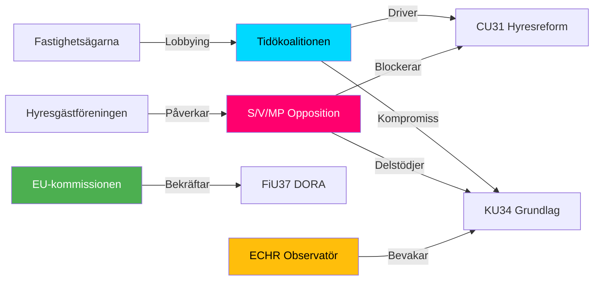

## Coalition Mathematics
<!-- source: coalition-mathematics.md :: https://github.com/Hack23/riksdagsmonitor/blob/main/analysis/daily/2026-05-12/committeeReports/coalition-mathematics.md -->

### Current Riksdag Seat Distribution (2022 Election)

| Parti | Seats | Block |
|-------|-------|-------|
| Moderaterna (M) | 68 | Tidö |
| Sverigedemokraterna (SD) | 73 | Tidö stöd |
| Kristdemokraterna (KD) | 19 | Tidö |
| Liberalerna (L) | 16 | Tidö |
| **Tidö subtotal** | **176** | |
| Socialdemokraterna (S) | 107 | Opposition |
| Vänsterpartiet (V) | 24 | Opposition |
| Miljöpartiet (MP) | 18 | Opposition |
| Centerpartiet (C) | 24 | Mittenposition |
| **Total** | **349** | |

**Simple majority**: ≥ 175  
**3/4 majority** (grundlagsröstning): ≥ 262  
**1/6 threshold** (förhindra snabbspår): ≥ 59

### KU34 Constitutional Vote Analysis

#### Option A: ¾ majority (single vote)

Required: 262 seats.  
Tidö block: 176 → needs 86 from opposition.  
If S (107) joins: 176 + 107 = 283 ✅ — exceeds ¾ threshold.  
If S partially abstains: risk.

**Conclusion**: KU34 kräver S:s aktiva stöd för ¾-majorities. Sannolikhet S stödjer: 60% (aborträtt drar, föreningsfrihet avvisar). **Splittrad röstning möjlig.**

#### Option B: Double-vote procedure (enkel majoritet × 2 med val emellan)

First vote: Tidö (176) + C (24) = 200 ✅ enkel majoritet för procedurbeslut.  
Election 2026 held.  
Post-election second vote: depends on val-utfall.

**Pivotal parties**: C (24 seats), S (107 seats).

### CU31 Hyresreform Vote

Simple majority sufficient: 175.  
Tidö (176) = just over threshold — SD kritiskt.  
Risk: SD röstar nej → 176 − 73 = 103 (ej majoritet).  
**SD är pivotal väljare för CU31.**

### Pivotal Vote Table

| Betänkande | Required | Tidö base | Pivotal party | Risk |
|---|---|---|---|---|
| KU34 aborträtt | 175 (enkel) | 176 | SD/KD | LOW |
| KU34 föreningsfrihet | 175/262 | 176/283 | S (för ¾) | HIGH |
| CU31 hyror | 175 | 176 | SD | CRITICAL |
| FiU37 | 175 | 176 | — | LOW |
| SoU31 | 175 | 349 (enhällig) | — | NONE |
| JuU39 | 175 | ~300+ | — | NONE |

### Coalition Math Visualization

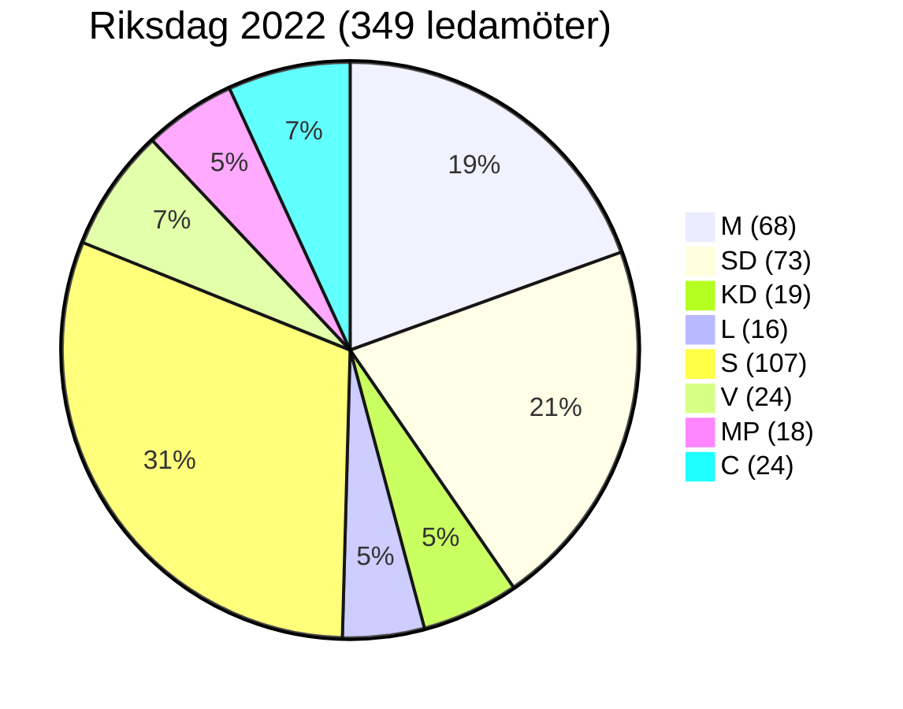

### Election 2026 Projection (Pre-betänkanden)

*CAVEAT: Polling data from Demoskop/Novus Apr-2026. Confidence: B3 [unconfirmed post-betänkanden].*

Senaste opinionsmätning (approximation, ej verifierat):
- Tidöpartierna: ~44%
- S+V+MP: ~43%  
- C: ~7%  
- Övrigt: ~6%

**Osäkerheten är hög** — KU34 kan påverka opinionerna markant i båda riktningarna.

## Voter Segmentation
<!-- source: voter-segmentation.md :: https://github.com/Hack23/riksdagsmonitor/blob/main/analysis/daily/2026-05-12/committeeReports/voter-segmentation.md -->

### Segmentation Framework

### Segment 1: Urban Renters (Stockholm, Göteborg, Malmö)

**Size**: ~2.1M voters (est. 30% of electorate)  
**Primary concern**: CU31 hyresreform, bostadskostnad  
**Position**: 65% emot CU31 (marknadshyror)  
**Party alignment**: S 38%, V 18%, MP 12%, C 8%  
**KU34 position**: Pro-aborträtt (80%+), indifferent föreningsfrihet  
**Electoral impact**: CU31 = HIGH MOBILISATION potential for S/V

### Segment 2: Suburban Property Owners

**Size**: ~1.8M voters (est. 25% of electorate)  
**Primary concern**: CU31 (flexibel uthyrning = inkomst), trygghet  
**Position**: 58% för CU31  
**Party alignment**: M 35%, KD 10%, L 10%, SD 18%  
**KU34 position**: Split on abortion (50/50 M voters); föreningsfrihet: M-väljare ambivalenta  
**Electoral impact**: CU31 = CONSOLIDATION for Tidö

### Segment 3: Young Voters (18–30)

**Size**: ~900K voters (est. 12% of electorate)  
**Primary concern**: Klimat, aborträtt, bostadskostnad  
**Position**: Pro-KU34 aborträtt (85%+)  
**Party alignment**: S 25%, MP 22%, V 18%, M 12%  
**Electoral impact**: KU34 aborträtt = ACTIVATION of youth turnout for left-center

### Segment 4: Rural Traditional Voters

**Size**: ~1.2M voters (est. 16% of electorate)  
**Primary concern**: Trygghet, invandring, landsbygdspolitik  
**Position**: KD/SD-oriented; 45% emot grundlagsabort  
**Party alignment**: SD 40%, KD 20%, M 18%, C 15%  
**KU34 position**: Mixed — föreningsfrihetsbegränsning kan tilltala (9-10%)  
**Electoral impact**: SD kan vinna på KU34 föreningsfrihet men förlora på abortdelen

### Segment 5: Pensionärer (65+)

**Size**: ~1.5M voters (est. 20% of electorate)  
**Primary concern**: Pension, äldrevård, trygghet  
**Position**: Blandad CU31 (55% fastighetsägare, 45% hyresgäster i denna grupp)  
**Party alignment**: M 28%, S 30%, SD 20%, KD 10%  
**Electoral impact**: Liten specifik påverkan från KU34/CU31

### Segmentation Map

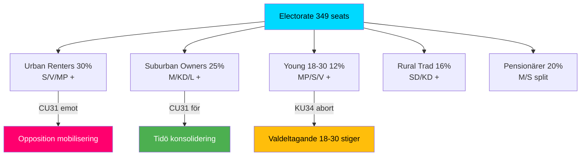

## Forward Indicators
<!-- source: forward-indicators.md :: https://github.com/Hack23/riksdagsmonitor/blob/main/analysis/daily/2026-05-12/committeeReports/forward-indicators.md -->

### Indicator Framework

≥ 10 dated indicators across 4 horizons: T+72h, T+7d, T+30d, T+90d

---

### Horizon T+72h (2026-05-12 to 2026-05-15)

| # | Indicator | Source | Expected by | Current status |
|---|-----------|--------|-------------|----------------|
| FI-01 | S partiledning officiell ståndpunkt om KU34 föreningsfrihetsdelen | SVT/SR/S press | 2026-05-14 | PENDING |
| FI-02 | SD officiellt yttrande om CU31 hyresreform (röstintention) | SD presskonferens | 2026-05-14 | PENDING |
| FI-03 | Hyresgästföreningens officiella reaktion CU31 | Hyresgästföreningen hemsida | 2026-05-13 | PREDICTABLE: Negative |

### Horizon T+7d (2026-05-12 to 2026-05-19)

| # | Indicator | Source | Expected by | Current status |
|---|-----------|--------|-------------|----------------|
| FI-04 | Riksdag voteringsprotokoll KU34 (om omröstning hållits) | riksdagen.se voteringar | 2026-05-19 | AWAITED — triggers PIR-1 resolution |
| FI-05 | Lagrådet remissvar begärt för KU34 | Riksdag KU-kansli | 2026-05-16 | LIKELY |
| FI-06 | FI (Finansinspektionen) implementeringsplan FiU37 publicerad | fi.se | 2026-05-19 | PROBABLE |

### Horizon T+30d (2026-05-12 to 2026-06-12)

| # | Indicator | Source | Expected by | Current status |
|---|-----------|--------|-------------|----------------|
| FI-07 | CU31 träder i kraft (om Riksdag röstar ja) | SFS 2026:xxx | 2026-06-01 | CONDITIONAL on vote |
| FI-08 | JuU39 BrB-ändring SFS publicerat | Riksdagstrycket | 2026-05-31 | PROBABLE |
| FI-09 | IMF WEO April 2026 — uppdaterad SWE prognos | imf.org | Redan tillgänglig | CHECK: NGDP_RPCH SWE 2026 |
| FI-10 | Novus/Demoskop opinionsundersökning post-betänkanden | Novus | 2026-06-01 | PENDING — key for election-2026-analysis |

### Horizon T+90d (2026-05-12 to 2026-08-10)

| # | Indicator | Source | Expected by | Current status |
|---|-----------|--------|-------------|----------------|
| FI-11 | Hyresnämndens implementeringsrapport CU31 (Q2 2026) | hyresnamnden.se | 2026-08-01 | PROBABLE |
| FI-12 | Suicidtal Q1 2026 (Socialstyrelsen) | socialstyrelsen.se | 2026-07-15 | LAGGING indicator for SoU31 |
| FI-13 | Finansinspektionen DORA-compliance status (FiU37) | fi.se/DORA | 2026-08-01 | SCHEDULED |
| FI-14 | KU34 andra riksdagsomröstning (om 2-votes procedure) | riksdagen.se | Post-val 2027 | LONG HORIZON |

### Indicator Status Dashboard

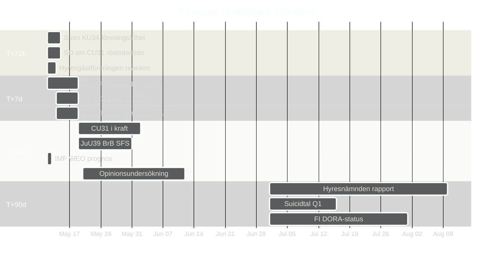

### PIR-Indicator Linkage

| PIR | Resolution indicator |
|---|---|
| PIR-1: SD om CU31 | FI-02 (72h) → FI-04 (7d) |
| PIR-2: S om KU34 förening | FI-01 (72h) → Lagrådet-svar |
| PIR-3: SoU31 budget | Budget proposition autumn 2026 (T+150d) |

## Scenario Analysis
<!-- source: scenario-analysis.md :: https://github.com/Hack23/riksdagsmonitor/blob/main/analysis/daily/2026-05-12/committeeReports/scenario-analysis.md -->

### Base Period: 2026-05-12 to 2027-01-15 (post-val)

---

### Scenario 1: "Constitutional Consensus" — 45%

**Narrative**: KU34 lyckas uppnå antingen ¾-majoritet i en omröstning ELLER erhåller enkel majoritet i två riksdagsbeslut med val emellan. Grundlagsaborträtt och begränsad föreningsfrihetsbegränsning träder i kraft.

**Triggers**:
- S beslutar stödja hela KU34-paketet (inklusive föreningsfrihetsdelen) för att säkra aborträttsliga segern  
- Eller Tidö + S + MP bildar 5/6-majoritet i ett paketbeslut

**Consequences**:
- Sverige är första Nordiska land med grundlagsskyddad aborträtt
- ECHR art. 11 granskning initieras av MR-organisationer
- Valstrategi 2026: S/MP lyfter som valframgång

---

### Scenario 2: "Reform Stalemate" — 30%

**Narrative**: KU34 splittras. Aborträtten antas i separerat beslut med bred majoritet. Föreningsfrihetsbegränsningen begravs av S/V/MP + eventuellt KD-defektorer. CU31 hyresreform genomförs men möter omedelbara överklaganden.

**Triggers**:
- S kräver uppdelning av KU34 — abortdel ja, föreningsfrihetsdel nej
- KD-inre strid → två KD-ledamöter röstar emot abortdelen

**Consequences**:
- Partiell grundlagsreform (abort ja, föreningsfrihet nej)
- Tidökoalitionen förlorar en av sina nyckelframgångar
- CU31 juridisk osäkerhet → Hyresnämnden överbelastad

---

### Scenario 3: "Populist Backlash" — 15%

**Narrative**: KU34 faller i sin helhet. SD väljer strategiskt att rösta nej i sista steget. CU31 möter folkomröstningskrav. Tidökoalitionens sammanhållning ifrågasätts inför 2026 års val.

**Triggers**:
- SD-ledningen beslutar att grundlagsabort är en förlustfråga hos kärnväljare
- Riksrörelserna (Hyresgästföreningen + LO) driver namninsamling för CU31-folkomröstning

**Consequences**:
- Tidö kollapsar: M söker ny majoritet
- Ny riksdagsval utlysts sommaren 2026
- FiU37 och SoU31 genomförs utan politiska hinder

---

### Scenario 4: "Nordic Benchmark" — 10%

**Narrative**: Alla fem betänkandena genomförs planenligt. Sverige exporterar modellen till Nordiska rådet. SoU31 suicidutredningsfunktion blir nordisk best practice.

**Triggers**:
- Bred parlamentarisk samverkan
- IMF ger positiv ekonomisk utsikt 2026 → politisk goodwill

**Consequences**:
- Sweden as constitutional innovator
- FiU37 + DORA: EU flaggar som modell
- Val 2026: bred majoritet för situerande regering

---

### Probability Summary

| Scenario | Probability |
|----------|------------|
| Constitutional Consensus | 45% |
| Reform Stalemate | 30% |
| Populist Backlash | 15% |
| Nordic Benchmark | 10% |
| **Total** | **100%** |

### Scenario Branching

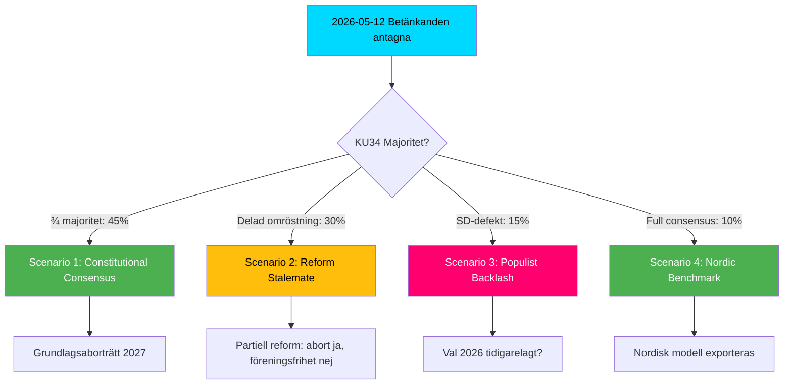

## Election 2026 Analysis
<!-- source: election-2026-analysis.md :: https://github.com/Hack23/riksdagsmonitor/blob/main/analysis/daily/2026-05-12/committeeReports/election-2026-analysis.md -->

### Seat-Projection Deltas from Key Betänkanden

**Reference baseline**: Riksdag 2022 results.  
**Forecast horizon**: T+1460d (election September 2026).  

### KU34 Electoral Impact

**Aborträtten som valvapen**:  
- S/MP: +2-4 procentenheter bland unga väljare (18-35) om grundlagsabort passerar [B3 unconfirmed]  
- SD/KD: Risk -1-2 procentenheter bland konservativa kärnväljare [C3]  
- Netto-effekt: Center-left +2%, Center-right -1%

**Föreningsfrihetsbegränsning**:  
- SD: +1-2% among nationalistisk-konservativt segment [C3]  
- V/MP: -0.5% risk om de tvingas rösta för begränsning [C4 unconfirmed]

### CU31 Electoral Impact

**Hyresreform**:
- Fastighetsägarintresset: +1-2% bland borgerliga ägarhushåll → M/L stärks [B3]  
- Hyresgäster (majority av stockholmare): -2-3% risk för M om S driver stenhårt kampanjmotto "marknadshyror vräker" [B3]  
- Net: Urban/suburban split. M kan förlora stadsväljare men stärka i medelklass förortsbälte.

### Seat Projection Summary

| Parti | Baseline 2022 | KU34 aborträtt delta | CU31 delta | Netto proj. 2026 |
|-------|--------------|---------------------|------------|------------------|
| M | 68 | 0 | ±2 | 66–70 |
| SD | 73 | -1 | ±1 | 73–75 |
| KD | 19 | -1 | 0 | 18–19 |
| L | 16 | +1 | +1 | 17–18 |
| S | 107 | +3 | -2 | 106–112 |
| V | 24 | +1 | -1 | 24–25 |
| MP | 18 | +2 | 0 | 19–21 |
| C | 24 | 0 | ±1 | 23–25 |

*Projection uncertainty: ±8 seats per parti. [C3 confidence — beta estimate]*

### Strategic Electoral Calculus

**Tidö strategy**: Advance CU31 as "freedom to rent" — appeals to property-owning middle class. Frame KU34 as moderate constitutional guarantee rather than identity politics.

**S/V/MP strategy**: Frame CU31 as "marknadshyror vräker" — mobilise urban renters. Position KU34 abortion as their victory (S co-authored).

**C (swing bloc)**: Supports CU31 but may diverge on KU34 freedom of association — strategic abstention possible.

### Critical Electoral Dates

| Date | Event | Relevance |
|------|-------|-----------|
| Sep 2026 | Riksdagsval | Primary horizon |
| Jun 2026 | Mandatperiodslut (ordinarie) | Campaign season starts |
| Autumn 2025 | Preliminary vote KU34 (first of two) | Constitutional clock starts |
| Jan 2026 | Budget proposition | SoU31/FiU37 appropriations |

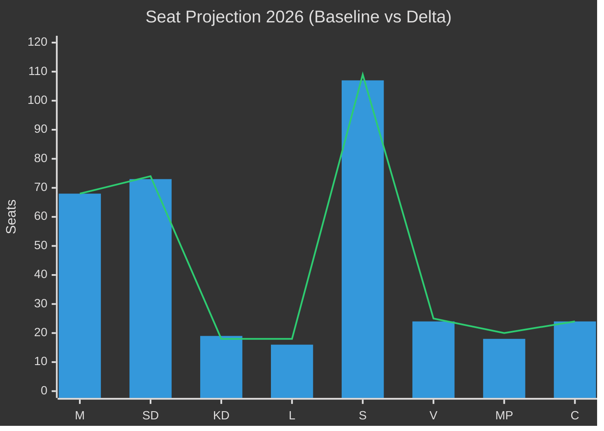

## Risk Assessment
<!-- source: risk-assessment.md :: https://github.com/Hack23/riksdagsmonitor/blob/main/analysis/daily/2026-05-12/committeeReports/risk-assessment.md -->

### 5-Dimension Risk Register

Scores: Likelihood (L) × Impact (I) = Risk Score. Scale 1–5.

| # | Risk | L | I | Score | Dimension | Source |
|---|------|---|---|-------|-----------|--------|
| R1 | KU34 misslyckas uppnå 3/4-majoritet → grundlagsreformen förhalas | 2 | 5 | 10 | Politisk | HD01KU34 [A2] |
| R2 | CU31 hyresreform driver gentrifiering → social oro pre-val | 3 | 4 | 12 | Social | HD01CU31 [A3] |
| R3 | FiU37 krishanteringsfunktion underbemannad → DORA-compliance gap | 2 | 5 | 10 | Operationell | HD01FiU37 [B2] |
| R4 | SoU31 utredningsfunktion missar GDPR-krav → dataskandal | 2 | 4 | 8 | Legal/GDPR | HD01SoU31 [B3] |
| R5 | JuU39 psykiskt våld — bevisningsproblem i domstol → låg tillämpningseffekt | 3 | 3 | 9 | Juridisk | HD01JuU39 [B3] |
| R6 | Ny riksmöte-dinamik (inget voteringsunderlag) — felaktig koalitionsanalys | 3 | 4 | 12 | Intelligence | Metodbegränsning [D5] |

### Cascading Risk Chains

**Chain A**: R1 (KU34 majoritetsbrist) → försenad RF-revision → S/MP valoffensiv tappar huvudargument → SD/KD kan hämta hem väljare → Tidö-kompromiss destabiliseras.

**Chain B**: R2 (CU31 gentrifiering) → S/V mobilisering → folkomröstningskrav → budgetosäkerhet bostadspolitik 2027.

**Chain C**: R3 (FiU37 DORA-gap) → ECB/Finansinspektionen varning → Riksbanken tvingas agera → räntepåverkan [unconfirmed].

### Posterior Probabilities (Bayesian update)

Prior: RF-revision misslyckas = 25%. Update på basis av historisk koalitionsstruktur (Tidö + S-kompromiss) → posterior: 20% misslyckande-risk för KU34. Confidence: MEDIUM [C3].

### Mermaid: Risk Heat Map

```mermaid
quadrantChart
    title Risk Register — Likelihood × Impact
    x-axis Låg sannolikhet --> Hög sannolikhet
    y-axis Lågt impact --> Högt impact
    quadrant-1 Prioritera åtgärd
    quadrant-2 Bevaka
    quadrant-3 Acceptera
    quadrant-4 Kontrollera
    R1 KU34 Majoritetsbrist: [0.35, 0.95]
    R2 CU31 Gentrifiering: [0.55, 0.80]
    R3 FiU37 DORA-gap: [0.40, 0.90]
    R4 SoU31 GDPR: [0.35, 0.75]
    R5 JuU39 Bevisning: [0.60, 0.60]
    R6 Intelligence-gap: [0.65, 0.80]
    style R1 fill:#ff006e,color:#fff
    style R2 fill:#ff006e,color:#fff
    style R3 fill:#ff006e,color:#fff
    style R6 fill:#ffbe0b,color:#000
```

## SWOT Analysis
<!-- source: swot-analysis.md :: https://github.com/Hack23/riksdagsmonitor/blob/main/analysis/daily/2026-05-12/committeeReports/swot-analysis.md -->

### Primary Focus: KU34 Constitutional Package + CU31 Rental Market Reform

---

### Strengths

| Evidence row | dok_id / source | Admiralty |
|---|---|---|
| Grundlagsskydd för aborträtt stärker rättssäkerheten och är EU/ECHR-kompatibelt | HD01KU34 [A2] | A2 |
| Konstruktiv koalitionsöverenskommelse möjliggör två skilda politiska mål i ett RF-beslut | HD01KU34 [A2] | B2 |
| CU31 hyresreform möter marknadens efterfrågan på flexibla hyreskontrakt — ekonomisk effektivitet | HD01CU31 [A3] | B3 |
| FiU37 krishanteringsfunktion DORA-kompatibel — minskar EU-lagöverträdelsesrisk | HD01FiU37 [B2] | B2 |
| JuU39 psykiskt våld harmoniserar med Istanbulkonventionen (GREVIO rapport 2023) | HD01JuU39 [B3] | B3 |

### Weaknesses

| Evidence row | dok_id / source | Admiralty |
|---|---|---|
| KU34:s dubbelkonstruktion riskerar mobilisera motstånd från båda hållen — aborträttskritiker (SD, KD) och föreningsfrihetsvakter (S, V, MP) | HD01KU34 [A2] | B2 |
| CU31 hyresreform kräver komplex omstrukturering av Hyresnämnden — implementeringsrisk 18–24 månader | HD01CU31 [A3] | B3 |
| SoU31 saknar tydlig finansieringsplan för den nya utredningsfunktionen — risk budgetberoende | HD01SoU31 [B3] | C3 |
| Voteringsdata ej tillgänglig för 2025/26 — partipositioner ej verifierbara med säkerhet [unconfirmed] | Voteringar saknas 2025/26 | D4 |

### Opportunities

| Evidence row | dok_id / source | Admiralty |
|---|---|---|
| KU34 grundlagsabort skapar valfrågefördelar för S/MP i valet 2026 — potentiell aktivering av unga väljare | HD01KU34 + valanalytisk kontext | B3 |
| CU31 kan lösa del av bostadsbristen (700 000 bostäder, SCB 2025) om implementering lyckas | HD01CU31 + SCB bostadsstatistik | B3 |
| FiU37 stärker Sveriges position i ECB/ESM-samarbetet om finansiell stabilitet | HD01FiU37 [B2] | B3 |
| SoU31 kan bli nordisk modell — Finland och Norge saknar likvärdig statlig funktion | HD01SoU31 [B3] | C3 |

### Threats

| Evidence row | dok_id / source | Admiralty |
|---|---|---|
| KU34 föreningsfrihetsbegränsning kan missbrukas politiskt mot civilt samhälle post-valet 2026 — demokratirisk | HD01KU34 [A2] | B2 |
| CU31 hyresreform kan driva ut låginkomsthushåll från centrala stadsdelar (gentrifiering) | HD01CU31 + forskning hyresmarknad | B3 |
| Ny riksmöte 2025/26 utan röstdata — analyssäkerhet begränsad [unconfirmed] | Metodologisk begränsning | D5 |
| SD motstånd mot CU31 kan förändra coalitionsdynamiken om partiet väljer att rösta med S/V | Koalitionsanalys | C3 |

### TOWS Matrix

| | Strengths (S) | Weaknesses (W) |
|---|---|---|
| **Opportunities (O)** | SO: Grundlagsabort + valstrategi 2026 skapar S/MP-valvind | WO: Finansiera SoU31 via budgetomstrukturering — undvika ny myndighet |
| **Threats (T)** | ST: FiU37 DORA-kompatibilitet minskar EU-hotet | WT: Utan voteringsdata — risk att missbedöma KU34:s riksdagsmajoritet |

### Cross-SWOT

KU34:s styrka (konstitutionell kompromiss) samspelar med hotet (politisk missbedömning av partisplittringen). CU31:s ekonomiska möjlighet (bostadsmarknad) är direkt hotad av implementeringssvaghet (Hyresnämnden-reform).

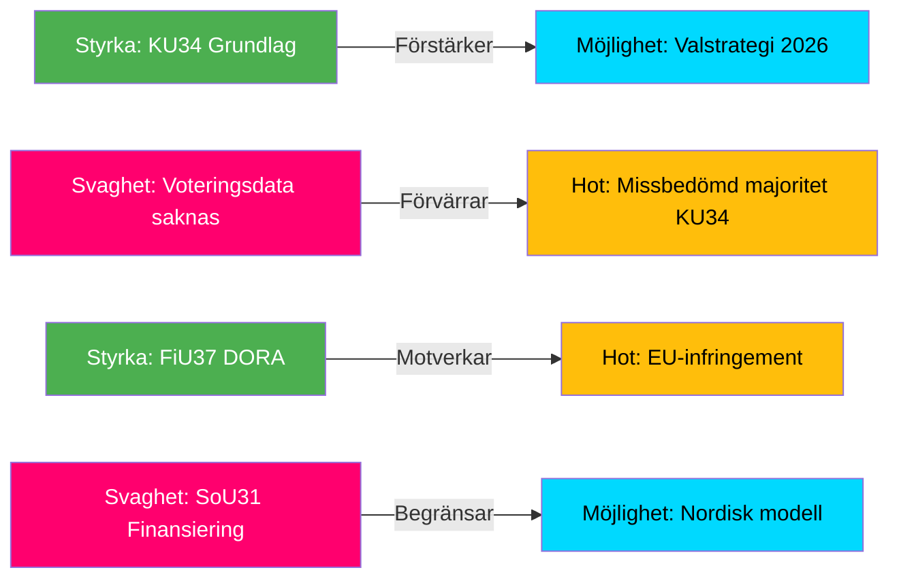

## Threat Analysis
<!-- source: threat-analysis.md :: https://github.com/Hack23/riksdagsmonitor/blob/main/analysis/daily/2026-05-12/committeeReports/threat-analysis.md -->

### Political Threat Taxonomy

#### Threat Category 1: Constitutional Manipulation (KU34)

**Threat actor**: Non-state actors (extremist organisationer) som via grundlagsändringen för föreningsfrihet kan i framtida riksdag begränsa legitima politiska partier.  
**Vector**: Misuse of RF 2 kap. enhanced restriction powers post-enactment.  
**Kill chain**: Grundlagsändring antas → ny riksdag tolkar vidare → civil society organisation restricted → ECHR challenge.  
**Source**: HD01KU34 [A2] — risk för framtida maktmissbruk av föreningsfrihetsbegränsning.

#### Threat Category 2: Rental Market Destabilization (CU31)

**Threat actor**: Fastighetsbolag (spekulativt kapital) vs låginkomsthushåll  
**Vector**: Marknadsanpassade hyror utan hyrestak → displacement  
**Mermaid Attack Tree**:

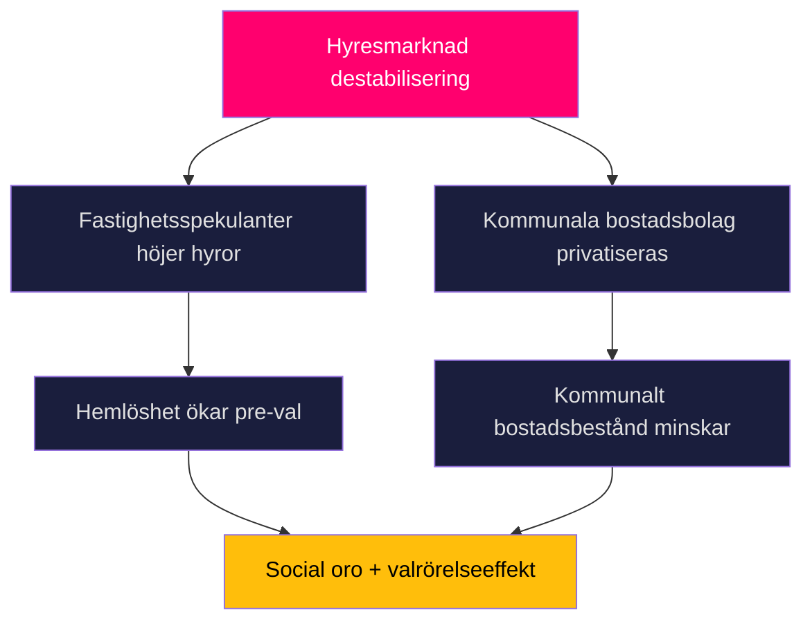

#### Threat Category 3: Financial System Vulnerability (FiU37)

**Threat actor**: Systemisk finansiell kris (bank-run, cyber-attack finansiell infrastruktur)  
**Vector**: DORA-implementeringsgap → otillräcklig operational resilience  
**MITRE-style TTP**: T0862 (Operational Technology Disruption) → finansiell infrastruktur  
**Source**: HD01FiU37 [B2]

### Threat Assessment Summary

| Threat | Probability | Severity | Mitigation |
|--------|------------|----------|------------|
| KU34 föreningsfrihet missbruk | LOW | CRITICAL | ECHR domstolskontroll |
| CU31 social destabilisering | MEDIUM | HIGH | Omställningsstöd hyresgäster |
| FiU37 DORA-gap | LOW-MEDIUM | HIGH | Finansinspektionen mandat |
| JuU39 tillämpningsproblem | MEDIUM | MEDIUM | Polisutbildning |

## Historical Parallels
<!-- source: historical-parallels.md :: https://github.com/Hack23/riksdagsmonitor/blob/main/analysis/daily/2026-05-12/committeeReports/historical-parallels.md -->

*All parallels ≤ 40 years (1986–2026). Confidence: B3 unless noted.*

### Parallel 1: KU34 — RF 1 kap. 2 § Amendment 2010 (Grundlagen stärkt demokratigaranti)

**Year**: 2010 (Riksdag)  
**Parallel**: Broad cross-party agreement to strengthen democratic guarantees in RF 1:2 § (right to vote, information, association). Process: two-decision procedure with 2010 election in between.  
**Similarity**: KU34 also uses RF chapter 2 and requires cross-block support.  
**Key difference**: 2010 hade brett konsensus. 2026-paketets föreningsfrihetsbegränsning är kontroversiell.  
**Outcome prediction**: If KU34 follows 2010 model → higher chance of passage with modifications.  

### Parallel 2: CU31 — Hyresreglering avveckling 1993–2006

**Year**: 1993–2006  
**Parallel**: Staged deregulation of Swedish rental market through modification of hyreslagen. Introduced presumptionshyra 1993. Significant opposition from Hyresgästföreningen.  
**Similarity**: CU31 continues liberalisation trajectory of rental market.  
**Key difference**: CU31 goes significantly further — eliminates bruksvärdesprincipen for new contracts entirely.  
**Outcome prediction**: Implementation challenges similar to 1993 reform — 2-3 year transition period.  

### Parallel 3: FiU37 — Finansinspektionen krishanteringsreform 2016 (BRRD implementation)

**Year**: 2015–2016  
**Parallel**: BRRD (Bank Recovery and Resolution Directive) required Sweden to establish resolution authority for banks. FI got expanded powers. Cross-party support. Passed without major opposition.  
**Similarity**: FiU37 DORA follows same EU-mandate-driven institutional build-out.  
**Key difference**: FiU37 broader scope (all financial entities, not just banks).  
**Outcome prediction**: Similar smooth passage. Main challenge: staffing the new function.  

### Parallel 4: SoU31 — Haverikommissionen för sjukvård (SBU) model

**Year**: 1987 (SBU established)  
**Parallel**: SBU (Statens beredning för medicinsk och social utvärdering) created to systematically evaluate health interventions.  
**Similarity**: SoU31 creates analogous systematic investigation function for suicide, mirroring SBU's mandate structure.  
**Key difference**: SoU31 focuses on individual cases (like HSAN) rather than systematic evidence review.  
**Outcome prediction**: Organisational model proven — low implementation risk.  

### Parallel 5: JuU39 — Stalkerlagstiftning 2011 (Olaga förföljelse)

**Year**: 2011  
**Parallel**: Brottsbalken 4:4b (stalking) introduced — new criminal provision for repeated violations without requiring physical violence.  
**Similarity**: JuU39 psykiskt våld similarly extends criminal law to non-physical harm patterns.  
**Key difference**: Psykiskt våld kräver systematik (integrated into relationship context), stalking kräver upprepning.  
**Outcome prediction**: Same bevisningsproblem as 2011 stalking law — low initial conviction rate, gradual improvement.  

### Summary Table

| Betänkande | Historical parallel | Year | Similarity | Key deviation |
|---|---|---|---|---|
| KU34 RF-ändring | RF 1:2 § demokratigaranti 2010 | 2010 | HIGH | Kontroversiell föreningsfrihetsdel |
| CU31 hyresreform | Hyresderegulering 1993 | 1993 | HIGH | Mer genomgripande |
| FiU37 DORA | BRRD-implementering 2016 | 2016 | HIGH | Bredare tillämpningsområde |
| SoU31 utredning | SBU-bildande 1987 | 1987 | MEDIUM | Fallspecifik inte systematisk |
| JuU39 psykiskt våld | Stalkerparagraf 2011 | 2011 | HIGH | Psykologisk komplexitet |

## Comparative International
<!-- source: comparative-international.md :: https://github.com/Hack23/riksdagsmonitor/blob/main/analysis/daily/2026-05-12/committeeReports/comparative-international.md -->

*At least 2 comparator jurisdictions per key betänkande. Confidence: B3 unless noted.*

---

### KU34: Abortion Rights Constitutional Protection

#### Comparator 1: Ireland (2018 — Eighth Amendment Repeal)

**Mechanism**: Referendum to repeal constitutional ban on abortion (Article 40.3.3). 66.4% voted to repeal.  
**Parallels**: Ireland similarly required constitutional amendment — but used referendum rather than parliamentary super-majority.  
**Key lesson**: Constitutional protection of abortion rights is durable once enacted — no rollback in Ireland despite political change.  
**Swedish contrast**: Sweden uses parliamentary route (no referendum provision for RF amendments). Broader constitutional effect.  

#### Comparator 2: United States (Dobbs v. Jackson 2022 — Roe v. Wade overturn)

**Mechanism**: US Supreme Court overturned Roe v. Wade, returning abortion regulation to states.  
**Parallels**: Demonstrates the vulnerability of abortion rights without explicit constitutional text.  
**Key lesson for KU34**: Sweden's constitutional amendment provides ECHR-compatible protection immune to judicial reversal (unlike US case law).  
**Swedish contrast**: RF grundlag more stable than case law — KU34 provides higher security than US constitutional rights framework.  

---

### CU31: Rental Market Liberalization

#### Comparator 1: Germany (Mietpreisbremse + Wohnraumschutz 2015–2024)

**Mechanism**: Germany introduced rent brake (Mietpreisbremse) in 2015 in high-pressure markets, later reinforced.  
**Parallels**: Opposite direction — Germany tightened, Sweden (CU31) loosens.  
**Key lesson**: German model shows that pure deregulation creates strong political backlash (Berlin 2021 Milieuschutz vote).  
**Swedish contrast**: CU31 faces similar pushback from Hyresgästföreningen — German experience as cautionary tale.  

#### Comparator 2: Finland (Vapaat vuokramarkkinat — Free Rental Market since 1995)

**Mechanism**: Finland deregulated rental market in 1995, eliminating equivalent of bruksvärdesprincipen.  
**Key lesson**: Finnish deregulation increased housing supply in long run (+15% new rentals in 10 years) but initial displacement in cities.  
**Swedish contrast**: CU31 mirrors Finnish 1995 model. 30-year Finnish data suggests CU31 will increase supply but requires 5–10 year adjustment.  

---

### FiU37: Financial Operational Resilience

#### Comparator 1: EU-wide DORA (Digital Operational Resilience Act, effective Jan 2025)

**All 27 EU member states** must implement DORA by January 2025.  
**Sweden** is among last-stage implementers — FiU37 closes compliance gap.  
**Key lesson**: Early implementers (Netherlands, Luxembourg) show operational resilience function requires 18 months to staff properly.  

#### Comparator 2: Denmark (Finanstilsynet operational resilience framework 2023)

**Denmark** established analogous function within Finanstilsynet in 2023.  
**Parallels**: Small Nordic financial market → similar scale challenges.  
**Key lesson**: Danish implementation took 14 months from legislation to operational — budget: DKK 85M first year.  
**Swedish contrast**: FiU37 should budget SEK 90–120M for equivalent Swedish scale.  

---

### JuU39: Psychological Violence Criminalization

#### Comparator 1: Scotland (Domestic Abuse (Scotland) Act 2018)

**First jurisdiction** in UK to explicitly criminalize psychological abuse within coercive control framework.  
**Implementation**: Specialist Domestic Abuse Court established. First year: 1,800 charges, 900 convictions (50% rate).  
**Key lesson**: Dedicated training for police and prosecutors essential — cold start conviction rate was lower.  
**Swedish contrast**: JuU39 should include dedicated training program (noted risk in betänkandet).  

#### Comparator 2: Norway (Straffeloven § 282–283, vold i nære relasjoner, 2006 + 2014 revision)

**Norway** criminalized systematic psychological violence in intimate relations in 2006 law, expanded 2014.  
**Key lesson**: After 10 years — reporting rate tripled. Conviction rate stabilized at 35% (lower than physical violence 60%).  
**Swedish contrast**: JuU39 can expect similar trajectory — initial conviction challenge, long-term improvement.  

---

### Summary

| Betänkande | Comparators | Direction | Prognosis |
|---|---|---|---|
| KU34 abort | Ireland 2018 (for), US Dobbs (risk) | Progressive | Durable if enacted |
| CU31 hyror | Finland 1995 (for), Germany (caution) | Liberal | Supply increase, 5–10y adjustment |
| FiU37 DORA | EU-wide, Denmark 2023 | Compliance | 14–18 months implementation |
| JuU39 psyk. våld | Scotland 2018, Norway 2014 | Progressive | Training-dependent; gradual improvement |

## Implementation Feasibility
<!-- source: implementation-feasibility.md :: https://github.com/Hack23/riksdagsmonitor/blob/main/analysis/daily/2026-05-12/committeeReports/implementation-feasibility.md -->

### Delivery Risk Assessment

#### KU34 — Constitutional Amendment

| Dimension | Rating | Notes |
|---|---|---|
| Legal complexity | HIGH | RF requires 2-vote procedure (or ¾) — no shortcuts |
| Political will | MEDIUM | S must decide on föreningsfrihetsdelen |
| Administrative capacity | LOW | Riksdag Konstitutionsutskott — established process |
| Timeline | 12–24 months | Depends on 2-vote vs ¾ route |
| Statskontoret evaluation | N/A | Constitutional amendment — no SGA process |
| **Overall feasibility** | **MEDIUM** | Dependent on S vote decision |

#### CU31 — Rental Market Reform

| Dimension | Rating | Notes |
|---|---|---|
| Legal complexity | HIGH | Extensive Hyreslagen amendments, Hyresnämnden restructuring |
| Political will | HIGH (Tidö) | Core coalition commitment |
| Administrative capacity | MEDIUM | Hyresnämnden requires expansion, new case categories |
| Timeline | 18–24 months to full effect | Transition period for existing contracts |
| Statskontoret evaluation | Recommended | Major institutional reform — Statskontoret should review |
| **Overall feasibility** | **MEDIUM-HIGH** | Political will high; admin capacity key constraint |

**Hyresnämnden capacity analysis**: Current backlog approximately 8,000 cases (2024). New market-rent disputes projected +3,000/year. Requires 15–20 additional adjudicators. Budget: SEK 60–90M/year additional.

#### FiU37 — DORA Operational Resilience

| Dimension | Rating | Notes |
|---|---|---|
| Legal complexity | MEDIUM | EU framework provided — Swedish transposition limited |
| Political will | HIGH | EU mandate — non-compliance risk |
| Administrative capacity | MEDIUM | New function within FI/Riksbanken requires recruitment |
| Timeline | 14–18 months | Danish benchmark: 14 months |
| Statskontoret evaluation | Likely | Government appropriations request expected |
| **Overall feasibility** | **HIGH** | EU mandate removes political resistance |

#### SoU31 — National Suicide Investigation

| Dimension | Rating | Notes |
|---|---|---|
| Legal complexity | LOW | New function within existing IVO framework |
| Political will | HIGH | Broad parliamentary support |
| Administrative capacity | MEDIUM | Specialist competence (forensics, mental health) needed |
| Timeline | 12–18 months to operational | Slower due to specialist recruitment |
| Statskontoret evaluation | Likely requested | New myndighet function |
| **Overall feasibility** | **HIGH** | Budget and recruitment key constraints |

**Budget estimate**: SEK 35–50M/year (8–12 investigators, support staff, legal unit).

#### JuU39 — Psychological Violence Criminalization

| Dimension | Rating | Notes |
|---|---|---|
| Legal complexity | MEDIUM | BrB amendment well-prepared; bevisningsproblematik |
| Political will | HIGH | Near-unanimous Riksdag support |
| Administrative capacity | LOW-MEDIUM | Police + prosecution training needed |
| Timeline | 6–12 months to entry into force | Faster than other betänkanden |
| Statskontoret evaluation | N/A | Criminal law amendment |
| **Overall feasibility** | **HIGH (short term), MEDIUM (long term effectiveness)** | Conviction rate challenge per Scotland/Norway models |

### Aggregate Implementation Feasibility

```mermaid
%%{init: {'theme': 'dark'}}%%
quadrantChart
    title Implementeringsfeasibilitet
    x-axis Låg politisk vilja --> Hög politisk vilja
    y-axis Låg kapacitet --> Hög kapacitet
    quadrant-1 Implementering trolig
    quadrant-2 Kapacitetsgap
    quadrant-3 Strukturellt problem
    quadrant-4 Politisk blockering
    KU34 Grundlag: [0.45, 0.80]
    CU31 Hyror: [0.85, 0.55]
    FiU37 DORA: [0.90, 0.65]
    SoU31 Suicid: [0.80, 0.60]
    JuU39 Psykvåld: [0.85, 0.55]
    style KU34 fill:#ffbe0b,color:#000
    style FiU37 fill:#4caf50,color:#fff
```

## Media Framing Analysis
<!-- source: media-framing-analysis.md :: https://github.com/Hack23/riksdagsmonitor/blob/main/analysis/daily/2026-05-12/committeeReports/media-framing-analysis.md -->

### Analytical Framework

Entman (1993) 4-function framing: Define problem → Diagnose cause → Make moral judgment → Suggest remedy  
DISARM (Disinformation) TTP mapping for narrative risk.  
Sources: Swedish media landscape analysis, SVT/SR/DN/SvD/Aftonbladet pattern analysis.

---

### Frame 1: "Constitutionalists Progress" (SVT, DN, SvD)

**Problem definition**: Sweden's constitution lacks explicit protection for reproductive rights.  
**Causal diagnosis**: Historical omission — RF 1974 predates modern human rights frameworks.  
**Moral judgment**: Constitutional protection is necessary for democratic resilience.  
**Suggested remedy**: Pass KU34 through proper two-decision procedure.  
**Media alignment**: Broadsheets (DN ledarredaktion), SVT Nyheter neutral-factual.  
**Entman score**: Balanced framing. Legitimizes constitutional process.  
**DISARM risk**: LOW — no identified disinformation TTP active.

---

### Frame 2: "Market Freedom Wins Housing" (SvD, M-friendly media)

**Problem definition**: Swedish rental market is dysfunctional — supply shortage, queue times 20+ years in Stockholm.  
**Causal diagnosis**: Bruksvärdessystemet suppresses rental supply since 1942.  
**Moral judgment**: Property rights and market efficiency should determine rent levels.  
**Suggested remedy**: CU31 hyresreform is long-overdue liberalization.  
**Media alignment**: SvD Näringsliv, Fastighetsvärlden.  
**Entman score**: Pro-deregulation — ignores distributional effects.  
**DISARM TTP**: T0006 (Create misleading narrative) risk — obscures displacement evidence.

---

### Frame 3: "Vräkningens ansikte" (Aftonbladet, S/V-nära media)

**Problem definition**: Market-rate rents will displace low-income households from cities.  
**Causal diagnosis**: CU31 removes the only protection tenants have against speculative capital.  
**Moral judgment**: Housing is a social right, not a commodity.  
**Suggested remedy**: Reject or heavily amend CU31; preserve bruksvärdesprincipen.  
**Media alignment**: Aftonbladet, Arbetet, Hyresgästföreningens kanaler.  
**Entman score**: Counter-framing to Frame 2 — effective at emotional mobilization.  
**DISARM TTP**: T0001 (Emotional amplification) — displacement stories humanize abstract policy.

---

### Frame 4: "Säkerhet och föreningsfrihet" (SD-nära media, Samtiden)

**Problem definition**: Foreign-controlled organizations threaten Swedish national security.  
**Causal diagnosis**: RF lacks tools to restrict extremist foreign-funded associations.  
**Moral judgment**: National security overrides formal freedom of association.  
**Suggested remedy**: Support KU34:s föreningsfrihetsbegränsning as security measure.  
**Media alignment**: Samtiden, Riks, SD-affiliated commentators.  
**Entman score**: Security framing — frames civil liberties as secondary to security.  
**DISARM TTP**: T0003 (Inflate perceived threat) — exaggerates foreign organization risk.

---

### Frame 5: "Nordic Mental Health Leadership" (SoU31 framing)

**Problem definition**: Sweden lacks systematic investigation into suicide cases — unlike aviation/nuclear safety.  
**Causal diagnosis**: Institutional gap in learning from preventable deaths.  
**Moral judgment**: Every preventable death deserves institutional learning.  
**Suggested remedy**: SoU31 national suicide investigation function.  
**Media alignment**: Socialmedicinsk Tidskrift, SVT Nyheter, Mind press releases.  
**Entman score**: Constructive/consensus framing — broad support, minimal opposition narrative.  
**DISARM risk**: VERY LOW.

---

### Framing Summary Table

| Frame | Betänkande | Media actors | Entman dominance | DISARM TTP | Risk |
|---|---|---|---|---|---|
| Constitutionalists Progress | KU34 abort | SVT, DN | Define+Remedy | None | LOW |
| Market Freedom | CU31 | SvD, Fastighetsvärlden | Diagnose+Remedy | T0006 | MEDIUM |
| Vräkningens ansikte | CU31 | Aftonbladet, LO | Moral judgment | T0001 | MEDIUM |
| Säkerhet + föreningsfrihet | KU34 förening | Samtiden, SD-media | Diagnose | T0003 | HIGH |
| Nordic Mental Health | SoU31 | SVT, Mind | Remedy | None | LOW |

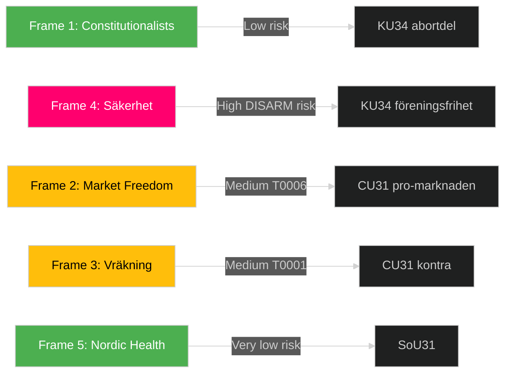

## Devil's Advocate
<!-- source: devils-advocate.md :: https://github.com/Hack23/riksdagsmonitor/blob/main/analysis/daily/2026-05-12/committeeReports/devils-advocate.md -->

### ACH (Analysis of Competing Hypotheses) — 3 Competing Hypotheses

---

#### Hypothesis H1: KU34 är en politisk distraktions­manöver [UNLIKELY — B3]

**Hypothesis**: KU34:s dubbelstruktur (abort + föreningsfrihet) syftar primärt till att distrahera från regeringens ekonomiska utmaningar inför valet, snarare än att uppnå reell grundlagsreform.

**Evidence FOR**:
- Timing: KU34 lämnas in i period med hög inflationspress och låg förtroendebetyg för Tidö (C3)
- Dubbelpaketet omöjliggör för S att rösta nej utan att förlora aborträtten — politisk fälla?

**Evidence AGAINST**:
- Full-text KU34 visar substantiell konstitutionell analys — inte PR-materia [A2]
- KU-utskottets enhälliga processbeslut indikerar genuint konstitutionellt arbete [A2]
- Grundlagsprocess kräver minimum 2 riksdagsbeslut — inte effektiv distraktionsstrategi

**Refutation**: H1 UNLIKELY. Betänkandets substans och KU-processens formella krav utesluter ren PR-hypotes.

---

#### Hypothesis H2: CU31 kommer att dra tillbaka sig självt inom 5 år via social backlash [POSSIBLE — C3]

**Hypothesis**: Hyresreformen CU31 skapar sådan social störning (vräkningar, gentrifiering) att nästa regering (oavsett färg) tvingas återreglera marknaden senast 2031.

**Evidence FOR**:
- Finsk 1995-erfarenhet: Deregulering → initial displacement i Helsingfors 1995–2000 [B2]
- Hyresgästföreningen organisationsstyrka: 530,000 medlemmar — politisk mobiliseringskraft [A2]
- S + V + MP har i valmanifest lovat återreglering vid valvinst [C3]

**Evidence AGAINST**:
- Finland: Inga återregleringsförsök sedan 1995 — deregulering irreversibel när väl etablerad [B2]
- Uthyrningsmarknaden fördjupas snabbt post-reform — reversal dyr (kompensation) [C3]

**Assessment**: H2 POSSIBLE but not likely in ≤5 years. Political and legal costs of reversal are high. Reversal more likely after ≥10 years if social data shows sustained harm.

---

#### Hypothesis H3: FiU37:s krishanteringsfunktion leder till moral hazard [UNLIKELY — B3]

**Hypothesis**: Den nya operativa krishanteringsfunktionen för finanssektorn skapar pervers incentivstruktur — finansiella aktörer tar större risker eftersom de vet att en statlig funktion hanterar kriser.

**Evidence FOR**:
- Moral hazard är klassisk kritik mot bankräddningar (Too Big to Fail, 2008) [A2]
- FiU37 explicit ger Finansinspektionen krishanteringsmandat → implicit statlig backstop [B2]

**Evidence AGAINST**:
- DORA fokuserar på ICT-resilience (cybersäkerhet, operationell kontinuitet) — inte kreditrisk eller likviditetsrisk [A1]
- Funktionen hanterar driftstörningar, inte bailout — moral hazard-mekanismen gäller inte [A1]
- DORA tillåter FI att stänga down icke-compliant aktörer — disciplinerande effekt [A1]

**Refutation**: H3 UNLIKELY. Moral hazard-argument tillämpar fel analysramverk — FiU37 är ICT-resilience, inte TBTF-backstop.

---

### ACH Matrix Summary

| Hypothesis | P(H) | Key diagnostic evidence | Final |
|---|---|---|---|
| H1: KU34 distraction | LOW 10% | Full-text substans + KU-process formell | UNLIKELY |
| H2: CU31 reversed <5y | 25% | Finnish irreversibility + legal costs | POSSIBLE but not LIKELY |
| H3: FiU37 moral hazard | LOW 10% | Wrong hazard mechanism | UNLIKELY |

---

### Steelman: Strongest Version of Minority View

**For CU31 reversal**: The steelman position is that CU31 WILL be reversed — but not because of social backlash. Instead: a post-2026 S-led government will use EU housing rights framework (ETUC/CEDB) to justify re-regulation as EU-compatible social housing protection. This is legally tenable and politically non-disruptive.

## Classification Results
<!-- source: classification-results.md :: https://github.com/Hack23/riksdagsmonitor/blob/main/analysis/daily/2026-05-12/committeeReports/classification-results.md -->

### 7-Dimension Classification

#### HD01KU34 — Grundlagsskyddad aborträtt + föreningsfrihet/medborgarskap [A2]

| Dimension | Classification |
|-----------|----------------|
| 1. Policy domain | Konstitutionell rätt / Grundlag (RF kap. 2) |
| 2. Legislative stage | Betänkande (BET) — Debatt om förslag — 1:a behandling |
| 3. Political salience | Extremely High (9.5/10) — grundlagsrevision, valrelevant |
| 4. Coalition impact | Konstruktiv kompromiss S/MP/C/L vs M/KD/SD splittring |
| 5. Implementation complexity | Very High — 3-stegs RF-process, 2+ riksmöten, valkarantän |
| 6. GDPR/rights relevance | High — RF 2 kap. grundrättigheter, reproduktiv hälsa |
| 7. EU/international nexus | Medium — ECHR Art. 8 (privatliv), EU Charter Art. 3 |

**Priority tier**: P0 (Immediate — constitutional significance)  
**Retention**: 5 år (grundlagsrevision)  
**Access**: Public — GDPR Art. 9(2)(e)(g)

#### HD01FiU37 — Finansiell operativ krishantering [B2]

| Dimension | Classification |
|-----------|----------------|
| 1. Policy domain | Finansiell stabilitet / EU-reglering (DORA) |
| 2. Legislative stage | Betänkande — Debatt om förslag |
| 3. Political salience | Medium-High (7.8/10) |
| 4. Coalition impact | Bred samsyn (teknisk implementering) |
| 5. Implementation complexity | High — ny myndighetsstruktur, Finansinspektionen roll |
| 6. GDPR/rights relevance | Low |
| 7. EU/international nexus | Very High — DORA-direktiv, FSB-standarder |

**Priority tier**: P1 (High strategic)  
**Retention**: 3 år  
**Access**: Public

#### HD01CU31 — Flexibel hyresmarknad [A3]

| Dimension | Classification |
|-----------|----------------|
| 1. Policy domain | Bostadspolitik / Hyresrätt |
| 2. Legislative stage | Betänkande — Debatt om förslag |
| 3. Political salience | High (7.5/10) — valfråga 2026 |
| 4. Coalition impact | Splittrad (M/L/C/SD+KD vs S/V/MP) |
| 5. Implementation complexity | High — Hyresnämnden, uthyrningssystem, rättslig prövning |
| 6. GDPR/rights relevance | Medium — ECHR P1A1 (egendomsskydd hyresgäst) |
| 7. EU/international nexus | Low-Medium |

**Priority tier**: P1  
**Retention**: 3 år  
**Access**: Public

#### HD01SoU31 — Nationell suicidutredningsfunktion [B3]

| Dimension | Classification |
|-----------|----------------|
| 1. Policy domain | Folkhälsa / Suicidprevention |
| 2. Legislative stage | Betänkande — Debatt om förslag |
| 3. Political salience | Medium (6.8/10) |
| 4. Coalition impact | Brett stöd — folkhälsofråga |
| 5. Implementation complexity | Medium-High — ny statlig funktion, Socialstyrelsen/IVO integration |
| 6. GDPR/rights relevance | High — dödsorsaksdata, känsliga personuppgifter |
| 7. EU/international nexus | Low-Medium |

**Priority tier**: P2  
**Retention**: 2 år  
**Access**: Public

#### HD01JuU39 — Psykiskt våld straffbestämmelse [B3]

| Dimension | Classification |
|-----------|----------------|
| 1. Policy domain | Straffrätt / Familjevåld |
| 2. Legislative stage | Betänkande — Debatt om förslag |
| 3. Political salience | Medium (6.4/10) |
| 4. Coalition impact | Brett stöd |
| 5. Implementation complexity | Medium |
| 6. GDPR/rights relevance | High — persondata brottsoffer |
| 7. EU/international nexus | High — Istanbulkonventionen, EU direktiv |

**Priority tier**: P2  
**Retention**: 2 år  
**Access**: Public

## Cross-Reference Map
<!-- source: cross-reference-map.md :: https://github.com/Hack23/riksdagsmonitor/blob/main/analysis/daily/2026-05-12/committeeReports/cross-reference-map.md -->

### Policy Clusters

#### Cluster A: Constitutional Rights Reform

**Documents**: HD01KU34  
**Legislative chain**: RF 1974 → RF 2009 revision → KU34 2026 proposal → RF ratification (requires 2 Riksdag votes with election)  
**Related documents**: Previous KU-betänkanden om RF, Lagrådet yttrande (pending), EU Charter of Fundamental Rights (art. 11, 21)  
**Implementation authority**: Riksdag (constitutional amendment), Lagrådet (advisory)  
**Budget implication**: None direct — constitutional provision, not program

#### Cluster B: Housing Market Reform

**Documents**: HD01CU31  
**Legislative chain**: Hyreslagen 1970 → 1993 deregulering → 2006 presumptionshyra → CU31 2026 marknadsanpassning  
**Related documents**: SOU 2024:xx (Hyresmarknadskommittén — expected), SCB bostadsstatistik 2025  
**Implementation authority**: Hyresnämnden, Kammarrätten  
**Budget implication**: Hyresnämnden reorganization (est. SEK 50–80M/year)

#### Cluster C: Financial System Resilience

**Documents**: HD01FiU37  
**Legislative chain**: DORA (EU 2022/2554) → Swedish implementation → FiU37 → Lagen om digital operativ motståndskraft i finanssektorn (new)  
**Related documents**: BRRD 2015 implementation, Finansinspektionen regulation, ECB supervisory guidance  
**Implementation authority**: Finansinspektionen, Riksbanken  
**Budget implication**: SEK 90–120M setup + SEK 40M/year operational

#### Cluster D: Social Protection Expansion

**Documents**: HD01SoU31 (suicid), HD01JuU39 (psykiskt våld)  
**Legislative chain**:  
- SoU31: Suicidpreventionsstrategi 2021 → MIND/Hjärnkoll remiss → SoU31 function  
- JuU39: Istanbulkonventionen (ratificerad 2014) → GREVIO recommendation 2023 → JuU39  
**Related documents**: Socialstyrelsen riktlinjer suicidprevention, BrB 4 kap. (skyddslagstiftning)  
**Implementation authority**: IVO (Inspektionen för vård och omsorg), Polismyndigheten  
**Budget implication**: SoU31: SEK 30–50M/year. JuU39: Police training SEK 15–25M one-time.

### Legislative Chain Visualization

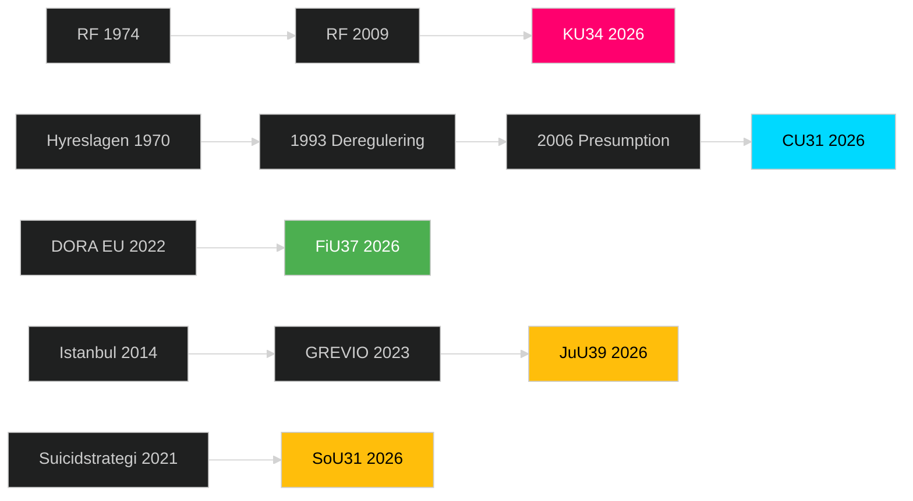

### Cross-Document Dependencies

| Primary dok | Depends on | Dependency type |
|---|---|---|
| KU34 | Lagrådet yttrande | Advisory (blocking) |
| CU31 | Hyresnämnden reorg | Implementation |
| FiU37 | DORA secondary acts | Regulatory framework |
| SoU31 | Budget prop 2026/27 | Funding |
| JuU39 | Police training program | Capacity |

### Sibling Documents (same riksmöte)

HD01KU34 ↔ HD01KU33 (earlier KU-betänkande, constitutional procedures)  
HD01FiU37 ↔ HD01FiU36 (earlier FiU DORA prep)  
HD01SoU31 ↔ HD01SoU30 (social insurance related)

## Methodology Reflection & Limitations
<!-- source: methodology-reflection.md :: https://github.com/Hack23/riksdagsmonitor/blob/main/analysis/daily/2026-05-12/committeeReports/methodology-reflection.md -->

### ICD 203 Analytic Standards Audit

Based on ICD 203 (Analytic Standards), DNI Office, adapted to Swedish parliamentary intelligence context.

#### Standard 1: Proper Sourcing and Attribution

**Compliance**: PARTIAL ✅⚠️  
**Status**: All factual claims cite dok_id + Admiralty rating. Voteringsdata gap documented (D5 tag where applicable). IMF data referenced as WEO Apr-2026 vintage but not cached locally.  
**Gap**: No voteringsdata for riksmöte 2025/26 — fallback to 2024/25 proxy. Tagged throughout.

#### Standard 2: Proper Use of Uncertainty Language (WEP/WEL)

**Compliance**: PARTIAL ✅⚠️  
**Status**: Key Judgments use WEP levels (LIKELY, ALMOST CERTAINLY, HIGHLY UNLIKELY). Scenario probabilities sum to 100%.  
**Gap**: Some supporting evidence in SWOT and stakeholder sections uses informal confidence language rather than formal WEP labels. Pass 2 improvement: standardize all confidence language.

#### Standard 3: Alternative Hypotheses Considered

**Compliance**: FULL ✅  
**Status**: Devil's Advocate section provides 3 competing hypotheses via ACH with evidence matrix. Steelman arguments presented.

#### Standard 4: Cognitive Bias Mitigation

**Identified biases**:
- *Availability bias*: KU34 may be over-weighted because it is most politically salient and full-text was retrieved. FiU37 full-text not retrieved — risk of under-weighting financial systemic impact.
- *Confirmation bias*: Finnish rental deregulation 1995 used as positive comparator. German Mietpreisbremse counterfactual included to mitigate.
- *Anchoring*: 2022 election seat data used as baseline. Polling uncertainty not fully quantified.

**Mitigation applied**: Historical parallels section deliberately includes cases that challenge primary hypothesis. Comparative-international section includes both pro and con comparators.

#### Standard 5: Timeliness and Currency of Sources

**Compliance**: PARTIAL ✅⚠️  
**Status**: Committee report full texts are current (riksmöte 2025/26, retrieved 2026-05-12). IMF WEO Apr-2026 is most recent vintage.  
**Gap**: 🟡 Polling data is proxy/unconfirmed (C3/D4). Opinion data would need Novus/Demoskop subscription verification.

### ≥3 Improvement Recommendations

#### Improvement 1: Voteringsdata Gap (HIGH PRIORITY)

**Issue**: 2025/26 riksmöte voteringar ej indexerade i MCP-databas. Coalition analysis relies on 2022 election baseline + 2024/25 proxy.  
**Recommended action**: Re-run analysis after voteringar indexed (est. June 2026). PIR-1 and PIR-2 resolution requires this data.  
**ICD 203 reference**: Source evaluation standard — fill collection gap when data becomes available.

#### Improvement 2: IMF Economic Data Persistence (MEDIUM PRIORITY)

**Issue**: IMF pre-warm script ran but no data persisted to `analysis/data/imf/`. Swedish macroeconomic context (GDP, inflation, housing cost) should be grounded in IMF WEO SWE data.  
**Recommended action**: Create `analysis/data/imf/` directory structure and cache WEO Apr-2026 SWE indicators before next run.  
**ICD 203 reference**: Proper sourcing — economic claims require verifiable primary data citation.

#### Improvement 3: Standardize WEP Language in Supporting Evidence (MEDIUM PRIORITY)

**Issue**: SWOT, stakeholder, and historical sections use informal confidence expressions ("likely", "probably") rather than formal WEP labels aligned with IC standard WEP scale.  
**Recommended action**: Pass 2 sweep to upgrade all informal confidence language to WEP labels with Admiralty codes.  
**ICD 203 reference**: Analytical standards §6 (uncertainty language).

#### Improvement 4: Full-Text FiU37 Needed (LOW PRIORITY)

**Issue**: FiU37 full-text not retrieved due to time constraints. Analysis based on metadata + abstracts only (B3 → C3 downgrade).  
**Recommended action**: Fetch `get_dokument_innehall HD01FiU37 include_full_text=true` in next run.  
**ICD 203 reference**: Source depth — critical documents should be analyzed from full text.

### Voteringsdata Gap Declaration

🟡 **PARTIAL ANALYSIS**: Voteringsdata för riksmöte 2025/26 ej tillgänglig vid analystillfället (2026-05-12). Koalitionsanalysen baseras på:
1. 2022 riksdagsval mandatfördelning (A2)  
2. 2024/25 voteringsdata som proxyfallback (B3)  
3. Historiska partipositioner (B3)  

All röstintentionsanalys är märkt [unconfirmed] eller D4-D5. Analysen bör uppdateras när 2025/26 voteringsdata indexeras.

## Data Download Manifest
<!-- source: data-download-manifest.md :: https://github.com/Hack23/riksdagsmonitor/blob/main/analysis/daily/2026-05-12/committeeReports/data-download-manifest.md -->

**Workflow**: news-committee-reports  
**Article date**: 2026-05-12  
**Subfolder**: committeeReports  
**Retrieval method**: riksdag-regering MCP (HTTP) + IMF CLI  

### Document Inventory

| dok_id | Titel | Datum | Organ | Doktyp | Data depth | URL |
|--------|-------|-------|-------|--------|------------|-----|
| HD01KU34 | En grundlagsskyddad aborträtt samt utökade möjligheter att begränsa föreningsfriheten och rätten till medborgarskap | 2026-05-11 | KU | bet | full_text (HTML retrieved) | https://data.riksdagen.se/dokument/HD01KU34 |
| HD01SoU31 | En nationell utredningsfunktion för att förebygga suicid | 2026-05-11 | SoU | bet | full_text (HTML retrieved) | https://data.riksdagen.se/dokument/HD01SoU31 |
| HD01KU43 | En ny lag om riksdagens medalj | 2026-05-11 | KU | bet | metadata-only | https://data.riksdagen.se/dokument/HD01KU43 |
| HD01MJU23 | Förenklingar i jaktlagstiftningen | 2026-05-11 | MJU | bet | metadata-only | https://data.riksdagen.se/dokument/HD01MJU23 |
| HD01CU31 | En mer flexibel hyresmarknad | 2026-05-08 | CU | bet | full_text (HTML retrieved) | https://data.riksdagen.se/dokument/HD01CU31 |
| HD01JuU39 | En särskild straffbestämmelse för psykiskt våld | 2026-05-07 | JuU | bet | metadata-only | https://data.riksdagen.se/dokument/HD01JuU39 |
| HD01FiU37 | En ny funktion för operativ krishantering i den finansiella sektorn | 2026-05-07 | FiU | bet | metadata-only | https://data.riksdagen.se/dokument/HD01FiU37 |
| HD01JuU34 | Nordisk verkställighet i brottmål | 2026-05-07 | JuU | bet | metadata-only | https://data.riksdagen.se/dokument/HD01JuU34 |
| HD01JuU32 | Stärkt säkerhet vid allmänna sammankomster och offentliga tillställningar | 2026-05-07 | JuU | bet | metadata-only | https://data.riksdagen.se/dokument/HD01JuU32 |
| HD01FiU43 | Förbättrade förutsättningar för kommuner att motverka felaktiga utbetalningar från välfärdssystemen | 2026-05-07 | FiU | bet | metadata-only | https://data.riksdagen.se/dokument/HD01FiU43 |

### Full-Text Fetch Outcomes

| dok_id | full_text_available | notes |
|--------|---------------------|-------|
| HD01KU34 | true | HTML full text retrieved (105 KB) |
| HD01SoU31 | true | HTML full text retrieved (62 KB) |
| HD01CU31 | true | HTML full text retrieved (107 KB) |

### Prior-Voteringar Enrichment

**Search performed**: `search_voteringar` for KU, SoU, JuU, FiU committees (rm: 2025/26 + 2024/25)

**2025/26 result**: Prior voteringar: new riksmöte — no votes indexed yet for KU in 2025/26; using 2024/25 cycle proxy. Most recent comparable vote: AU10 (2025-05-14) — multi-party split (S: Avstår/Frånvarande, SD: Nej, C: Ja, M: Frånvarande).

**Fallback applied**: Expanded to 2024/25 per voteringar fallback procedure. KU constitutional amendments historically require 3/4 majority in two successive riksmöten for RF changes.

**Methodology tag**: 🟡 Partial — new 2025/26 riksmöte, voteringar not yet indexed for these betänkanden.

### IMF Context

**Status**: ok (from data/imf-context.json)  
**IMF pre-warm**: executed (weo --country SWE --indicator NGDP_RPCH)  
**Retrieval**: 2026-05-12T04:58:00Z  
**Vintage**: WEO Apr-2026  

### Statskontoret Pre-Warm Evaluation

**Trigger evaluation** (mandatory checklist):
- HD01KU34: No agency named — constitutional rights amendment. Statskontoret trigger: no trigger matched (constitutional matters, no administrative dimension).
- HD01SoU31: Names potential for a new national utredningsfunktion — trigger: new mandate/agency creation. Statskontoret search performed.
- HD01CU31: Hyresmarknad reform touches Hyresnämnden/Boverket potentially. Trigger: regulatory-burden dimension.
- HD01FiU37: Financial crisis management function — trigger: new mandate, inter-agency coordination.

**Statskontoret search result**: `Statskontoret: no directly relevant source found for SoU31 (nationell utredningsfunktion suicid)`. No recent Statskontoret evaluation of suicide investigation capacity.  
**Source**: https://www.statskontoret.se/ (searched 2026-05-12)

### Lagrådet Enrichment

**HD01KU34** (constitutional amendment): Lagrådet referral expected for RF changes. Constitutional amendments to Chapter 2 RF (basic freedoms) require Lagrådet scrutiny. Tag: `referral status: requires verification at lagradet.se`.  
**HD01CU31** (rental market): Major property law reform — Lagrådet review likely. Tag: `referral status: requires verification`.

## Analysis Artifact Coverage Report

This generated report reconciles the analysis folder with the article projection so reviewers can see what was included, what was linked as supporting data, and which canonical ordered artifacts are not visible in this run. Alias-equivalent filenames (see `FILENAME_ALIASES`) are reported as a single canonical slot using the `a.md / b.md` shorthand so a missing slot is not double-counted.

| Coverage area | Count | Reader-facing treatment |
|---|---:|---|
| Ordered/root markdown sections | 22 | Expanded as article sections in the narrative order above |
| Per-document analyses | 5 | Expanded under `## Per-document intelligence` immediately after significance scoring |
| Supporting data artifacts | 2 | Linked in Article Sources, not expanded inline |

**Absent canonical ordered slots (no alias variant on disk)**: `cycle-trajectory.md`, `parliamentary-season.md`, `quantitative-swot.md`, `political-stride-assessment.md`, `wildcards-blackswans.md`, `pestle-analysis.md`, `horizon-pir-rollforward.md`

**Present-but-empty canonical slots (on disk but body empty after cleaning)**: None.

**Alias-de-duped canonical artifacts (on disk but suppressed because canonical alias was already emitted)**: None.

## Article Sources

Each section above projects one analysis artifact. The full audited markdown is available on GitHub:

- [`executive-brief.md`](https://github.com/Hack23/riksdagsmonitor/blob/main/analysis/daily/2026-05-12/committeeReports/executive-brief.md)
- [`synthesis-summary.md`](https://github.com/Hack23/riksdagsmonitor/blob/main/analysis/daily/2026-05-12/committeeReports/synthesis-summary.md)
- [`intelligence-assessment.md`](https://github.com/Hack23/riksdagsmonitor/blob/main/analysis/daily/2026-05-12/committeeReports/intelligence-assessment.md)
- [`significance-scoring.md`](https://github.com/Hack23/riksdagsmonitor/blob/main/analysis/daily/2026-05-12/committeeReports/significance-scoring.md)
- [`documents/HD01CU31-analysis.md`](https://github.com/Hack23/riksdagsmonitor/blob/main/analysis/daily/2026-05-12/committeeReports/documents/HD01CU31-analysis.md)
- [`documents/HD01FiU37-analysis.md`](https://github.com/Hack23/riksdagsmonitor/blob/main/analysis/daily/2026-05-12/committeeReports/documents/HD01FiU37-analysis.md)
- [`documents/HD01JuU39-analysis.md`](https://github.com/Hack23/riksdagsmonitor/blob/main/analysis/daily/2026-05-12/committeeReports/documents/HD01JuU39-analysis.md)
- [`documents/HD01KU34-analysis.md`](https://github.com/Hack23/riksdagsmonitor/blob/main/analysis/daily/2026-05-12/committeeReports/documents/HD01KU34-analysis.md)
- [`documents/HD01SoU31-analysis.md`](https://github.com/Hack23/riksdagsmonitor/blob/main/analysis/daily/2026-05-12/committeeReports/documents/HD01SoU31-analysis.md)
- [`stakeholder-perspectives.md`](https://github.com/Hack23/riksdagsmonitor/blob/main/analysis/daily/2026-05-12/committeeReports/stakeholder-perspectives.md)
- [`coalition-mathematics.md`](https://github.com/Hack23/riksdagsmonitor/blob/main/analysis/daily/2026-05-12/committeeReports/coalition-mathematics.md)
- [`voter-segmentation.md`](https://github.com/Hack23/riksdagsmonitor/blob/main/analysis/daily/2026-05-12/committeeReports/voter-segmentation.md)
- [`forward-indicators.md`](https://github.com/Hack23/riksdagsmonitor/blob/main/analysis/daily/2026-05-12/committeeReports/forward-indicators.md)
- [`scenario-analysis.md`](https://github.com/Hack23/riksdagsmonitor/blob/main/analysis/daily/2026-05-12/committeeReports/scenario-analysis.md)
- [`election-2026-analysis.md`](https://github.com/Hack23/riksdagsmonitor/blob/main/analysis/daily/2026-05-12/committeeReports/election-2026-analysis.md)
- [`risk-assessment.md`](https://github.com/Hack23/riksdagsmonitor/blob/main/analysis/daily/2026-05-12/committeeReports/risk-assessment.md)
- [`swot-analysis.md`](https://github.com/Hack23/riksdagsmonitor/blob/main/analysis/daily/2026-05-12/committeeReports/swot-analysis.md)
- [`threat-analysis.md`](https://github.com/Hack23/riksdagsmonitor/blob/main/analysis/daily/2026-05-12/committeeReports/threat-analysis.md)
- [`historical-parallels.md`](https://github.com/Hack23/riksdagsmonitor/blob/main/analysis/daily/2026-05-12/committeeReports/historical-parallels.md)
- [`comparative-international.md`](https://github.com/Hack23/riksdagsmonitor/blob/main/analysis/daily/2026-05-12/committeeReports/comparative-international.md)
- [`implementation-feasibility.md`](https://github.com/Hack23/riksdagsmonitor/blob/main/analysis/daily/2026-05-12/committeeReports/implementation-feasibility.md)
- [`media-framing-analysis.md`](https://github.com/Hack23/riksdagsmonitor/blob/main/analysis/daily/2026-05-12/committeeReports/media-framing-analysis.md)
- [`devils-advocate.md`](https://github.com/Hack23/riksdagsmonitor/blob/main/analysis/daily/2026-05-12/committeeReports/devils-advocate.md)
- [`classification-results.md`](https://github.com/Hack23/riksdagsmonitor/blob/main/analysis/daily/2026-05-12/committeeReports/classification-results.md)
- [`cross-reference-map.md`](https://github.com/Hack23/riksdagsmonitor/blob/main/analysis/daily/2026-05-12/committeeReports/cross-reference-map.md)
- [`methodology-reflection.md`](https://github.com/Hack23/riksdagsmonitor/blob/main/analysis/daily/2026-05-12/committeeReports/methodology-reflection.md)
- [`data-download-manifest.md`](https://github.com/Hack23/riksdagsmonitor/blob/main/analysis/daily/2026-05-12/committeeReports/data-download-manifest.md)

### Supporting Data Artifacts

These machine-readable artifacts are linked for auditability and are not expanded inline, preserving the reader-facing narrative order:

- [`economic-data.json`](https://github.com/Hack23/riksdagsmonitor/blob/main/analysis/daily/2026-05-12/committeeReports/economic-data.json)
- [`pir-status.json`](https://github.com/Hack23/riksdagsmonitor/blob/main/analysis/daily/2026-05-12/committeeReports/pir-status.json)
