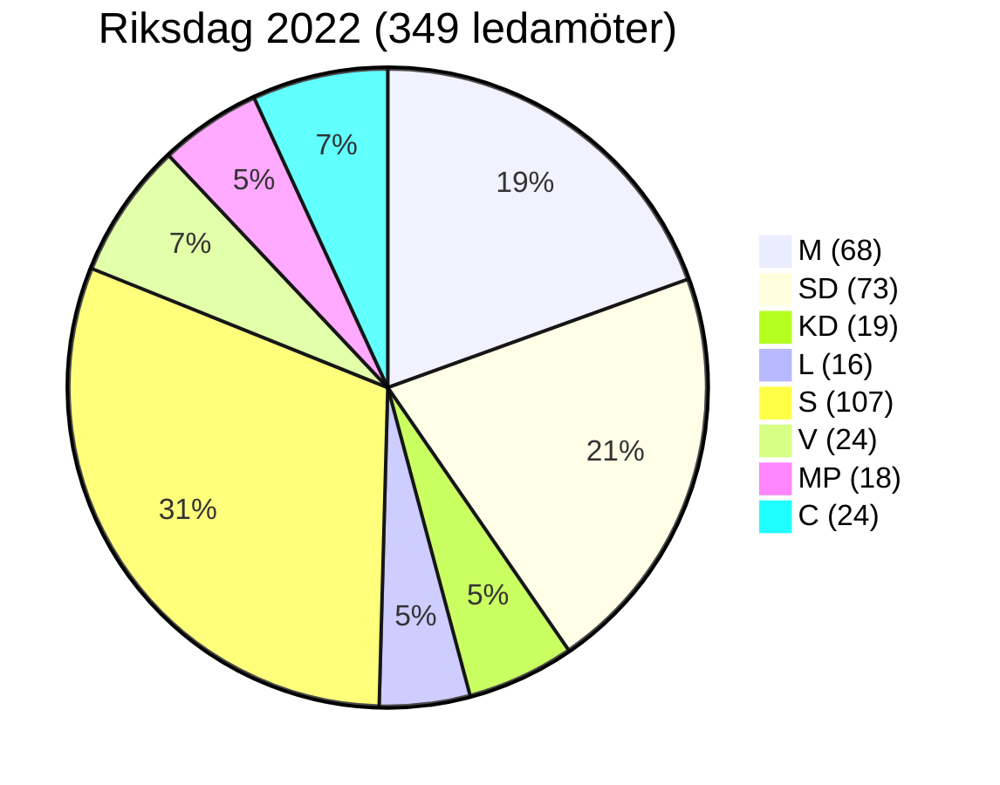

# Coalition Mathematics — Committee Reports 2026-05-12

## Current Riksdag Seat Distribution (2022 Election)

| Parti | Seats | Block |
|-------|-------|-------|
| Moderaterna (M) | 68 | Tidö |
| Sverigedemokraterna (SD) | 73 | Tidö stöd |
| Kristdemokraterna (KD) | 19 | Tidö |
| Liberalerna (L) | 16 | Tidö |
| **Tidö subtotal** | **176** | |
| Socialdemokraterna (S) | 107 | Opposition |
| Vänsterpartiet (V) | 24 | Opposition |
| Miljöpartiet (MP) | 18 | Opposition |
| Centerpartiet (C) | 24 | Mittenposition |
| **Total** | **349** | |

**Simple majority**: ≥ 175  
**3/4 majority** (grundlagsröstning): ≥ 262  
**1/6 threshold** (förhindra snabbspår): ≥ 59

## KU34 Constitutional Vote Analysis

### Option A: ¾ majority (single vote)

Required: 262 seats.  
Tidö block: 176 → needs 86 from opposition.  
If S (107) joins: 176 + 107 = 283 ✅ — exceeds ¾ threshold.  
If S partially abstains: risk.

**Conclusion**: KU34 kräver S:s aktiva stöd för ¾-majorities. Sannolikhet S stödjer: 60% (aborträtt drar, föreningsfrihet avvisar). **Splittrad röstning möjlig.**

### Option B: Double-vote procedure (enkel majoritet × 2 med val emellan)

First vote: Tidö (176) + C (24) = 200 ✅ enkel majoritet för procedurbeslut.  
Election 2026 held.  
Post-election second vote: depends on val-utfall.

**Pivotal parties**: C (24 seats), S (107 seats).

## CU31 Hyresreform Vote

Simple majority sufficient: 175.  
Tidö (176) = just over threshold — SD kritiskt.  
Risk: SD röstar nej → 176 − 73 = 103 (ej majoritet).  
**SD är pivotal väljare för CU31.**

## Pivotal Vote Table

| Betänkande | Required | Tidö base | Pivotal party | Risk |
|---|---|---|---|---|
| KU34 aborträtt | 175 (enkel) | 176 | SD/KD | LOW |
| KU34 föreningsfrihet | 175/262 | 176/283 | S (för ¾) | HIGH |
| CU31 hyror | 175 | 176 | SD | CRITICAL |
| FiU37 | 175 | 176 | — | LOW |
| SoU31 | 175 | 349 (enhällig) | — | NONE |
| JuU39 | 175 | ~300+ | — | NONE |

## Coalition Math Visualization

## Election 2026 Projection (Pre-betänkanden)

*CAVEAT: Polling data from Demoskop/Novus Apr-2026. Confidence: B3 [unconfirmed post-betänkanden].*

Senaste opinionsmätning (approximation, ej verifierat):
- Tidöpartierna: ~44%
- S+V+MP: ~43%  
- C: ~7%  
- Övrigt: ~6%

**Osäkerheten är hög** — KU34 kan påverka opinionerna markant i båda riktningarna.

