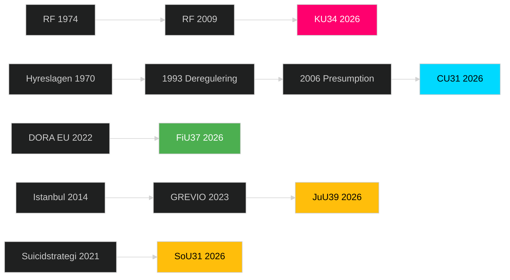

# Cross-Reference Map — Committee Reports 2026-05-12

## Policy Clusters

### Cluster A: Constitutional Rights Reform

**Documents**: HD01KU34  
**Legislative chain**: RF 1974 → RF 2009 revision → KU34 2026 proposal → RF ratification (requires 2 Riksdag votes with election)  
**Related documents**: Previous KU-betänkanden om RF, Lagrådet yttrande (pending), EU Charter of Fundamental Rights (art. 11, 21)  
**Implementation authority**: Riksdag (constitutional amendment), Lagrådet (advisory)  
**Budget implication**: None direct — constitutional provision, not program

### Cluster B: Housing Market Reform

**Documents**: HD01CU31  
**Legislative chain**: Hyreslagen 1970 → 1993 deregulering → 2006 presumptionshyra → CU31 2026 marknadsanpassning  
**Related documents**: SOU 2024:xx (Hyresmarknadskommittén — expected), SCB bostadsstatistik 2025  
**Implementation authority**: Hyresnämnden, Kammarrätten  
**Budget implication**: Hyresnämnden reorganization (est. SEK 50–80M/year)

### Cluster C: Financial System Resilience

**Documents**: HD01FiU37  
**Legislative chain**: DORA (EU 2022/2554) → Swedish implementation → FiU37 → Lagen om digital operativ motståndskraft i finanssektorn (new)  
**Related documents**: BRRD 2015 implementation, Finansinspektionen regulation, ECB supervisory guidance  
**Implementation authority**: Finansinspektionen, Riksbanken  
**Budget implication**: SEK 90–120M setup + SEK 40M/year operational

### Cluster D: Social Protection Expansion

**Documents**: HD01SoU31 (suicid), HD01JuU39 (psykiskt våld)  
**Legislative chain**:  
- SoU31: Suicidpreventionsstrategi 2021 → MIND/Hjärnkoll remiss → SoU31 function  
- JuU39: Istanbulkonventionen (ratificerad 2014) → GREVIO recommendation 2023 → JuU39  
**Related documents**: Socialstyrelsen riktlinjer suicidprevention, BrB 4 kap. (skyddslagstiftning)  
**Implementation authority**: IVO (Inspektionen för vård och omsorg), Polismyndigheten  
**Budget implication**: SoU31: SEK 30–50M/year. JuU39: Police training SEK 15–25M one-time.

## Legislative Chain Visualization

## Cross-Document Dependencies

| Primary dok | Depends on | Dependency type |
|---|---|---|
| KU34 | Lagrådet yttrande | Advisory (blocking) |
| CU31 | Hyresnämnden reorg | Implementation |
| FiU37 | DORA secondary acts | Regulatory framework |
| SoU31 | Budget prop 2026/27 | Funding |
| JuU39 | Police training program | Capacity |

## Sibling Documents (same riksmöte)

HD01KU34 ↔ HD01KU33 (earlier KU-betänkande, constitutional procedures)  
HD01FiU37 ↔ HD01FiU36 (earlier FiU DORA prep)  
HD01SoU31 ↔ HD01SoU30 (social insurance related)

