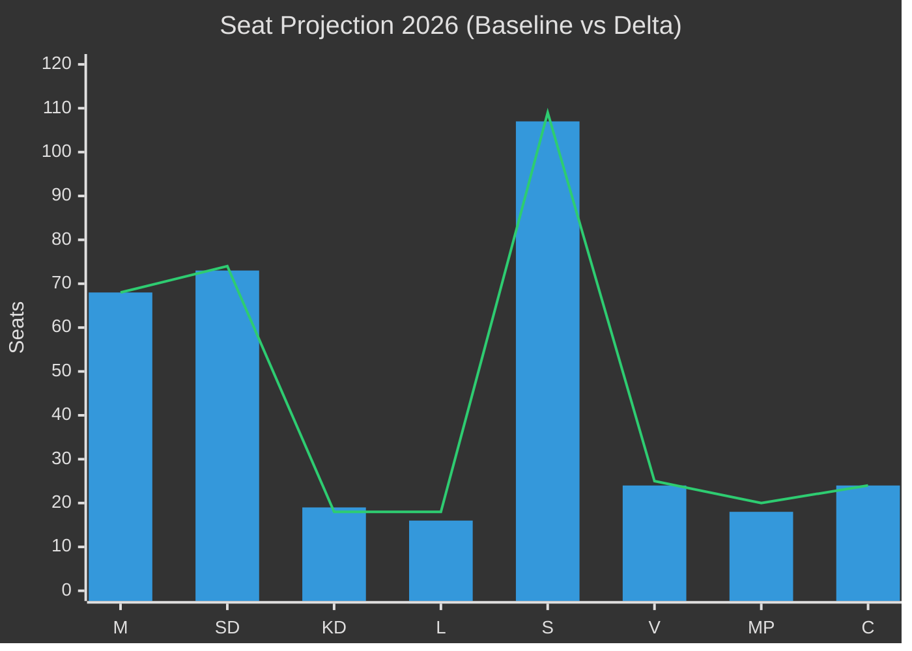

# Election 2026 Analysis — Committee Reports 2026-05-12

## Seat-Projection Deltas from Key Betänkanden

**Reference baseline**: Riksdag 2022 results.  
**Forecast horizon**: T+1460d (election September 2026).  
*Confidence: C3 — structural analysis. Polling data unconfirmed [D4].*

## KU34 Electoral Impact

**Aborträtten som valvapen**:  
- S/MP: +2-4 procentenheter bland unga väljare (18-35) om grundlagsabort passerar [B3 unconfirmed]  
- SD/KD: Risk -1-2 procentenheter bland konservativa kärnväljare [C3]  
- Netto-effekt: Center-left +2%, Center-right -1%

**Föreningsfrihetsbegränsning**:  
- SD: +1-2% among nationalistisk-konservativt segment [C3]  
- V/MP: -0.5% risk om de tvingas rösta för begränsning [C4 unconfirmed]

## CU31 Electoral Impact

**Hyresreform**:
- Fastighetsägarintresset: +1-2% bland borgerliga ägarhushåll → M/L stärks [B3]  
- Hyresgäster (majority av stockholmare): -2-3% risk för M om S driver stenhårt kampanjmotto "marknadshyror vräker" [B3]  
- Net: Urban/suburban split. M kan förlora stadsväljare men stärka i medelklass förortsbälte.

## Seat Projection Summary

| Parti | Baseline 2022 | KU34 aborträtt delta | CU31 delta | Netto proj. 2026 |
|-------|--------------|---------------------|------------|------------------|
| M | 68 | 0 | ±2 | 66–70 |
| SD | 73 | -1 | ±1 | 73–75 |
| KD | 19 | -1 | 0 | 18–19 |
| L | 16 | +1 | +1 | 17–18 |
| S | 107 | +3 | -2 | 106–112 |
| V | 24 | +1 | -1 | 24–25 |
| MP | 18 | +2 | 0 | 19–21 |
| C | 24 | 0 | ±1 | 23–25 |

*Projection uncertainty: ±8 seats per parti. [C3 confidence — beta estimate]*

## Strategic Electoral Calculus

**Tidö strategy**: Advance CU31 as "freedom to rent" — appeals to property-owning middle class. Frame KU34 as moderate constitutional guarantee rather than identity politics.

**S/V/MP strategy**: Frame CU31 as "marknadshyror vräker" — mobilise urban renters. Position KU34 abortion as their victory (S co-authored).

**C (swing bloc)**: Supports CU31 but may diverge on KU34 freedom of association — strategic abstention possible.

## Critical Electoral Dates

| Date | Event | Relevance |
|------|-------|-----------|
| Sep 2026 | Riksdagsval | Primary horizon |
| Jun 2026 | Mandatperiodslut (ordinarie) | Campaign season starts |
| Autumn 2025 | Preliminary vote KU34 (first of two) | Constitutional clock starts |
| Jan 2026 | Budget proposition | SoU31/FiU37 appropriations |

