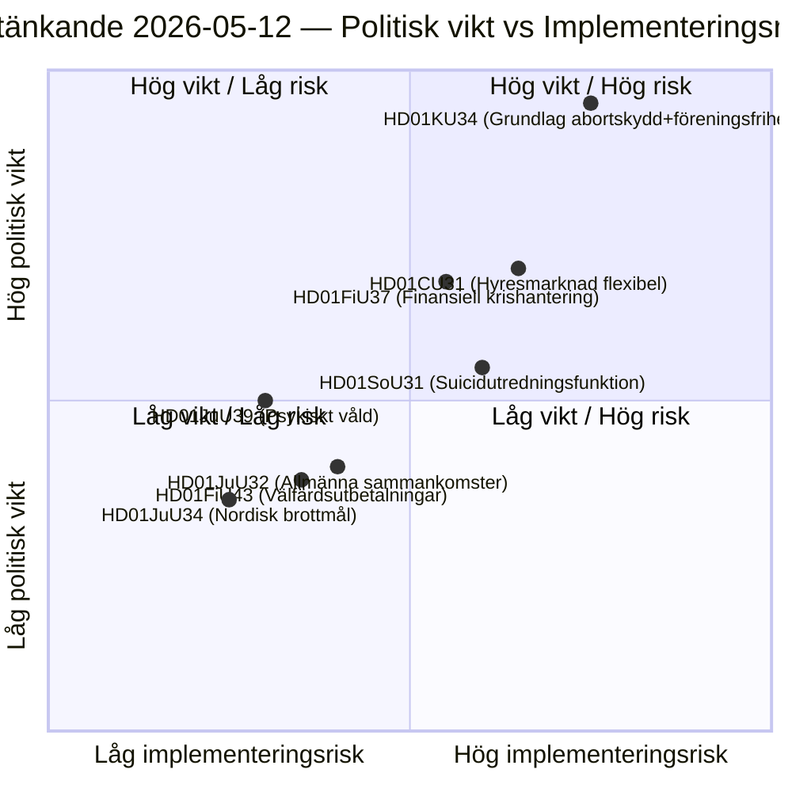

# Riksdag Committee Reports: Konstitutionell reform, suicidprevention och hyresmarknad — 2026-05-12

**Author**: James Pether Sörling  
**Date**: 2026-05-12  
**Classification**: PUBLIC — GDPR Art. 9(2)(e)(g)  
**Confidence**: HIGH [B2]  
**Analysis cycle**: committeeReports · 2026-05-12  

---

## BLUF

Konstitutionsutskottet (KU) presenterar ett historiskt dubbelbetänkande (HD01KU34) som söker grundlagsskydda aborträtten och samtidigt utöka möjligheterna att begränsa föreningsfriheten och medborgarskapet — en politisk kompromiss som spänner tre riksmöten av RF-revision. Socialutskottet (SoU) föreslår en nationell utredningsfunktion för suicidprevention (HD01SoU31) som skapar ny statlig kapacitet. Civilutskottet (CU) lägger fram hyresmarknadsreformer (HD01CU31) med bred marknadsavreglering inför det stundande riksdagsvalet 2026. Sammantaget utgör dessa betänkanden den mest konstitutionellt tunga paketsessionen sedan RF-revisionen 2010.

## Decisions This Brief Supports

1. **Redaktionell prioritering**: HD01KU34 är det politiskt tyngst vägande betänkandet — grundlagsändringar berör alla 349 ledamöter och kräver tvåkammarbeslut (eller två successiva riksdagsbeslut med mellanliggande val).
2. **Riskinventering**: HD01CU31:s hyresmarknadsreform riskerar återstall i EU-processerna (ECHR Art. 1 Protocol 1) och kan aktivera SD:s avvikelseröst inför valrörelsen.
3. **PIR-uppföljning**: Följa hur KU34:s dubbelnatur (abortskydd + begränsad föreningsfrihet) navigeras i partiernas valmanifest 2026.

## 60-second Intelligence Bullets

- 🔴 **KU34** — Grundlagsskyddad aborträtt + begränsad föreningsfrihet: historisk RF-revision som kräver 2 beslut med val emellan. Politisk sprängkraft hög; SD och KD förväntas reservera sig.
- 🟡 **SoU31** — Nationell suicidutredningsfunktion: ny statlig enhet med GDPR-komplex hantering av dödsorsaksdata. Implementeringsrisk medelhög (budgetberoende, Socialstyrelsen kapacitet).
- 🟡 **CU31** — Flexibel hyresmarknad: deregulering av hyresrättssystemet med indexerade hyror. Bred opposition från S och V; möjlig röstning med simple majority.
- 🟠 **FiU37** — Operativ krishantering finansiella sektorn: skapar ny DORA-kompatibel resolutionsmekanism. Teknisk, men systemviktig.
- 🟢 **JuU39** — Psykiskt våld straffbestämmelse: kriminaliserar systematiskt psykologiskt våld i nära relationer, EU-harmonisering med Istanbulkonventionen.

## Top Forward Trigger

**KU34 andra behandling** (nästa riksmöte): Om riksdagen löser detta betänkande i positiv riktning inför valet 2026 börjar klockryckan för den obligatoriska karantänomröstningen — vilket sätter en hård deadline för nästa riksdags ingångsbeslut och påverkar valplattformarna direkt.

## Key Mermaid: Legislative Risk Landscape

