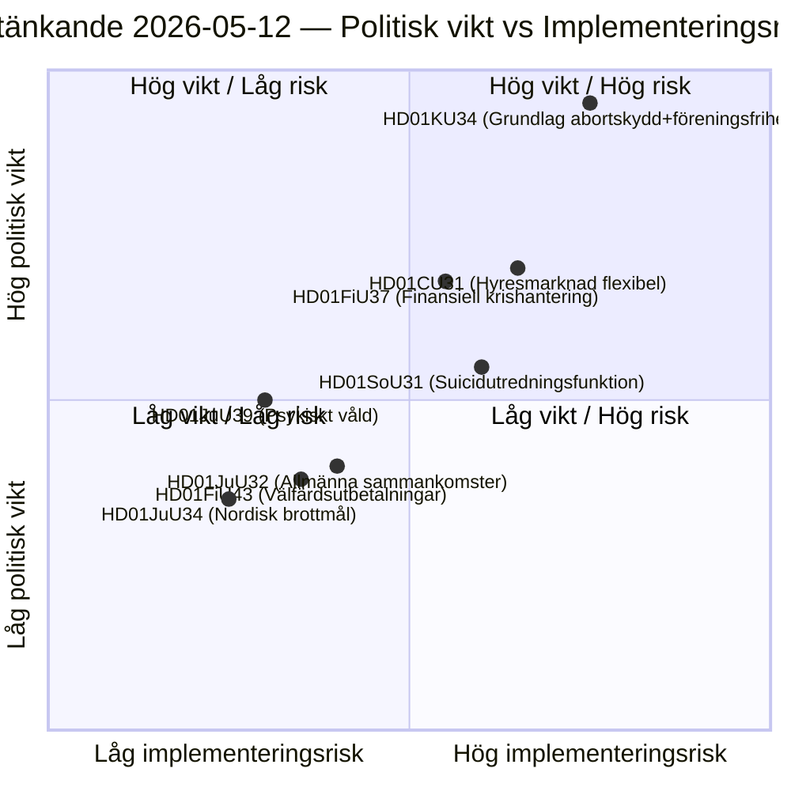

<!-- dir: rtl -->
# تقارير لجان البرلمان السويدي: الإصلاح الدستوري، الوقاية من الانتحار وسوق الإيجار — 2026-05-12

**المؤلف**: James Pether Sörling  
**التاريخ**: 2026-05-12  
**التصنيف**: عام — اللائحة العامة لحماية البيانات المادة 9(2)(ه)(ز)  
**مستوى الثقة**: HIGH [B2]  
**دورة التحليل**: committeeReports · 2026-05-12  

---

## الملخص التنفيذي

تقدّم لجنة الدستور (KU) تقريراً مزدوجاً تاريخياً (HD01KU34) يسعى إلى حماية حق الإجهاض دستورياً مع توسيع صلاحيات تقييد حرية تكوين الجمعيات والجنسية — تسوية سياسية تمتد على ثلاثة دورات برلمانية لمراجعة الدستور السويدي. تقترح لجنة الشؤون الاجتماعية (SoU) وظيفة تحقيق وطنية للوقاية من الانتحار (HD01SoU31) تُنشئ قدرات حكومية جديدة. تطرح لجنة الشؤون المدنية (CU) إصلاحات سوق الإيجار (HD01CU31) مع تحرير واسع للسوق قبيل انتخابات البرلمان السويدية لعام 2026. في مجملها، تُشكّل هذه التقارير أثقل جلسة حزمة دستورية منذ مراجعة الدستور السويدي عام 2010.

## القرارات التي يدعمها هذا المستند

1. **الأولوية التحريرية**: HD01KU34 هو التقرير الأثقل سياسياً — تعديلات الدستور تمسّ جميع الـ 349 عضواً وتستلزم قراراً ثنائي الغرفة (أو قرارين متتاليين من البرلمان مع انتخابات بينهما).
2. **جرد المخاطر**: إصلاح سوق الإيجار HD01CU31 يخاطر بتراجعات في المسارات الأوروبية (ECHR Art. 1 البروتوكول 1) وقد يُفعّل صوت الانحراف لحزبSD قبيل الحملة الانتخابية.
3. **متابعة PIR**: رصد كيفية التعامل مع الطبيعة المزدوجة للـKU34 (حماية الإجهاض + تقييد حرية التجمع) في البرامج الانتخابية للأحزاب عام 2026.

## نقاط الاستخبارات في 60 ثانية

- 🔴 **KU34** — حق الإجهاض محمي دستورياً + تقييد حرية تكوين الجمعيات: مراجعة دستورية تاريخية تستلزم قرارين مع انتخابات بينهما. القوة التفجيرية السياسية عالية؛ يُتوقع أن يُبدي حزبا SD وKD تحفظات.
- 🟡 **SoU31** — وظيفة التحقيق الوطني في حالات الانتحار: وحدة حكومية جديدة ذات معالجة معقدة لبيانات أسباب الوفاة وفق اللائحة العامة لحماية البيانات. مخاطر التنفيذ متوسطة إلى عالية (تعتمد على الميزانية، طاقة مديرية الصحة).
- 🟡 **CU31** — سوق إيجار مرن: تحرير نظام الإيجارات مع إيجارات مُفهرَسة. معارضة واسعة من حزبي S وV؛ تصويت محتمل بالأغلبية البسيطة.
- 🟠 **FiU37** — إدارة الأزمات التشغيلية للقطاع المالي: يُنشئ آلية تسوية جديدة متوافقة مع DORA. تقنية، لكنها بالغة الأهمية للنظام.
- 🟢 **JuU39** — نص عقوبة العنف النفسي: تجريم العنف النفسي المنهجي في العلاقات الحميمة، توافق مع اتفاقية إسطنبول على مستوى الاتحاد الأوروبي.

## أهم محفز مستقبلي

**القراءة الثانية لـKU34** (الدورة البرلمانية القادمة): إذا حسم البرلمان هذا التقرير بشكل إيجابي قبل انتخابات 2026، يبدأ العد التنازلي لتصويت الحجر الإلزامي — مما يضع موعداً نهائياً صارماً للقرار الافتتاحي للبرلمان القادم ويؤثر مباشرة على المنصات الانتخابية.

## الرسم البياني الرئيسي: مشهد المخاطر التشريعية

<!-- source-sha: 9cdd9bfe0bc226548b5ddf453782f5076880156a -->
