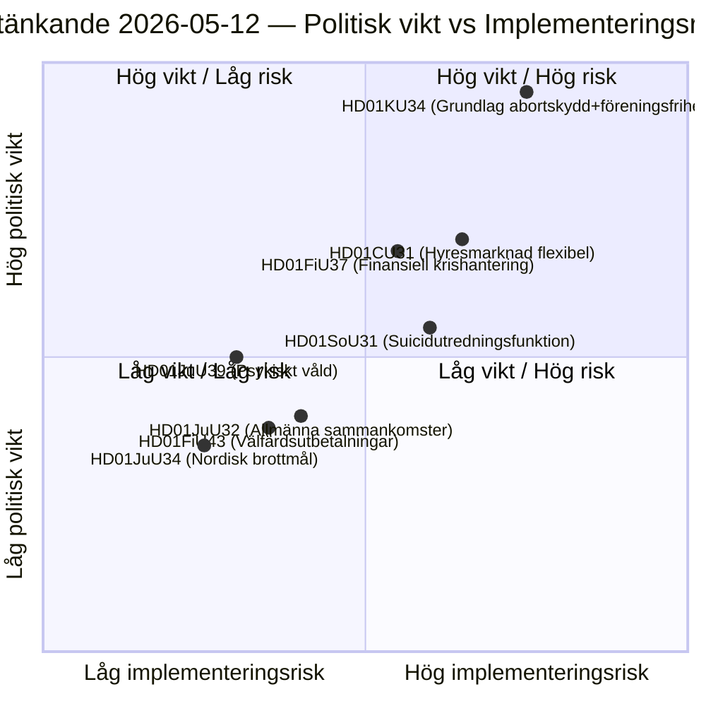

# Riksdagets udvalgsbetænkninger: Forfatningsreform, selvmordsforebyggelse og lejemarked — 2026-05-12

**Forfatter**: James Pether Sörling  
**Dato**: 2026-05-12  
**Klassificering**: OFFENTLIG — GDPR Art. 9(2)(e)(g)  
**Konfidens**: HIGH [B2]  
**Analysecyklus**: committeeReports · 2026-05-12  

---

## BLUF

Forfatningsudvalget (KU) fremlægger en historisk dobbeltbetænkning (HD01KU34), der søger at grundlovsfæste abortrettigheder og samtidig udvide mulighederne for at begrænse foreningsfrihed og statsborgerskab — et politisk kompromis, der spænder over tre riksmöten med RF-revision. Socialudvalget (SoU) foreslår en national undersøgelsesfunktion for selvmordsforebyggelse (HD01SoU31), der skaber ny statslig kapacitet. Civiludvalget (CU) fremlægger lejemarkedsreformer (HD01CU31) med bred markedsderegulering op til det kommende valg til riksdagen i 2026. Samlet set udgør disse betænkninger den mest forfatningstunge pakkesession siden RF-revisionen i 2010.

## Beslutninger dette underlag understøtter

1. **Redaktionel prioritering**: HD01KU34 er den politisk tungestvejende betænkning — grundlovsændringer berører alle 349 medlemmer og kræver to-kammer-beslutning (eller to successive riksdag-beslutninger med mellemliggende valg).
2. **Risikokortlægning**: HD01CU31's lejemarkedsreform risikerer tilbageslag i EU-processerne (ECHR Art. 1 Protokol 1) og kan aktivere SD's afvigestemme op til valgkampen.
3. **PIR-opfølgning**: Følge hvordan KU34's dobbeltnatur (abortbeskyttelse + begrænset foreningsfrihed) navigeres i partiernes valgprogrammer 2026.

## 60-sekunders efterretningspunkter

- 🔴 **KU34** — Grundlovssikret abortret + begrænset foreningsfrihed: historisk RF-revision der kræver 2 beslutninger med valg imellem. Politisk sprængkraft høj; SD og KD forventes at tage forbehold.
- 🟡 **SoU31** — National selvmordsundersøgelsesfunktion: ny statslig enhed med GDPR-kompleks håndtering af dødsfalddata. Implementeringsrisiko mellemhøj (budgetafhængig, Socialstyrelsen kapacitet).
- 🟡 **CU31** — Fleksibelt lejemarked: deregulering af lejeboligsystemet med indekserede lejer. Bred opposition fra S og V; mulig afstemning med simpelt flertal.
- 🟠 **FiU37** — Operativ krisehåndtering finansiel sektor: skaber ny DORA-kompatibel resolutionsmekanisme. Teknisk, men systemvigtig.
- 🟢 **JuU39** — Psykisk vold straffebestemmelse: kriminaliserer systematisk psykologisk vold i nære relationer, EU-harmonisering med Istanbulkonventionen.

## Vigtigste fremadrettede udløser

**KU34 anden behandling** (næste riksmöte): Hvis riksdagen løser denne betænkning i positiv retning inden valget 2026 begynder nedtællingen for den obligatoriske karantæneafstemning — hvilket sætter en hård deadline for næste riksdags indledende beslutning og påvirker valgprogrammerne direkte.

## Nøglediagram: Lovgivningsmæssigt risikolandskab

<!-- source-sha: 9cdd9bfe0bc226548b5ddf453782f5076880156a -->
