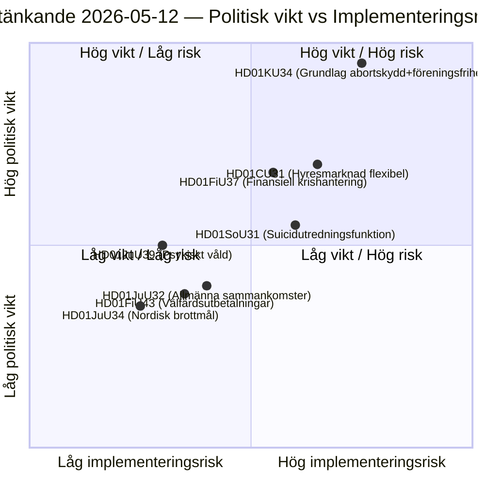

# Schwedische Reichstags-Ausschussberichte: Verfassungsreform, Suizidprävention und Wohnungsmarkt — 2026-05-12

**Autor**: James Pether Sörling  
**Datum**: 2026-05-12  
**Klassifizierung**: ÖFFENTLICH — DSGVO Art. 9(2)(e)(g)  
**Konfidenzniveau**: HIGH [B2]  
**Analysezykus**: committeeReports · 2026-05-12  

---

## BLUF

Der Verfassungsausschuss (KU) legt ein historisches Doppelgutachten (HD01KU34) vor, das sowohl das Abtreibungsrecht verfassungsrechtlich schützen als auch die Möglichkeiten zur Einschränkung der Vereinigungsfreiheit und Staatsbürgerschaft ausweiten soll — ein politischer Kompromiss, der drei Riksmöten der RF-Revision umfasst. Der Sozialausschuss (SoU) schlägt eine nationale Untersuchungsfunktion zur Suizidprävention (HD01SoU31) vor, die neue staatliche Kapazitäten schafft. Der Zivilausschuss (CU) legt Wohnungsmarktreformen (HD01CU31) mit weitreichender Marktderegulierung vor den bevorstehenden Reichstagswahlen 2026 vor. Insgesamt bilden diese Gutachten die verfassungsrechtlich schwergewichtigste Paketsitzung seit der RF-Revision 2010.

## Von diesem Unterlagen unterstützte Entscheidungen

1. **Redaktionelle Priorisierung**: HD01KU34 ist das politisch gewichtigste Gutachten — Verfassungsänderungen betreffen alle 349 Abgeordneten und erfordern Zweikammerbeschlüsse (oder zwei aufeinanderfolgende Riksdagsbeschlüsse mit zwischenzeitlicher Wahl).
2. **Risikoinventar**: Die Wohnungsmarktreform HD01CU31 riskiert Rückschläge in EU-Verfahren (ECHR Art. 1 Protokoll 1) und könnte die Abweichungsstimme der SD im Vorwahlkampf aktivieren.
3. **PIR-Nachverfolgung**: Verfolgen, wie die Doppelnatur von KU34 (Abtreibungsschutz + eingeschränkte Vereinigungsfreiheit) in den Wahlprogrammen der Parteien 2026 navigiert wird.

## 60-Sekunden-Geheimdienstpunkte

- 🔴 **KU34** — Verfassungsrechtlich geschütztes Abtreibungsrecht + eingeschränkte Vereinigungsfreiheit: historische RF-Revision, die 2 Beschlüsse mit dazwischenliegender Wahl erfordert. Politische Sprengkraft hoch; SD und KD werden voraussichtlich Vorbehalte einlegen.
- 🟡 **SoU31** — Nationale Suiziduntersuchungsfunktion: neue staatliche Einheit mit DSGVO-komplexer Handhabung von Todesursachendaten. Umsetzungsrisiko mittelhoch (budgetabhängig, Kapazität der Socialstyrelsen).
- 🟡 **CU31** — Flexibler Wohnungsmarkt: Deregulierung des Mietsystems mit indexierten Mieten. Breite Opposition von S und V; mögliche Abstimmung mit einfacher Mehrheit.
- 🟠 **FiU37** — Operatives Krisenmanagement im Finanzsektor: schafft neuen DORA-kompatiblen Abwicklungsmechanismus. Technisch, aber systemrelevant.
- 🟢 **JuU39** — Strafvorschrift für psychische Gewalt: kriminalisiert systematische psychologische Gewalt in engen Beziehungen, EU-Harmonisierung mit der Istanbul-Konvention.

## Wichtigster vorausweisender Auslöser

**KU34 zweite Lesung** (nächstes Riksmöte): Wenn der Riksdag dieses Gutachten vor der Wahl 2026 in positiver Richtung auflöst, beginnt der Countdown für die obligatorische Quarantäneabstimmung — was eine harte Deadline für den Eröffnungsbeschluss des nächsten Riksdags setzt und die Wahlplattformen direkt beeinflusst.

## Schlüsseldiagramm: Legislatives Risikolandschaft

<!-- source-sha: 9cdd9bfe0bc226548b5ddf453782f5076880156a -->
