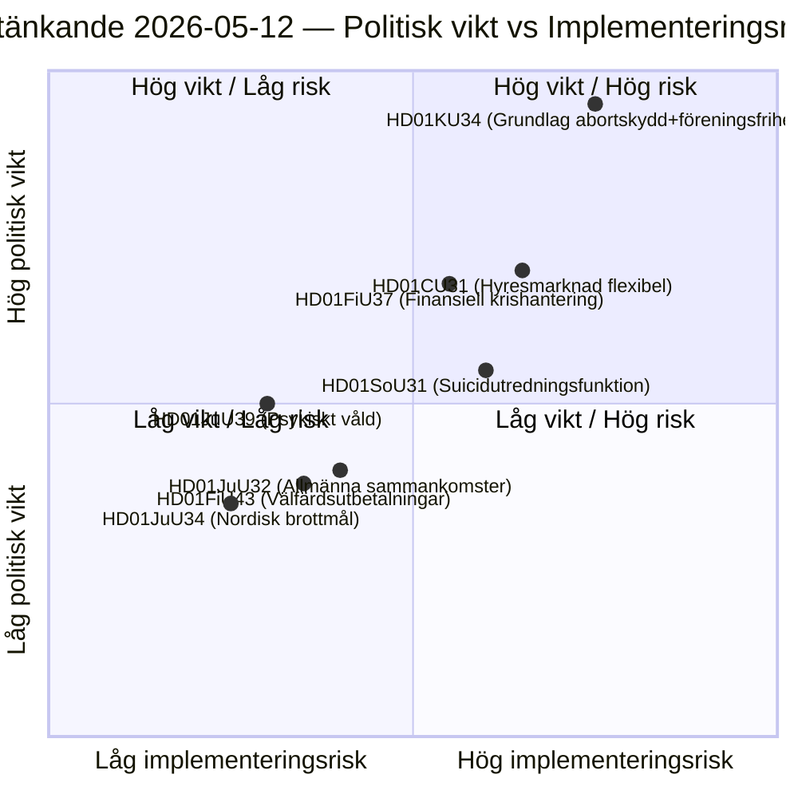

# Informes de comités del Riksdag sueco: Reforma constitucional, prevención del suicidio y mercado de alquiler — 2026-05-12

**Autor**: James Pether Sörling  
**Fecha**: 2026-05-12  
**Clasificación**: PÚBLICO — RGPD Art. 9(2)(e)(g)  
**Nivel de confianza**: HIGH [B2]  
**Ciclo de análisis**: committeeReports · 2026-05-12  

---

## BLUF

El Comité Constitucional (KU) presenta un informe doble histórico (HD01KU34) que busca proteger constitucionalmente el derecho al aborto y al mismo tiempo ampliar las posibilidades de restringir la libertad de asociación y la ciudadanía — un compromiso político que abarca tres riksmöten de revisión de la RF. El Comité Social (SoU) propone una función nacional de investigación para la prevención del suicidio (HD01SoU31) que crea nueva capacidad estatal. El Comité Civil (CU) presenta reformas del mercado de alquiler (HD01CU31) con amplia desregulación del mercado antes de las próximas elecciones parlamentarias suecas de 2026. En conjunto, estos informes constituyen la sesión de paquete constitucionalmente más pesada desde la revisión de la RF en 2010.

## Decisiones apoyadas por este documento

1. **Priorización editorial**: HD01KU34 es el informe políticamente más importante — los cambios constitucionales afectan a los 349 miembros y requieren una decisión bicameral (o dos decisiones sucesivas del Riksdag con elección intermedia).
2. **Inventario de riesgos**: La reforma del mercado de alquiler HD01CU31 corre el riesgo de reveses en los procesos de la UE (ECHR Art. 1 Protocolo 1) y podría activar el voto disidente del SD ante la campaña electoral.
3. **Seguimiento PIR**: Seguir cómo la doble naturaleza del KU34 (protección del aborto + libertad de asociación restringida) se navega en los manifiestos electorales de los partidos en 2026.

## Puntos de inteligencia en 60 segundos

- 🔴 **KU34** — Derecho al aborto protegido constitucionalmente + libertad de asociación restringida: revisión histórica de la RF que requiere 2 decisiones con elección intermedia. Fuerza explosiva política alta; se espera que SD y KD presenten reservas.
- 🟡 **SoU31** — Función nacional de investigación de suicidios: nueva entidad estatal con manejo RGPD complejo de datos de causas de muerte. Riesgo de implementación medio-alto (dependiente del presupuesto, capacidad de la Socialstyrelsen).
- 🟡 **CU31** — Mercado de alquiler flexible: desregulación del sistema de arrendamiento con alquileres indexados. Amplia oposición de S y V; posible votación por mayoría simple.
- 🟠 **FiU37** — Gestión de crisis operativa del sector financiero: crea nuevo mecanismo de resolución compatible con DORA. Técnico, pero sistémicamente importante.
- 🟢 **JuU39** — Disposición penal sobre violencia psicológica: criminaliza la violencia psicológica sistemática en relaciones íntimas, armonización UE con el Convenio de Estambul.

## Desencadenante prospectivo más importante

**Segunda lectura del KU34** (próximo riksmöte): Si el Riksdag resuelve este informe en dirección positiva antes de las elecciones 2026, comenzará la cuenta regresiva para la votación de cuarentena obligatoria — lo que establece una fecha límite estricta para la decisión inicial del próximo Riksdag y afecta directamente las plataformas electorales.

## Diagrama clave: Panorama de riesgos legislativos

<!-- source-sha: 9cdd9bfe0bc226548b5ddf453782f5076880156a -->
