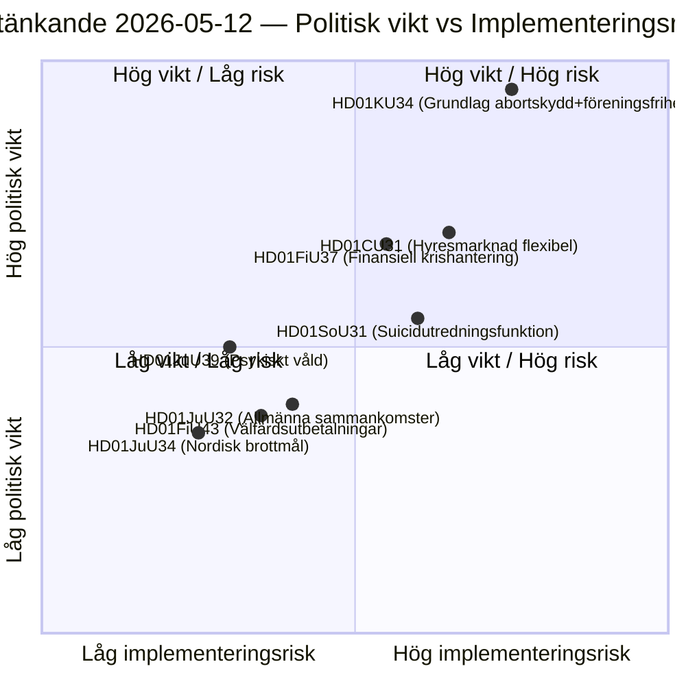

# Ruotsin eduskunnan valiokuntamietinnöt: Perustuslakiuudistus, itsemurhien ehkäisy ja vuokramarkkina — 2026-05-12

**Tekijä**: James Pether Sörling  
**Päiväys**: 2026-05-12  
**Luokittelu**: JULKINEN — GDPR Art. 9(2)(e)(g)  
**Luottamustaso**: HIGH [B2]  
**Analyysisykli**: committeeReports · 2026-05-12  

---

## BLUF

Perustuslakivaliokunta (KU) esittää historiallisen kaksoistuomion (HD01KU34), joka pyrkii perustuslaillisesti suojaamaan aborttioikeuden ja samalla laajentamaan mahdollisuuksia rajoittaa yhdistymisvapautta ja kansalaisuutta — poliittinen kompromissi, joka kattaa kolme riksmöteniä RF-revision osalta. Sosialivaliokunta (SoU) ehdottaa kansallista tutkimustoimintoa itsemurhien ehkäisyyn (HD01SoU31), joka luo uutta valtion kapasiteettia. Siviilivaliokunnan (CU) asuntomarkkina-uudistukset (HD01CU31) sisältävät laajan markkinasääntelystä vapautumisen ennen vuoden 2026 eduskuntavaaleja. Kokonaisuudessaan nämä mietinnöt muodostavat perustuslaillisesti raskaimman pakettisession vuoden 2010 RF-revision jälkeen.

## Päätökset joita tämä analyysi tukee

1. **Toimituksellinen priorisointi**: HD01KU34 on poliittisesti painavin mietintö — perustuslakimuutokset koskevat kaikkia 349 edustajaa ja vaativat kaksikammarioihin päätöstä (tai kahta peräkkäistä riksdag-päätöstä välivaaleilla).
2. **Riskikartoitus**: HD01CU31:n vuokramarkkina-uudistus voi törmätä EU-prosesseissa vastarintaan (ECHR Art. 1 Protokolla 1) ja voi aktivoida SD:n poikkeavat äänestykset vaalikauden lähestyessä.
3. **PIR-seuranta**: Seurata kuinka KU34:n kaksoisluonne (aborttioikeuden suojaus + rajoitettu yhdistymisvapaus) navigoidaan puolueiden vaalimanifestoissa 2026.

## 60 sekunnin tiedustelupisteet

- 🔴 **KU34** — Perustuslaillisesti suojattu aborttioikeus + rajoitettu yhdistymisvapaus: historiallinen RF-revisio, joka vaatii 2 päätöstä välillä olevan vaalin kanssa. Poliittinen räjähdysvoima korkea; SD:n ja KD:n odotetaan esittävän varaumia.
- 🟡 **SoU31** — Kansallinen itsemurhien tutkimistoiminto: uusi valtion yksikkö, jolla on GDPR-monimutkainen kuolinsyyaineiston käsittely. Toteutusriski kohtalaisesti korkea (budjettiriippuvuus, Socialstyrelsenin kapasiteetti).
- 🟡 **CU31** — Joustava vuokramarkkina: vuokra-asuntojärjestelmän deregulointi indeksoiduilla vuokrilla. Laaja oppositio S:ltä ja V:ltä; mahdollinen äänestys yksinkertaisella enemmistöllä.
- 🟠 **FiU37** — Rahoitussektorin operatiivinen kriisinhallinta: luo uuden DORA-yhteensopivan kriisinratkaisumekanismin. Tekninen, mutta järjestelmällisesti tärkeä.
- 🟢 **JuU39** — Psyykkisen väkivallan rikossäännös: kriminalisoi järjestelmällisen psykologisen väkivallan läheisissä suhteissa, EU-harmonisointi Istanbulin sopimuksen kanssa.

## Tärkein eteenpäin osoittava laukaisin

**KU34 toinen käsittely** (seuraava riksmöte): Jos riksdag ratkaisee tämän mietinnön myönteiseen suuntaan ennen vuoden 2026 vaaleja, alkaa pakollisen karanteeniäänestyksen laskenta — mikä asettaa tiukan määräajan seuraavan riksdagin aloituspäätökselle ja vaikuttaa suoraan vaaliplatformeihin.

## Keskeinen kaavio: Lainsäädännöllinen riskimaisema

<!-- source-sha: 9cdd9bfe0bc226548b5ddf453782f5076880156a -->
