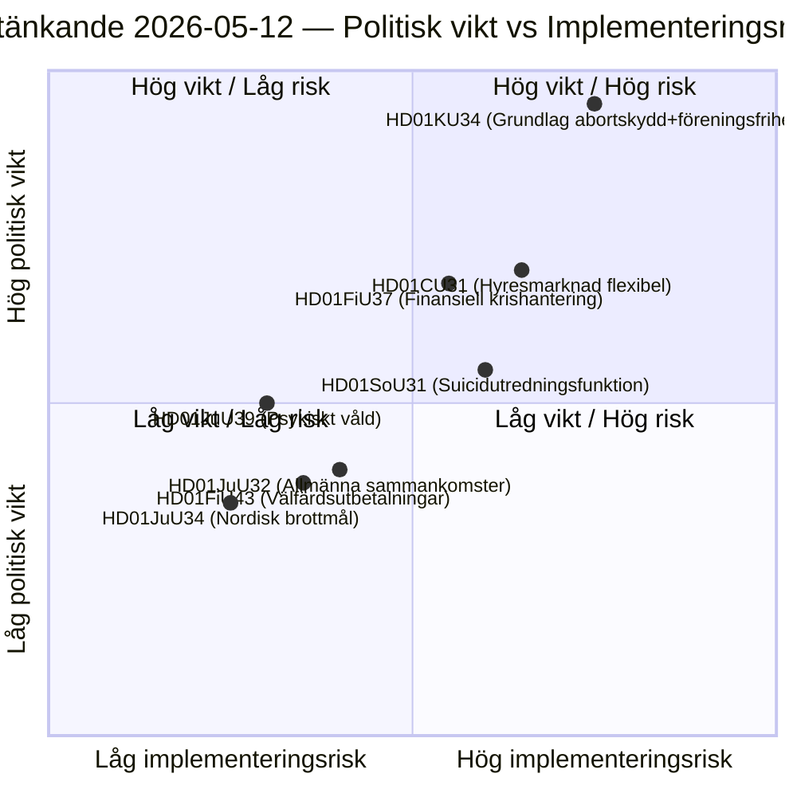

# Rapports des comités du Riksdag suédois : Réforme constitutionnelle, prévention du suicide et marché locatif — 2026-05-12

**Auteur** : James Pether Sörling  
**Date** : 2026-05-12  
**Classification** : PUBLIC — RGPD Art. 9(2)(e)(g)  
**Niveau de confiance** : HIGH [B2]  
**Cycle d'analyse** : committeeReports · 2026-05-12  

---

## BLUF

Le Comité constitutionnel (KU) présente un double rapport historique (HD01KU34) cherchant à protéger constitutionnellement le droit à l'avortement tout en élargissant les possibilités de restriction de la liberté d'association et de la citoyenneté — un compromis politique couvrant trois riksmöten de révision de la RF. Le Comité social (SoU) propose une fonction nationale d'enquête sur la prévention du suicide (HD01SoU31) créant de nouvelles capacités étatiques. Le Comité civil (CU) présente des réformes du marché locatif (HD01CU31) avec une large déréglementation du marché en amont des prochaines élections législatives suédoises de 2026. Dans l'ensemble, ces rapports constituent la session de paquet la plus constitutionnellement lourde depuis la révision de la RF en 2010.

## Décisions soutenues par ce document

1. **Priorisation rédactionnelle** : HD01KU34 est le rapport politiquement le plus important — les modifications constitutionnelles concernent les 349 membres et requièrent une décision bicamérale (ou deux décisions successives du Riksdag avec une élection intermédiaire).
2. **Inventaire des risques** : La réforme du marché locatif HD01CU31 risque des recours dans les procédures de l'UE (ECHR Art. 1 Protocole 1) et pourrait activer le vote déviant du SD avant la campagne électorale.
3. **Suivi PIR** : Suivre comment la double nature de KU34 (protection de l'avortement + liberté d'association restreinte) est navigée dans les programmes électoraux des partis en 2026.

## Points de renseignement en 60 secondes

- 🔴 **KU34** — Droit à l'avortement protégé constitutionnellement + liberté d'association restreinte : révision historique de la RF nécessitant 2 décisions avec une élection intermédiaire. Force explosive politique élevée ; SD et KD devraient formuler des réserves.
- 🟡 **SoU31** — Fonction nationale d'enquête sur les suicides : nouvelle entité d'État avec gestion RGPD complexe des données sur les causes de décès. Risque de mise en œuvre moyen-élevé (dépendant du budget, capacité de la Socialstyrelsen).
- 🟡 **CU31** — Marché locatif flexible : déréglementation du système de location avec loyers indexés. Large opposition de S et V ; vote possible à la majorité simple.
- 🟠 **FiU37** — Gestion de crise opérationnelle du secteur financier : crée un nouveau mécanisme de résolution compatible DORA. Technique, mais d'importance systémique.
- 🟢 **JuU39** — Disposition pénale sur la violence psychologique : criminalise la violence psychologique systématique dans les relations proches, harmonisation EU avec la Convention d'Istanbul.

## Déclencheur prospectif le plus important

**Deuxième lecture de KU34** (prochain riksmöte) : Si le Riksdag résout ce rapport dans une direction positive avant les élections 2026, le compte à rebours pour le vote de quarantaine obligatoire commencera — ce qui fixe une échéance ferme pour la décision d'ouverture du prochain Riksdag et affecte directement les plateformes électorales.

## Schéma clé : Paysage des risques législatifs

<!-- source-sha: 9cdd9bfe0bc226548b5ddf453782f5076880156a -->
