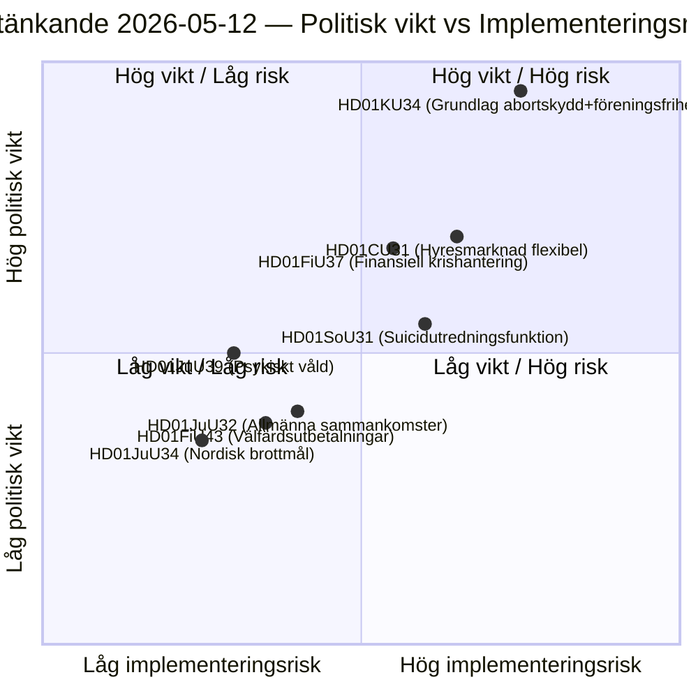

<!-- dir: rtl -->
# דוחות ועדות הרייכסדאג השבדי: רפורמה חוקתית, מניעת התאבדות ושוק השכירות — 2026-05-12

**מחבר**: James Pether Sörling  
**תאריך**: 2026-05-12  
**סיווג**: ציבורי — GDPR סעיף 9(2)(ה)(ז)  
**רמת ביטחון**: HIGH [B2]  
**מחזור ניתוח**: committeeReports · 2026-05-12  

---

## סיכום מנהלים

ועדת החוקה (KU) מציגה דוח כפול היסטורי (HD01KU34) המבקש להגן חוקתית על זכות ההפלה ובו בזמן להרחיב את האפשרויות להגביל את חופש ההתאגדות והאזרחות — פשרה פוליטית המשתרעת על שלושה מושבי פרלמנט של מרים RF. ועדת הרווחה (SoU) מציעה פונקציית חקירה לאומית למניעת התאבדות (HD01SoU31) היוצרת יכולת ממלכתית חדשה. ועדת הנושאים האזרחיים (CU) מציגה רפורמות בשוק השכירות (HD01CU31) עם ביטול רגולציה נרחב של השוק לקראת הבחירות הפרלמנטריות השבדיות הקרובות לשנת 2026. בסך הכל, מהווים דוחות אלה את ההפגנה החוקתית הכבדה ביותר מאז מרים RF בשנת 2010.

## החלטות שמסמך זה תומך בהן

1. **עדיפות עריכה**: HD01KU34 הוא הדוח הכבד ביותר מבחינה פוליטית — שינויים חוקתיים משפיעים על כל 349 החברים ומחייבים החלטת שתי לשכות (או שתי החלטות פרלמנטריות עוקבות עם בחירות ביניהן).
2. **מלאי סיכונים**: רפורמת שוק השכירות HD01CU31 מסתכנת בנסיגות בהליכים האירופיים (ECHR סעיף 1 פרוטוקול 1) ועלולה להפעיל את הצבעת החריגה של SD לפני מסע הבחירות.
3. **מעקב PIR**: לעקוב כיצד הטבע הכפול של KU34 (הגנה על הפלה + חופש התאגדות מוגבל) מנוהל במצעי הבחירות של המפלגות בשנת 2026.

## נקודות מודיעין בתוך 60 שניות

- 🔴 **KU34** — זכות הפלה מוגנת חוקתית + חופש התאגדות מוגבל: מרים RF היסטורית הדורשת 2 החלטות עם בחירות ביניהן. כוח פיצוץ פוליטי גבוה; צפוי ש-SD ו-KD יטילו הסתייגויות.
- 🟡 **SoU31** — פונקציית חקירה לאומית לאירועי התאבדות: יחידה ממלכתית חדשה עם טיפול מורכב ב-GDPR בנתוני סיבות מוות. סיכון יישום גבוה-בינוני (תלוי תקציב, יכולת Socialstyrelsen).
- 🟡 **CU31** — שוק שכירות גמיש: ביטול רגולציה של מערכת השכירות עם שכר דירה צמוד מדד. אופוזיציה רחבה מ-S ו-V; הצבעה אפשרית ברוב פשוט.
- 🟠 **FiU37** — ניהול משבר תפעולי במגזר הפיננסי: יוצר מנגנון ניתוח חדש תואם DORA. טכני, אך בעל חשיבות מערכתית.
- 🟢 **JuU39** — הוראת עונש אלימות נפשית: מפלילה אלימות פסיכולוגית שיטתית ביחסים אינטימיים, הרמוניזציה אירופאית עם אמנת איסטנבול.

## הפעולה המניעה החשובה ביותר לקדימה

**קריאה שנייה של KU34** (מושב פרלמנט הבא): אם הרייכסדאג יפתור דוח זה לכיוון חיובי לפני בחירות 2026, יחל מנייה לאחור עבור הצבעת הסגר החובה — מה שקובע מועד אחרון נוקשה להחלטת הפתיחה של הרייכסדאג הבא ומשפיע ישירות על פלטפורמות הבחירות.

## דיאגרמה מרכזית: נוף הסיכון החקיקתי

<!-- source-sha: 9cdd9bfe0bc226548b5ddf453782f5076880156a -->
