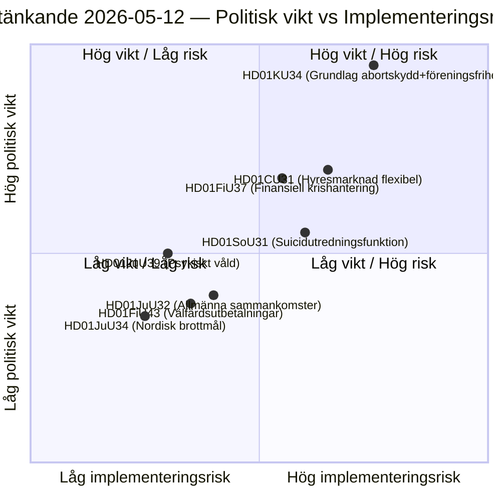

# スウェーデン議会委員会報告書：憲法改革、自殺防止、賃貸市場 — 2026-05-12

**著者**: James Pether Sörling  
**日付**: 2026-05-12  
**分類**: 🟢 公開 — GDPR Art. 9(2)(e)(g)  
**信頼水準**: HIGH [B2]  
**分析サイクル**: committeeReports · 2026-05-12  

---

## 結論（BLUF）

憲法委員会（KU）は歴史的な二重報告書（HD01KU34）を提出し、中絶権の憲法的保護を求めつつ、結社の自由と市民権を制限する国家権限も拡大しようとしています — RF改正を3つの議会期にわたって包括する政治的妥協です。社会委員会（SoU）は自殺防止のための全国調査機能（HD01SoU31）を提案し、新たな国家能力を創出します。民事委員会（CU）は2026年スウェーデン総選挙を前に市場全面規制緩和を伴う賃貸市場改革（HD01CU31）を提示します。総じてこれらの報告書は、2010年RF改正以来最も憲法的に重厚なパッケージセッションを形成します。

## 本文書が支持する決定

1. **編集優先度**: HD01KU34は政治的に最も重要な報告書です — 憲法改正は349人全員の議員に影響を与え、二院制決定（または中間選挙を挟んだ2回の連続議会決定）が必要です。
2. **リスク棚卸し**: HD01CU31の賃貸市場改革はEU手続き（ECHR第1議定書）での後退リスクがあり、選挙運動前にSDの離反票を活性化させる可能性があります。
3. **PIR追跡**: KU34の二重性（中絶保護+結社の自由制限）が2026年の各党選挙公約でどのように扱われるかを追跡します。

## 60秒インテリジェンスポイント

- 🔴 **KU34** — 憲法的に保護された中絶権+結社の自由制限：中間選挙を挟んだ2決議を必要とする歴史的RF改正。政治的破壊力は高く、SDとKDが留保を表明すると予想されます。
- 🟡 **SoU31** — 全国自殺調査機能：死因データのGDPR複雑処理を伴う新国家機関。実施リスク中高（予算依存、Socialstyrelsenの能力）。
- 🟡 **CU31** — 柔軟な賃貸市場：インデックス連動賃料による賃貸システムの規制緩和。SとVからの広範な反対；単純多数による採決の可能性あり。
- 🟠 **FiU37** — 金融部門の運用危機管理：新しいDORA準拠の破綻処理メカニズムを創設。技術的ですがシステム上重要。
- 🟢 **JuU39** — 精神的暴力刑事規定：親密な関係における体系的な精神的暴力を犯罪化、イスタンブール条約とのEU調和。

## 最重要前向き引き金

**KU34第二読会**（次の議会期）：2026年選挙前に議会がこの報告書を肯定方向に解決すれば、義務的な検疫投票のカウントダウンが始まります — これにより次期議会の開会決定に厳格な期限が設定され、選挙プラットフォームに直接影響します。

## 主要図表：立法リスク景観

<!-- source-sha: 9cdd9bfe0bc226548b5ddf453782f5076880156a -->
