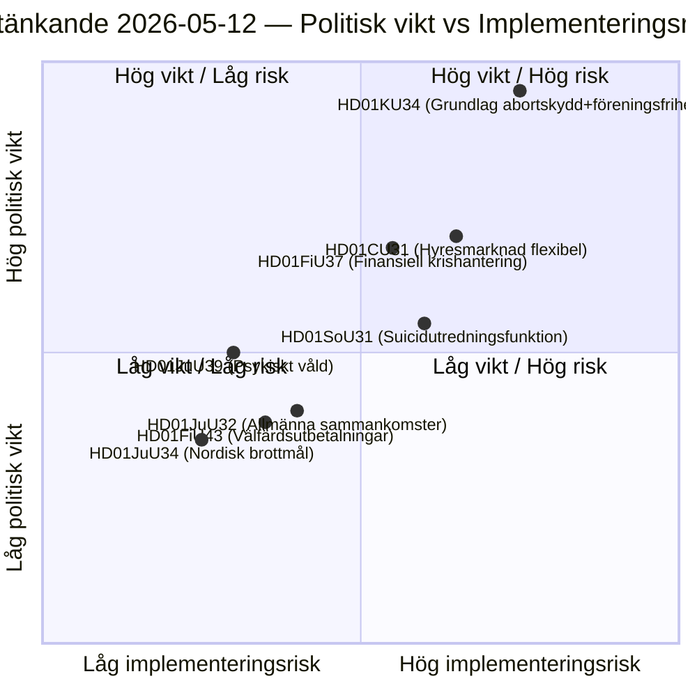

# 스웨덴 의회 위원회 보고서: 헌법 개혁, 자살 예방 및 임대 시장 — 2026-05-12

**저자**: James Pether Sörling  
**날짜**: 2026-05-12  
**분류**: 🟢 공개 — GDPR Art. 9(2)(e)(g)  
**신뢰 수준**: HIGH [B2]  
**분석 주기**: committeeReports · 2026-05-12  

---

## 결론(BLUF)

헌법위원회(KU)는 역사적인 이중 보고서(HD01KU34)를 제출하며, 낙태권을 헌법적으로 보호하는 동시에 결사의 자유와 시민권을 제한하는 국가 권한을 확대하려 합니다 — RF 개정안을 세 번의 의회 회기에 걸쳐 포괄하는 정치적 타협입니다. 사회위원회(SoU)는 자살 예방을 위한 전국 조사 기능(HD01SoU31)을 제안하여 새로운 국가 역량을 창출합니다. 민사위원회(CU)는 2026년 스웨덴 의회 선거를 앞두고 광범위한 시장 규제 완화를 담은 임대 시장 개혁(HD01CU31)을 제시합니다. 종합적으로 이 보고서들은 2010년 RF 개정 이후 가장 헌법적으로 무거운 패키지 세션을 구성합니다.

## 이 문서가 지원하는 결정

1. **편집 우선순위**: HD01KU34는 정치적으로 가장 비중 있는 보고서입니다 — 헌법 개정은 349명 전원에게 영향을 미치며, 양원 결정(또는 중간 선거를 포함한 두 번의 연속 의회 결정)이 필요합니다.
2. **위험 목록**: HD01CU31의 임대 시장 개혁은 EU 절차(ECHR 제1의정서)에서 후퇴 위험이 있으며, 선거 운동 전 SD의 이탈 투표를 촉발할 수 있습니다.
3. **PIR 추적**: KU34의 이중성(낙태 보호+결사의 자유 제한)이 2026년 각 당의 선거 공약에서 어떻게 다뤄지는지 추적합니다.

## 60초 정보 요점

- 🔴 **KU34** — 헌법적으로 보호된 낙태권+결사의 자유 제한: 중간 선거를 포함한 2번의 결의가 필요한 역사적 RF 개정. 정치적 폭발력 높음; SD와 KD가 유보 입장을 표명할 것으로 예상됩니다.
- 🟡 **SoU31** — 전국 자살 조사 기능: 사망 원인 데이터에 대한 GDPR 복잡 처리를 수반하는 새 국가 기관. 이행 위험 중상(예산 의존, Socialstyrelsen 역량).
- 🟡 **CU31** — 유연한 임대 시장: 인덱스 연동 임대료를 통한 임대 시스템 규제 완화. S와 V의 광범위한 반대; 단순 다수결 투표 가능성.
- 🟠 **FiU37** — 금융 부문 운영 위기 관리: 새로운 DORA 호환 정리 메커니즘 생성. 기술적이지만 시스템적으로 중요합니다.
- 🟢 **JuU39** — 심리적 폭력 형사 조항: 친밀한 관계에서의 체계적 심리적 폭력 범죄화, 이스탄불 협약과의 EU 조화.

## 가장 중요한 선행 촉발 요인

**KU34 2차 독회**(다음 의회 회기): 2026년 선거 전에 의회가 이 보고서를 긍정적 방향으로 해결하면, 의무적 격리 투표의 카운트다운이 시작됩니다 — 이는 다음 의회의 개회 결정에 엄격한 기한을 설정하고 선거 플랫폼에 직접 영향을 미칩니다.

## 주요 도표: 입법 위험 지형

<!-- source-sha: 9cdd9bfe0bc226548b5ddf453782f5076880156a -->
