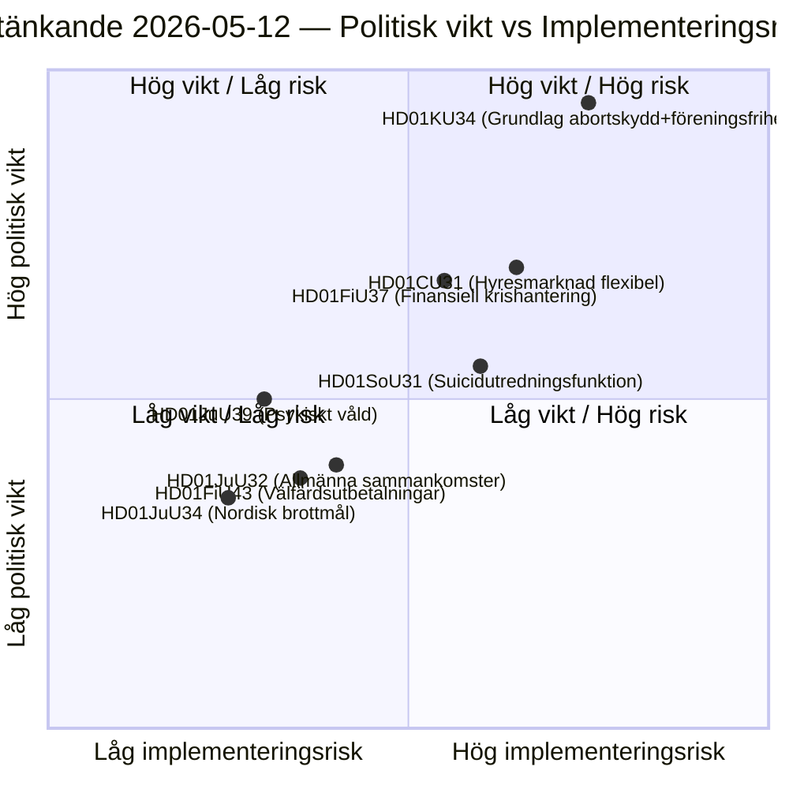

# Zweedse Riksdag-commissierapporten: Constitutionele hervorming, suïcidepreventie en huurmarkt — 2026-05-12

**Auteur**: James Pether Sörling  
**Datum**: 2026-05-12  
**Classificatie**: OPENBAAR — AVG Art. 9(2)(e)(g)  
**Betrouwbaarheidsniveau**: HIGH [B2]  
**Analysecyclus**: committeeReports · 2026-05-12  

---

## BLUF

De Grondwetscommissie (KU) presenteert een historisch dubbel adviesrapport (HD01KU34) dat beoogt het abortusrecht grondwettelijk te beschermen en tegelijkertijd de mogelijkheden tot beperking van de vrijheid van vereniging en staatsburgerschap uit te breiden — een politisch compromis dat drie riksmöten van RF-herziening omspant. De Sociale Commissie (SoU) stelt een nationale onderzoeksfunctie voor suïcidepreventie voor (HD01SoU31) die nieuwe staatscapaciteit creëert. De Civiele Commissie (CU) presenteert huurmarkthervormen (HD01CU31) met brede marktderegulering voor de aankomende Zweedse verkiezingen van 2026. Tezamen vormen deze rapporten de constitutioneel zwaarste pakketsessie sinds de RF-herziening in 2010.

## Beslissingen die dit document ondersteunt

1. **Redactionele prioritering**: HD01KU34 is het politiek zwaarwegenste rapport — grondwetswijzigingen betreffen alle 349 leden en vereisen een tweekamerbesluit (of twee opeenvolgende Riksdag-beslissingen met tussenliggende verkiezingen).
2. **Risico-inventarisatie**: De huurmarkthervorming HD01CU31 loopt het risico op terugval in EU-procedures (ECHR Art. 1 Protocol 1) en kan de afwijkende stem van SD activeren voor de verkiezingscampagne.
3. **PIR-opvolging**: Volgen hoe de dubbele aard van KU34 (abortusprotectie + beperkte vrijheid van vereniging) wordt genavigeerd in de verkiezingsmanifesten van de partijen in 2026.

## 60-secondeninformatiepunten

- 🔴 **KU34** — Grondwettelijk beschermd abortusrecht + beperkte vrijheid van vereniging: historische RF-herziening die 2 beslissingen vereist met tussenliggende verkiezingen. Politieke explosiekracht hoog; SD en KD worden verwacht voorbehouden te maken.
- 🟡 **SoU31** — Nationale suïcideonderzoeksfunctie: nieuwe staatseenheid met AVG-complexe behandeling van overlijdensgegevens. Implementatierisico middel-hoog (budgetafhankelijk, capaciteit Socialstyrelsen).
- 🟡 **CU31** — Flexibele huurmarkt: deregulering van het huurstelsel met geïndexeerde huren. Brede oppositie van S en V; mogelijke stemming met gewone meerderheid.
- 🟠 **FiU37** — Operationeel crisisbeheer financiële sector: creëert nieuw DORA-compatibel afwikkelingsmechanisme. Technisch, maar systeemrelevant.
- 🟢 **JuU39** — Strafbepaling psychisch geweld: criminaliseert systematisch psychologisch geweld in intieme relaties, EU-harmonisering met het Verdrag van Istanbul.

## Belangrijkste vooruitblikkende trigger

**KU34 tweede lezing** (volgend riksmöte): Als de Riksdag dit rapport in positieve richting oplost voor de verkiezingen van 2026, begint de aftelling voor de verplichte quarantainestemming — wat een harde deadline stelt voor het openingsbesluit van de volgende Riksdag en de verkiezingsplatforms direct beïnvloedt.

## Sleuteldiagram: Wetgevend risicolandschap

<!-- source-sha: 9cdd9bfe0bc226548b5ddf453782f5076880156a -->
