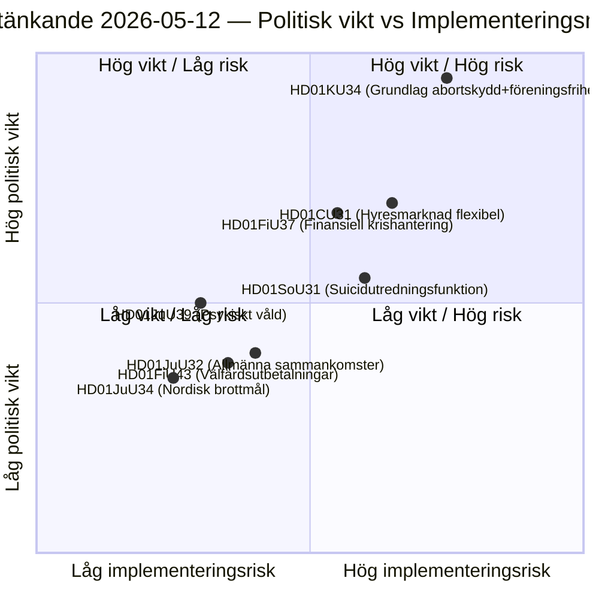

# Riksdagets komitébetenkninger: Forfatningsreform, selvmordsforebygging og leiemarked — 2026-05-12

**Forfatter**: James Pether Sörling  
**Dato**: 2026-05-12  
**Klassifisering**: OFFENTLIG — GDPR Art. 9(2)(e)(g)  
**Konfidens**: HIGH [B2]  
**Analysesyklus**: committeeReports · 2026-05-12  

---

## BLUF

Konstitusjonskomiteen (KU) fremlegger en historisk dobbeltbetenkelse (HD01KU34) som søker å grunnlovsfeste abortrettigheter og samtidig utvide mulighetene til å begrense foreningsfriheten og statsborgerskap — et politisk kompromiss som strekker seg over tre riksmöten med RF-revisjon. Sosialkomiteen (SoU) foreslår en nasjonal utredningsfunksjon for selvmordsforebygging (HD01SoU31) som skaper ny statlig kapasitet. Siviltutvalget (CU) legger frem leiemarkedsreformer (HD01CU31) med bred markedsderegulering foran det kommende riksdagsvalget i 2026. Samlet utgjør disse betenkningene den mest konstitusjonelt tunge pakkesesjonen siden RF-revisjonen i 2010.

## Beslutninger dette underlaget støtter

1. **Redaksjonell prioritering**: HD01KU34 er den politisk tyngst veiende betenkelsen — grunnlovsendringer berører alle 349 representanter og krever tokammerbeslutning (eller to successive riksdagsbeslutninger med mellomliggende valg).
2. **Risikokartlegging**: HD01CU31's leiemarkedsreform risikerer tilbakeslag i EU-prosessene (ECHR Art. 1 Protokoll 1) og kan aktivere SD's avviksstemme foran valgkampen.
3. **PIR-oppfølging**: Følge hvordan KU34's dobbeltnatur (abortbeskyttelse + begrenset foreningsfrihet) navigeres i partienes valgprogrammer 2026.

## 60-sekunders etterretningspunkter

- 🔴 **KU34** — Grunnlovssikret abortrett + begrenset foreningsfrihet: historisk RF-revisjon som krever 2 beslutninger med valg imellom. Politisk sprengkraft høy; SD og KD forventes å ta forbehold.
- 🟡 **SoU31** — Nasjonal selvmordsutredningsfunksjon: ny statlig enhet med GDPR-kompleks håndtering av dødsfalldata. Implementeringsrisiko middels høy (budgetavhengig, Socialstyrelsen kapasitet).
- 🟡 **CU31** — Fleksibelt leiemarked: deregulering av leieboligsystemet med indekserte leier. Bred opposisjon fra S og V; mulig avstemning med simpelt flertall.
- 🟠 **FiU37** — Operativ krisehåndtering finansiell sektor: skaper ny DORA-kompatibel resolusjonmekanisme. Teknisk, men systemviktig.
- 🟢 **JuU39** — Psykisk vold straffebestemmelse: kriminaliserer systematisk psykologisk vold i nære relasjoner, EU-harmonisering med Istanbul-konvensjonen.

## Viktigste fremoverpekende utløser

**KU34 andre behandling** (neste riksmöte): Hvis riksdagen løser denne betenkelsen i positiv retning før valget 2026 begynner nedtellingen for den obligatoriske karantenestemningen — noe som setter en hard deadline for neste riksdags innledende beslutning og påvirker valgprogrammene direkte.

## Nøkkeldiagram: Lovgivningsmessig risikolandskap

<!-- source-sha: 9cdd9bfe0bc226548b5ddf453782f5076880156a -->
