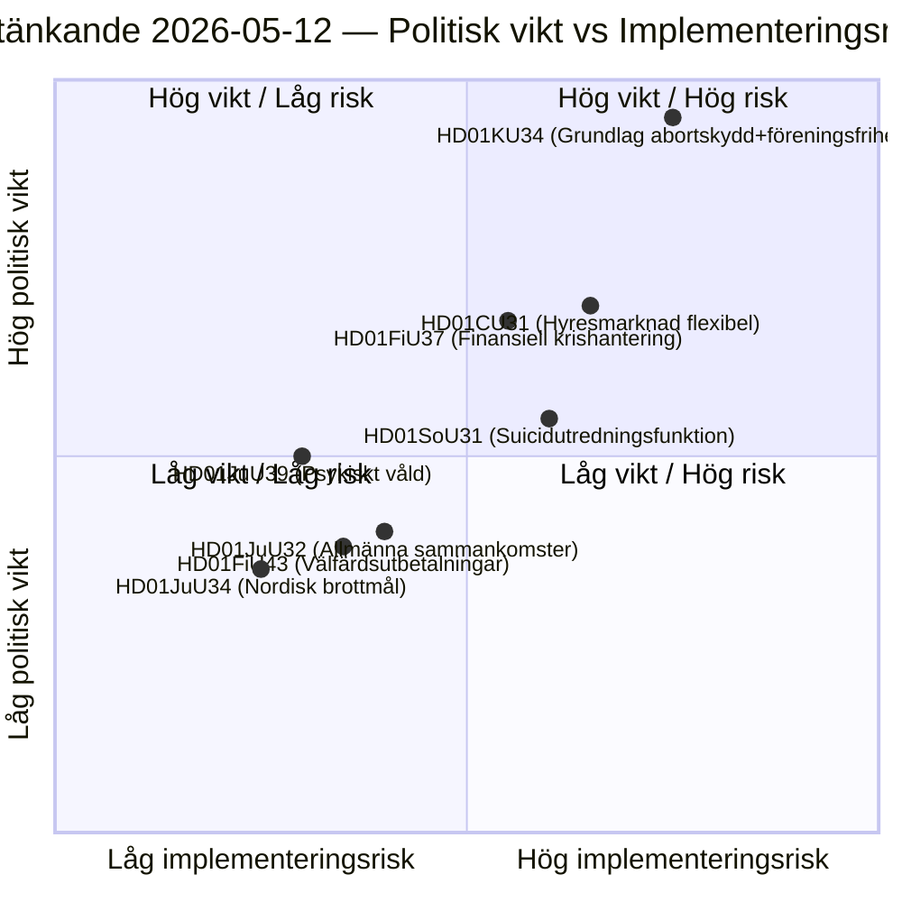

# 瑞典议会委员会报告：宪法改革、自杀预防与租房市场 — 2026-05-12

**作者**: James Pether Sörling  
**日期**: 2026-05-12  
**分类**: 🟢 公开 — GDPR Art. 9(2)(e)(g)  
**置信度**: HIGH [B2]  
**分析周期**: committeeReports · 2026-05-12  

---

## 摘要

宪法委员会（KU）提交了一份历史性的双重报告（HD01KU34），既寻求宪法保护堕胎权，又扩大限制结社自由和公民权的国家权力——这是一项跨越三届议会会期RF修订的政治妥协。社会委员会（SoU）提议设立全国自杀预防调查功能（HD01SoU31），创建新的国家能力。民事委员会（CU）在2026年瑞典议会选举前提出租房市场改革（HD01CU31），涵盖广泛的市场解除管制。总体而言，这些报告构成了自2010年RF修订以来宪法上最为沉重的一揽子会议。

## 本文件支持的决策

1. **编辑优先级**：HD01KU34是政治上最具分量的报告——宪法修正案影响全部349名成员，需要两院决议（或含中间选举的两次连续议会决议）。
2. **风险清单**：HD01CU31的租房市场改革在EU程序（ECHR第1附加议定书）中存在受阻风险，并可能在选举前激活SD的异议票。
3. **PIR跟踪**：追踪KU34的双重性质（堕胎保护+结社自由受限）如何在各党2026年选举纲领中加以处理。

## 60秒情报要点

- 🔴 **KU34** — 宪法保护的堕胎权+结社自由受限：历史性RF修订，需要含中间选举的2次决议。政治爆炸性高；预计SD和KD将提出保留意见。
- 🟡 **SoU31** — 全国自杀调查功能：处理死亡原因数据的GDPR复杂性新国家机构。实施风险中高（依赖预算、Socialstyrelsen的能力）。
- 🟡 **CU31** — 灵活租房市场：以指数化租金解除租赁系统管制。S和V的广泛反对；可能以简单多数表决。
- 🟠 **FiU37** — 金融部门运营危机管理：创建新的DORA兼容处置机制。技术性强，但具有系统性重要性。
- 🟢 **JuU39** — 心理暴力刑事条款：将亲密关系中的系统性心理暴力入罪，与伊斯坦布尔公约的EU协调。

## 最重要的前瞻性触发因素

**KU34第二次审议**（下届议会期）：如果议会在2026年选举前以积极方向解决本报告，强制隔离投票的倒计时将开始——这为下届议会的开幕决议设定了严格截止日期，并直接影响各党选举平台。

## 关键图表：立法风险图景

<!-- source-sha: 9cdd9bfe0bc226548b5ddf453782f5076880156a -->
