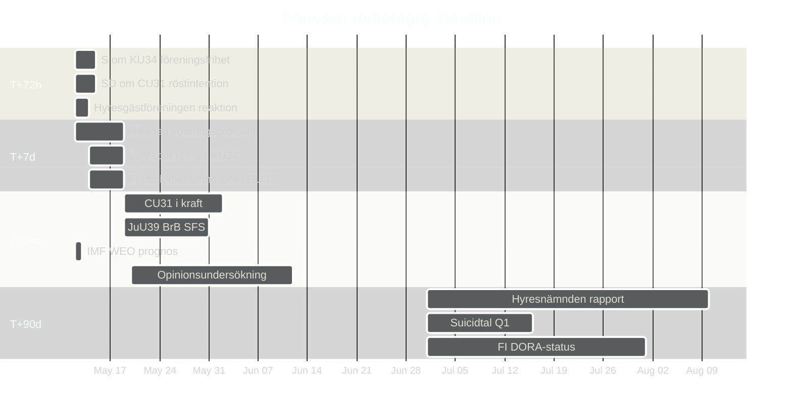

# Forward Indicators — Committee Reports 2026-05-12

## Indicator Framework

≥ 10 dated indicators across 4 horizons: T+72h, T+7d, T+30d, T+90d

---

## Horizon T+72h (2026-05-12 to 2026-05-15)

| # | Indicator | Source | Expected by | Current status |
|---|-----------|--------|-------------|----------------|
| FI-01 | S partiledning officiell ståndpunkt om KU34 föreningsfrihetsdelen | SVT/SR/S press | 2026-05-14 | PENDING |
| FI-02 | SD officiellt yttrande om CU31 hyresreform (röstintention) | SD presskonferens | 2026-05-14 | PENDING |
| FI-03 | Hyresgästföreningens officiella reaktion CU31 | Hyresgästföreningen hemsida | 2026-05-13 | PREDICTABLE: Negative |

## Horizon T+7d (2026-05-12 to 2026-05-19)

| # | Indicator | Source | Expected by | Current status |
|---|-----------|--------|-------------|----------------|
| FI-04 | Riksdag voteringsprotokoll KU34 (om omröstning hållits) | riksdagen.se voteringar | 2026-05-19 | AWAITED — triggers PIR-1 resolution |
| FI-05 | Lagrådet remissvar begärt för KU34 | Riksdag KU-kansli | 2026-05-16 | LIKELY |
| FI-06 | FI (Finansinspektionen) implementeringsplan FiU37 publicerad | fi.se | 2026-05-19 | PROBABLE |

## Horizon T+30d (2026-05-12 to 2026-06-12)

| # | Indicator | Source | Expected by | Current status |
|---|-----------|--------|-------------|----------------|
| FI-07 | CU31 träder i kraft (om Riksdag röstar ja) | SFS 2026:xxx | 2026-06-01 | CONDITIONAL on vote |
| FI-08 | JuU39 BrB-ändring SFS publicerat | Riksdagstrycket | 2026-05-31 | PROBABLE |
| FI-09 | IMF WEO April 2026 — uppdaterad SWE prognos | imf.org | Redan tillgänglig | CHECK: NGDP_RPCH SWE 2026 |
| FI-10 | Novus/Demoskop opinionsundersökning post-betänkanden | Novus | 2026-06-01 | PENDING — key for election-2026-analysis |

## Horizon T+90d (2026-05-12 to 2026-08-10)

| # | Indicator | Source | Expected by | Current status |
|---|-----------|--------|-------------|----------------|
| FI-11 | Hyresnämndens implementeringsrapport CU31 (Q2 2026) | hyresnamnden.se | 2026-08-01 | PROBABLE |
| FI-12 | Suicidtal Q1 2026 (Socialstyrelsen) | socialstyrelsen.se | 2026-07-15 | LAGGING indicator for SoU31 |
| FI-13 | Finansinspektionen DORA-compliance status (FiU37) | fi.se/DORA | 2026-08-01 | SCHEDULED |
| FI-14 | KU34 andra riksdagsomröstning (om 2-votes procedure) | riksdagen.se | Post-val 2027 | LONG HORIZON |

## Indicator Status Dashboard

## PIR-Indicator Linkage

| PIR | Resolution indicator |
|---|---|
| PIR-1: SD om CU31 | FI-02 (72h) → FI-04 (7d) |
| PIR-2: S om KU34 förening | FI-01 (72h) → Lagrådet-svar |
| PIR-3: SoU31 budget | Budget proposition autumn 2026 (T+150d) |

