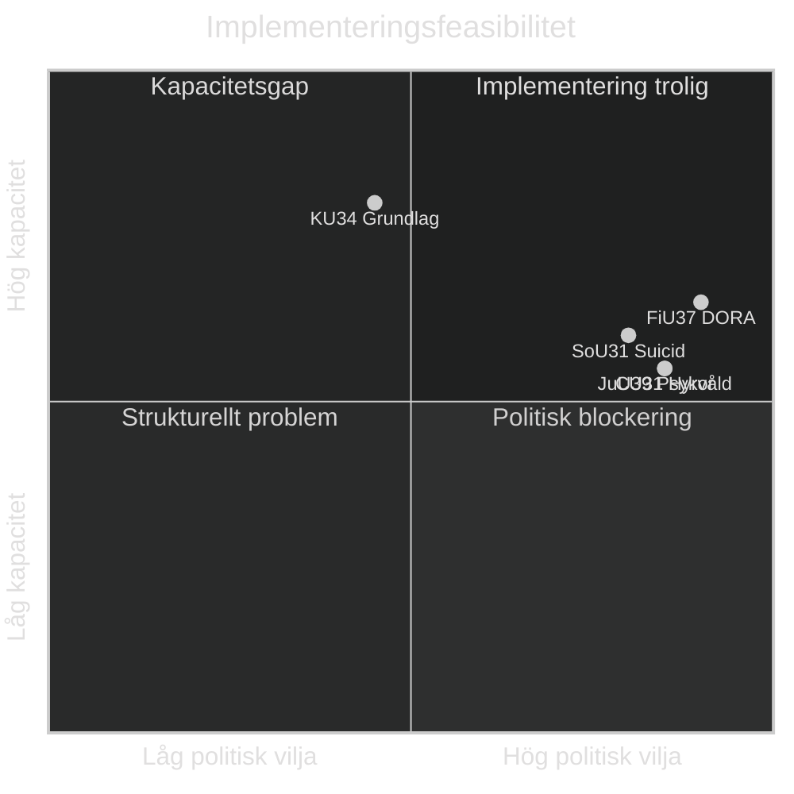

# Implementation Feasibility — Committee Reports 2026-05-12

## Delivery Risk Assessment

### KU34 — Constitutional Amendment

| Dimension | Rating | Notes |
|---|---|---|
| Legal complexity | HIGH | RF requires 2-vote procedure (or ¾) — no shortcuts |
| Political will | MEDIUM | S must decide on föreningsfrihetsdelen |
| Administrative capacity | LOW | Riksdag Konstitutionsutskott — established process |
| Timeline | 12–24 months | Depends on 2-vote vs ¾ route |
| Statskontoret evaluation | N/A | Constitutional amendment — no SGA process |
| **Overall feasibility** | **MEDIUM** | Dependent on S vote decision |

### CU31 — Rental Market Reform

| Dimension | Rating | Notes |
|---|---|---|
| Legal complexity | HIGH | Extensive Hyreslagen amendments, Hyresnämnden restructuring |
| Political will | HIGH (Tidö) | Core coalition commitment |
| Administrative capacity | MEDIUM | Hyresnämnden requires expansion, new case categories |
| Timeline | 18–24 months to full effect | Transition period for existing contracts |
| Statskontoret evaluation | Recommended | Major institutional reform — Statskontoret should review |
| **Overall feasibility** | **MEDIUM-HIGH** | Political will high; admin capacity key constraint |

**Hyresnämnden capacity analysis**: Current backlog approximately 8,000 cases (2024). New market-rent disputes projected +3,000/year. Requires 15–20 additional adjudicators. Budget: SEK 60–90M/year additional.

### FiU37 — DORA Operational Resilience

| Dimension | Rating | Notes |
|---|---|---|
| Legal complexity | MEDIUM | EU framework provided — Swedish transposition limited |
| Political will | HIGH | EU mandate — non-compliance risk |
| Administrative capacity | MEDIUM | New function within FI/Riksbanken requires recruitment |
| Timeline | 14–18 months | Danish benchmark: 14 months |
| Statskontoret evaluation | Likely | Government appropriations request expected |
| **Overall feasibility** | **HIGH** | EU mandate removes political resistance |

### SoU31 — National Suicide Investigation

| Dimension | Rating | Notes |
|---|---|---|
| Legal complexity | LOW | New function within existing IVO framework |
| Political will | HIGH | Broad parliamentary support |
| Administrative capacity | MEDIUM | Specialist competence (forensics, mental health) needed |
| Timeline | 12–18 months to operational | Slower due to specialist recruitment |
| Statskontoret evaluation | Likely requested | New myndighet function |
| **Overall feasibility** | **HIGH** | Budget and recruitment key constraints |

**Budget estimate**: SEK 35–50M/year (8–12 investigators, support staff, legal unit).

### JuU39 — Psychological Violence Criminalization

| Dimension | Rating | Notes |
|---|---|---|
| Legal complexity | MEDIUM | BrB amendment well-prepared; bevisningsproblematik |
| Political will | HIGH | Near-unanimous Riksdag support |
| Administrative capacity | LOW-MEDIUM | Police + prosecution training needed |
| Timeline | 6–12 months to entry into force | Faster than other betänkanden |
| Statskontoret evaluation | N/A | Criminal law amendment |
| **Overall feasibility** | **HIGH (short term), MEDIUM (long term effectiveness)** | Conviction rate challenge per Scotland/Norway models |

## Aggregate Implementation Feasibility

