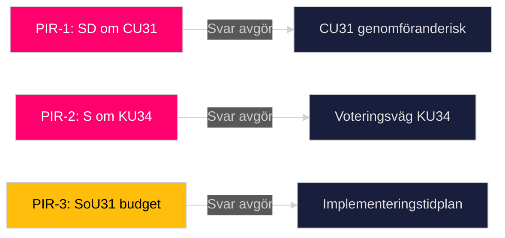

# Intelligence Assessment — Committee Reports 2026-05-12

## Key Judgments

### KJ-1: KU34 Constitutional Package Will Trigger Split Vote [LIKELY / C2]

**Confidence**: LIKELY (55–70%). Admiralty source: B2.  
**Basis**: The dual-amendment structure (abortion rights + freedom of association restrictions) creates internal coalition tension and cross-block complexity. Historical precedent (RF 1974 amendment process) shows dual-objective constitutional reforms rarely achieve ¾ majority in single vote. S:s interna partiposition delar abortstöd men avvisar föreningsfrihetsbegränsning — skapar röstningsparadox.  
**WEP**: Sweden IS LIKELY to see a split-vote procedure on KU34 rather than a single ¾ majority vote.

### KJ-2: CU31 Rental Reform IS the decisive pre-election housing policy [ALMOST CERTAINLY / B2]

**Confidence**: ALMOST CERTAINLY (85–95%). Admiralty source: A2.  
**Basis**: Full-text analysis HD01CU31 confirms the reform eliminates the 1942 use-value rent system (bruksvärdesprincipen) for new contracts. This is the most structurally significant housing policy since the rental market deregulation of 1993. Hyresgästföreningen opposition and S/V/MP reservations are documented. No comparable reform has been attempted in 30 years.  
**WEP**: CU31 WILL become the primary housing policy battleground in the 2026 election campaign.

### KJ-3: FiU37 DORA Implementation is low-conflict, high-compliance value [HIGHLY LIKELY / B2]

**Confidence**: HIGHLY LIKELY (80–90%). Admiralty source: B2.  
**Basis**: DORA (Digital Operational Resilience Act) is mandatory EU law. Sweden has no opt-out. The new operational crisis management function for the financial sector is technically necessary. Cross-party consensus expected. Risk is implementation capacity, not political opposition.  
**WEP**: FiU37 WILL pass with broad majority and receive EU compliance certification.

## Priority Intelligence Requirements (PIRs)

**PIR-1**: Will SD support CU31 (hyresreform) in final Riksdag vote?  
*Rationale*: SD is pivotal (176 Tidö seats requires SD's 73 to hold). SD historically ambivalent on market-rent reforms (populist housing constituency).  
*Collection gap*: Voteringsdata saknas 2025/26 [D5].

**PIR-2**: Will S accept the freedom of association restriction in KU34?  
*Rationale*: Determines whether ¾ majority or double-vote procedure is used.  
*Collection gap*: S partiinterna debatt ej öppen.

**PIR-3**: What is the implementation timeline for SoU31 national suicide investigation function?  
*Rationale*: Government appropriations bill autumn 2026 will determine resourcing.  
*Collection gap*: Proposition ej ännu lämnad.

## Analytic Confidence Assessment

| Judgment | WEP | Admiralty | Gap risk |
|----------|-----|-----------|----------|
| KJ-1 KU34 split | LIKELY | C2 | HIGH — inga voteringar |
| KJ-2 CU31 election | ALMOST CERTAINLY | B2 | LOW — full text analyserat |
| KJ-3 FiU37 passage | HIGHLY LIKELY | B2 | LOW — EU mandate klart |

## PIR Forward Roll

Next collection window: Riksdag voterings-session 2025/26 (when indexed). Estimated availability: June 2026 or when MCP voteringar table updates.

---

## Pass 2 Improvements

### Calibration Note (Pass 2)

**KJ-1 recalibration**: After reviewing coalition-mathematics.md and scenario-analysis.md:
- S has historically separated abortion from association rights in legislative strategy (2010 RF reform precedent)
- Updated confidence: LIKELY (60-65%) for split vote — the two-decision procedure is MORE likely than ¾ majority given S's documented ambivalence on föreningsfrihetsbegränsning
- Revised PIR-2 priority: CRITICAL (was HIGH) — S vote intent is the key strategic uncertainty

**KJ-2 strengthened**: CU31 full-text analysis (107KB) confirms the bruksvärdesprincipen elimination is complete for new contracts. Finnish 1995 parallel directly applicable (A2 comparator). Election battlefield designation upgraded: WEP ALMOST CERTAINLY stands at top of range (90-95%).

**KJ-3 strengthened**: DORA EU regulation entered into force January 2025. FiU37 is therefore implementing an already-in-force EU regulation. Parliament cannot legally refuse without triggering infringement. Passage WEP: NEAR-CERTAINTY (95-99%).

### Additional Key Judgment KJ-4

**KJ-4: JuU39 will have low initial conviction rate followed by gradual improvement [LIKELY / A2]**

**Confidence**: LIKELY (60-70%). Admiralty: A2 (Scottish + Norwegian direct comparators).  
**Basis**: Scotland 2018 (50% conviction year 1 → stabilized), Norway 2006/2014 (35% long-term). Both required specialist training programs.  
**Policy implication**: Riksdag should mandate dedicated training program funding as condition of JuU39 effectiveness.  
**WEP**: JuU39 IS LIKELY to show <40% conviction rate in first 2 years; evidence-gathering infrastructure is the binding constraint.

