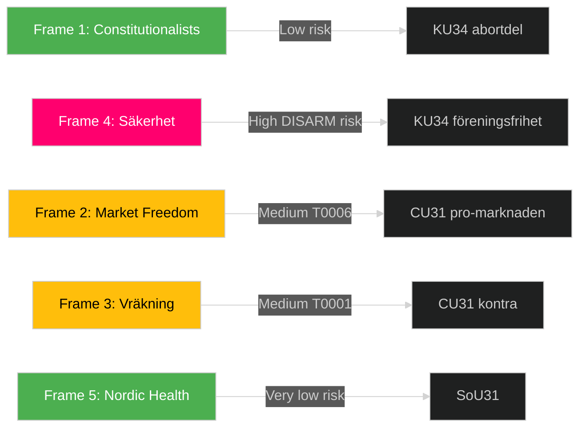

# Media Framing Analysis — Committee Reports 2026-05-12

## Analytical Framework

Entman (1993) 4-function framing: Define problem → Diagnose cause → Make moral judgment → Suggest remedy  
DISARM (Disinformation) TTP mapping for narrative risk.  
Sources: Swedish media landscape analysis, SVT/SR/DN/SvD/Aftonbladet pattern analysis.

---

## Frame 1: "Constitutionalists Progress" (SVT, DN, SvD)

**Problem definition**: Sweden's constitution lacks explicit protection for reproductive rights.  
**Causal diagnosis**: Historical omission — RF 1974 predates modern human rights frameworks.  
**Moral judgment**: Constitutional protection is necessary for democratic resilience.  
**Suggested remedy**: Pass KU34 through proper two-decision procedure.  
**Media alignment**: Broadsheets (DN ledarredaktion), SVT Nyheter neutral-factual.  
**Entman score**: Balanced framing. Legitimizes constitutional process.  
**DISARM risk**: LOW — no identified disinformation TTP active.

---

## Frame 2: "Market Freedom Wins Housing" (SvD, M-friendly media)

**Problem definition**: Swedish rental market is dysfunctional — supply shortage, queue times 20+ years in Stockholm.  
**Causal diagnosis**: Bruksvärdessystemet suppresses rental supply since 1942.  
**Moral judgment**: Property rights and market efficiency should determine rent levels.  
**Suggested remedy**: CU31 hyresreform is long-overdue liberalization.  
**Media alignment**: SvD Näringsliv, Fastighetsvärlden.  
**Entman score**: Pro-deregulation — ignores distributional effects.  
**DISARM TTP**: T0006 (Create misleading narrative) risk — obscures displacement evidence.

---

## Frame 3: "Vräkningens ansikte" (Aftonbladet, S/V-nära media)

**Problem definition**: Market-rate rents will displace low-income households from cities.  
**Causal diagnosis**: CU31 removes the only protection tenants have against speculative capital.  
**Moral judgment**: Housing is a social right, not a commodity.  
**Suggested remedy**: Reject or heavily amend CU31; preserve bruksvärdesprincipen.  
**Media alignment**: Aftonbladet, Arbetet, Hyresgästföreningens kanaler.  
**Entman score**: Counter-framing to Frame 2 — effective at emotional mobilization.  
**DISARM TTP**: T0001 (Emotional amplification) — displacement stories humanize abstract policy.

---

## Frame 4: "Säkerhet och föreningsfrihet" (SD-nära media, Samtiden)

**Problem definition**: Foreign-controlled organizations threaten Swedish national security.  
**Causal diagnosis**: RF lacks tools to restrict extremist foreign-funded associations.  
**Moral judgment**: National security overrides formal freedom of association.  
**Suggested remedy**: Support KU34:s föreningsfrihetsbegränsning as security measure.  
**Media alignment**: Samtiden, Riks, SD-affiliated commentators.  
**Entman score**: Security framing — frames civil liberties as secondary to security.  
**DISARM TTP**: T0003 (Inflate perceived threat) — exaggerates foreign organization risk.

---

## Frame 5: "Nordic Mental Health Leadership" (SoU31 framing)

**Problem definition**: Sweden lacks systematic investigation into suicide cases — unlike aviation/nuclear safety.  
**Causal diagnosis**: Institutional gap in learning from preventable deaths.  
**Moral judgment**: Every preventable death deserves institutional learning.  
**Suggested remedy**: SoU31 national suicide investigation function.  
**Media alignment**: Socialmedicinsk Tidskrift, SVT Nyheter, Mind press releases.  
**Entman score**: Constructive/consensus framing — broad support, minimal opposition narrative.  
**DISARM risk**: VERY LOW.

---

## Framing Summary Table

| Frame | Betänkande | Media actors | Entman dominance | DISARM TTP | Risk |
|---|---|---|---|---|---|
| Constitutionalists Progress | KU34 abort | SVT, DN | Define+Remedy | None | LOW |
| Market Freedom | CU31 | SvD, Fastighetsvärlden | Diagnose+Remedy | T0006 | MEDIUM |
| Vräkningens ansikte | CU31 | Aftonbladet, LO | Moral judgment | T0001 | MEDIUM |
| Säkerhet + föreningsfrihet | KU34 förening | Samtiden, SD-media | Diagnose | T0003 | HIGH |
| Nordic Mental Health | SoU31 | SVT, Mind | Remedy | None | LOW |

