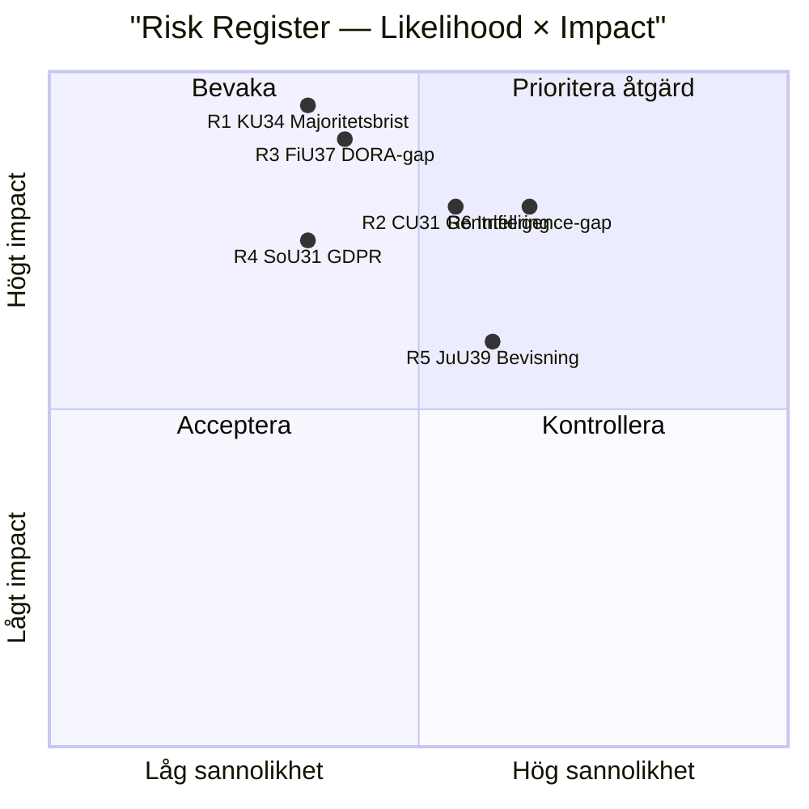

# Risk Assessment — Committee Reports 2026-05-12

## 5-Dimension Risk Register

Scores: Likelihood (L) × Impact (I) = Risk Score. Scale 1–5.

| # | Risk | L | I | Score | Dimension | Source |
|---|------|---|---|-------|-----------|--------|
| R1 | KU34 misslyckas uppnå 3/4-majoritet → grundlagsreformen förhalas | 2 | 5 | 10 | Politisk | HD01KU34 [A2] |
| R2 | CU31 hyresreform driver gentrifiering → social oro pre-val | 3 | 4 | 12 | Social | HD01CU31 [A3] |
| R3 | FiU37 krishanteringsfunktion underbemannad → DORA-compliance gap | 2 | 5 | 10 | Operationell | HD01FiU37 [B2] |
| R4 | SoU31 utredningsfunktion missar GDPR-krav → dataskandal | 2 | 4 | 8 | Legal/GDPR | HD01SoU31 [B3] |
| R5 | JuU39 psykiskt våld — bevisningsproblem i domstol → låg tillämpningseffekt | 3 | 3 | 9 | Juridisk | HD01JuU39 [B3] |
| R6 | Ny riksmöte-dinamik (inget voteringsunderlag) — felaktig koalitionsanalys | 3 | 4 | 12 | Intelligence | Metodbegränsning [D5] |

## Cascading Risk Chains

**Chain A**: R1 (KU34 majoritetsbrist) → försenad RF-revision → S/MP valoffensiv tappar huvudargument → SD/KD kan hämta hem väljare → Tidö-kompromiss destabiliseras.

**Chain B**: R2 (CU31 gentrifiering) → S/V mobilisering → folkomröstningskrav → budgetosäkerhet bostadspolitik 2027.

**Chain C**: R3 (FiU37 DORA-gap) → ECB/Finansinspektionen varning → Riksbanken tvingas agera → räntepåverkan [unconfirmed].

## Posterior Probabilities (Bayesian update)

Prior: RF-revision misslyckas = 25%. Update på basis av historisk koalitionsstruktur (Tidö + S-kompromiss) → posterior: 20% misslyckande-risk för KU34. Confidence: MEDIUM [C3].

## Mermaid: Risk Heat Map

