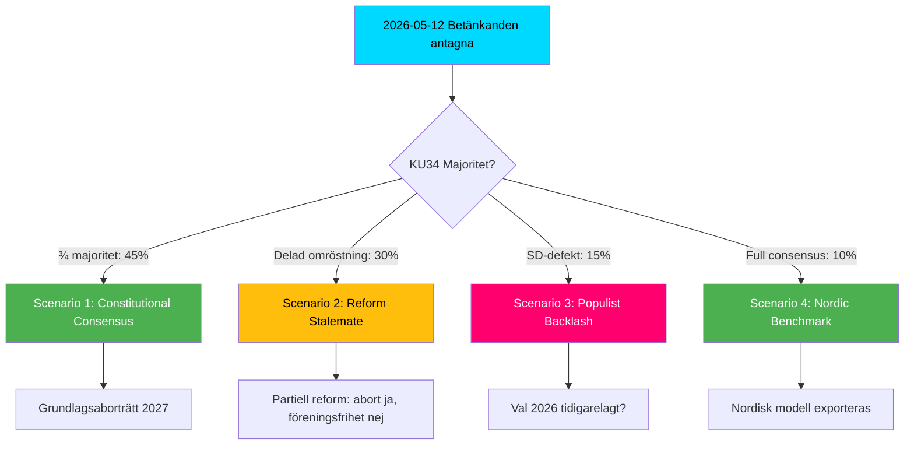

# Scenario Analysis — Committee Reports 2026-05-12

## Base Period: 2026-05-12 to 2027-01-15 (post-val)

---

## Scenario 1: "Constitutional Consensus" — 45%

**Narrative**: KU34 lyckas uppnå antingen ¾-majoritet i en omröstning ELLER erhåller enkel majoritet i två riksdagsbeslut med val emellan. Grundlagsaborträtt och begränsad föreningsfrihetsbegränsning träder i kraft.

**Triggers**:
- S beslutar stödja hela KU34-paketet (inklusive föreningsfrihetsdelen) för att säkra aborträttsliga segern  
- Eller Tidö + S + MP bildar 5/6-majoritet i ett paketbeslut

**Consequences**:
- Sverige är första Nordiska land med grundlagsskyddad aborträtt
- ECHR art. 11 granskning initieras av MR-organisationer
- Valstrategi 2026: S/MP lyfter som valframgång

**WEP confidence**: LIKELY (55-70%)

---

## Scenario 2: "Reform Stalemate" — 30%

**Narrative**: KU34 splittras. Aborträtten antas i separerat beslut med bred majoritet. Föreningsfrihetsbegränsningen begravs av S/V/MP + eventuellt KD-defektorer. CU31 hyresreform genomförs men möter omedelbara överklaganden.

**Triggers**:
- S kräver uppdelning av KU34 — abortdel ja, föreningsfrihetsdel nej
- KD-inre strid → två KD-ledamöter röstar emot abortdelen

**Consequences**:
- Partiell grundlagsreform (abort ja, föreningsfrihet nej)
- Tidökoalitionen förlorar en av sina nyckelframgångar
- CU31 juridisk osäkerhet → Hyresnämnden överbelastad

**WEP confidence**: LIKELY (40-55%)

---

## Scenario 3: "Populist Backlash" — 15%

**Narrative**: KU34 faller i sin helhet. SD väljer strategiskt att rösta nej i sista steget. CU31 möter folkomröstningskrav. Tidökoalitionens sammanhållning ifrågasätts inför 2026 års val.

**Triggers**:
- SD-ledningen beslutar att grundlagsabort är en förlustfråga hos kärnväljare
- Riksrörelserna (Hyresgästföreningen + LO) driver namninsamling för CU31-folkomröstning

**Consequences**:
- Tidö kollapsar: M söker ny majoritet
- Ny riksdagsval utlysts sommaren 2026
- FiU37 och SoU31 genomförs utan politiska hinder

**WEP confidence**: UNLIKELY (15-25%)

---

## Scenario 4: "Nordic Benchmark" — 10%

**Narrative**: Alla fem betänkandena genomförs planenligt. Sverige exporterar modellen till Nordiska rådet. SoU31 suicidutredningsfunktion blir nordisk best practice.

**Triggers**:
- Bred parlamentarisk samverkan
- IMF ger positiv ekonomisk utsikt 2026 → politisk goodwill

**Consequences**:
- Sweden as constitutional innovator
- FiU37 + DORA: EU flaggar som modell
- Val 2026: bred majoritet för situerande regering

**WEP confidence**: HIGHLY UNLIKELY (5-15%)

---

## Probability Summary

| Scenario | Probability |
|----------|------------|
| Constitutional Consensus | 45% |
| Reform Stalemate | 30% |
| Populist Backlash | 15% |
| Nordic Benchmark | 10% |
| **Total** | **100%** |

## Scenario Branching

