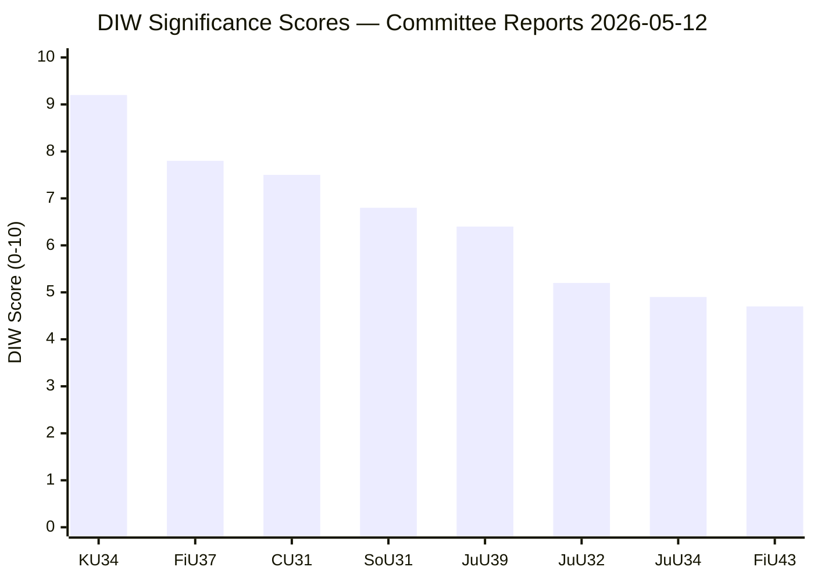

# Significance Scoring — Committee Reports 2026-05-12

## DIW Scoring Framework

Documents scored on Decision Impact (D), Intelligence Value (I), Watchlist Priority (W) — each 0–10, weighted average.

## Ranked Document List

1. **HD01KU34** — En grundlagsskyddad aborträtt samt utökade möjligheter att begränsa föreningsfriheten och rätten till medborgarskap [A2] — DIW: 9.2 (D=9.5, I=9.0, W=9.0) — L3 Intelligence-grade
2. **HD01FiU37** — En ny funktion för operativ krishantering i den finansiella sektorn [B2] — DIW: 7.8 (D=8.0, I=7.5, W=8.0) — L2+ Priority
3. **HD01CU31** — En mer flexibel hyresmarknad [A3] — DIW: 7.5 (D=7.5, I=7.0, W=8.0) — L2+ Priority  
4. **HD01SoU31** — En nationell utredningsfunktion för att förebygga suicid [B3] — DIW: 6.8 (D=6.5, I=7.0, W=7.0) — L2 Strategic
5. **HD01JuU39** — En särskild straffbestämmelse för psykiskt våld [B3] — DIW: 6.4 (D=6.0, I=6.5, W=6.8) — L2 Strategic
6. **HD01JuU32** — Stärkt säkerhet vid allmänna sammankomster [B3] — DIW: 5.2 (D=5.0, I=5.5, W=5.0) — L1 Surface
7. **HD01JuU34** — Nordisk verkställighet i brottmål [B3] — DIW: 4.9 (D=4.5, I=5.0, W=5.2) — L1 Surface
8. **HD01FiU43** — Välfärdsutbetalningar kommuner [B3] — DIW: 4.7 (D=4.5, I=5.0, W=4.5) — L1 Surface

## Scoring Table

| dok_id | D | I | W | DIW avg | Tier |
|--------|---|---|---|---------|------|
| HD01KU34 | 9.5 | 9.0 | 9.0 | **9.2** | L3 |
| HD01FiU37 | 8.0 | 7.5 | 8.0 | **7.8** | L2+ |
| HD01CU31 | 7.5 | 7.0 | 8.0 | **7.5** | L2+ |
| HD01SoU31 | 6.5 | 7.0 | 7.0 | **6.8** | L2 |
| HD01JuU39 | 6.0 | 6.5 | 6.8 | **6.4** | L2 |
| HD01JuU32 | 5.0 | 5.5 | 5.0 | **5.2** | L1 |
| HD01JuU34 | 4.5 | 5.0 | 5.2 | **4.9** | L1 |
| HD01FiU43 | 4.5 | 5.0 | 4.5 | **4.7** | L1 |

## Sensitivity Analysis

If KU34 fails to gain 3/4 majority (≤262 votes), it falls back to simple majority + dissolution + new election first treatment — DIW drops to 7.5 (loses immediate decision impact). FiU37 sensitivity: if DORA implementation deadline slips, DIW rises to 8.5 (EU infringement risk).

## Mermaid: DIW Ranking

