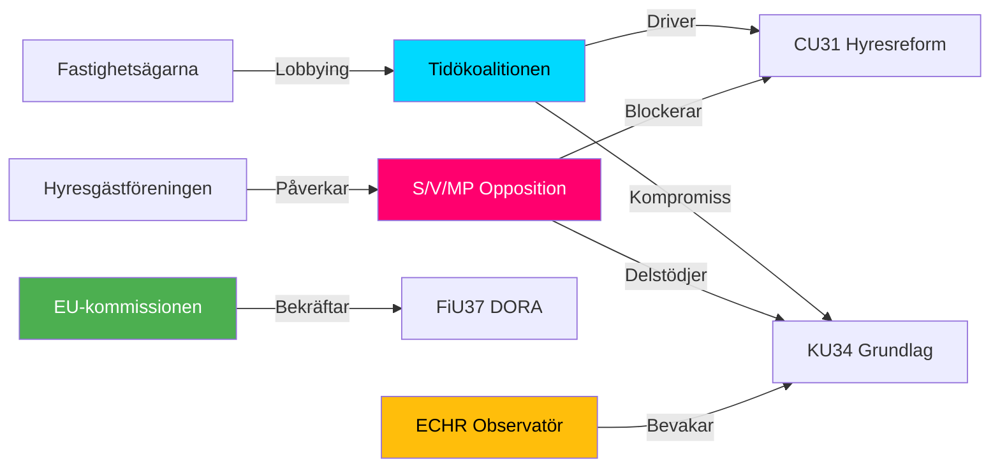

# Stakeholder Perspectives — Committee Reports 2026-05-12

## 6-Lens Stakeholder Matrix

### Lens 1: Government (Tidöpartierna: M, SD, KD, L)

**Position KU34**: M/L stödjer grundlagsabort pragmatiskt (liberala väljare); SD/KD emot aborträttslig grundlagsstiftning — intern spänning i Tidö.  
**Position CU31**: Enhetlig koalitionslinje — hyresreform central Tidö-ambition.  
**Position FiU37**: Stödjer — DORA-implementering EU-åtagande.  
Named actors: Finansminister Elisabeth Svantesson (M), statsminister Ulf Kristersson (M).

### Lens 2: Opposition (S, V, MP)

**Position KU34**: S stödjer grundlagsabort, EMOT föreningsfrihetsbegränsning — röstdelat. V/MP: stödjer abort, emot föreningsfrihetsdelen — möjlig blockering.  
**Position CU31**: S/V/MP emot hyresreform — marknadshyror anses skadliga.  
Named actors: Magdalena Andersson (S), Nooshi Dadgostar (V).

### Lens 3: Riksdag-utskott (KU, FiU, CU, SoU, JuU)

**KU**: Utgett enhälligt betänkande om grundlagsändring — processuell enighet, politisk oenighet.  
**FiU**: Stödjer FiU37 krishantering.  
**CU**: Majoritetsbeslut hyresreform — V/S reservation.  
**SoU**: Enhällig om suicidutredningsfunktion.  
**JuU**: Stödjer JuU39 psykiskt våld — bred samsyn.

### Lens 4: Civil Society / NGO

**Aborträttsorganisationer (RFSU, RFSL)**: Starkt för KU34:s abortdel.  
**Hyresgästföreningen**: Stark motståndare CU31 — marknadshyror hotar hyresgäster.  
**MIND (suicidprevention)**: Stödjer SoU31 — representerar Hjärnkoll, Mind, 1177.  
**Storstädernas fastighetsägare (Fastighetsägarna)**: För CU31.

### Lens 5: Media Actors

**SVT/SR**: Neutral faktarapportering KU34 (komplicerad grundlagsprocess).  
**DN/SvD**: Ledarrubrik för CU31 hyresreform (marknadsorienterade).  
**Aftonbladet/Expressen**: Kritiska CU31 — lyfter social dimension.  
**Riksdag & Departement**: Procedurorienterad, lägger fram KU-betänkandets tekniska aspekter.

### Lens 6: International Actors

**EU-kommissionen**: FiU37 DORA-implementering bedöms positivt — minskar infringement-risk.  
**ECHR/Europadomstolen**: Observerar KU34:s föreningsfrihetsbegränsning — ECHR art. 11 relevant.  
**GREVIO**: Bekräftar JuU39:s psykiska våldsbestämmelse uppfyller Istanbulkonventionens krav.  
**ECB/Riksbanken**: FiU37 krishanteringsfunktion förstärker finansiell stabilitet — positivt signalvärde.

## Stakeholder Influence Map

